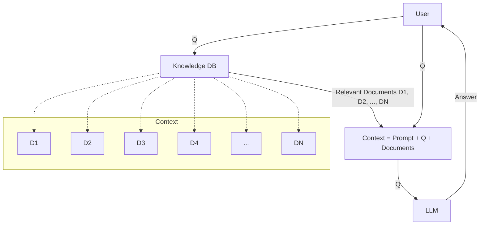

```python
import requests
```


```python
import sys
import os
```


```python
from openai import OpenAI
```


```python
client = OpenAI()
```

# 1.3 Retrieval and Search - Notes
- Before jumping into using elasticsearch to index our documents, we're going to use the search engine build by DTC
- In order to do that, I need to import minsearch.py (the search engine library)
- Once that's done, we need to understand a few things about how `minsearch` is implemented:
    - `minsearch.Index()` is the method used to index a document and takes a few parameters: `text_fields` and `keyword_fields`
        - text_fields: the fields we use to search
        - keyword_fields: the fields used to group the data (i.e. similar to a WHERE clause in SQL)
    - So for example, if you pass a query like: ***"How do I execute a command in a running docker container?"*** the search engine would filter results by `keyword_fields` and would search through `text_fields`
    - index.fit() is the method used to specify the document you want to *fit* your Index to. So in this case, you would pass it the document containing all the data with the relevant keyword_fields and text_fields
    - index.search():
        - This is the method used to actually search the fitted document for the specific question
        - All the `text_fields` you search through are given equal weighting. If you want to change that, you can use a parameter called `boost` which allows you to ***relatively*** overweight or underweight certain `text_fields` by passing it a dictionary with `{text_field: weight}`
        - There are two other parameters, that are pretty straightforward: `filter_dict` which just lets you filter based on a `keyword_fields` again as a dict of the form `{"keyword_fields": "value"}` entry and `num_results` which just limits the number of elements it returns


```python
# Map the relative path in order to import minsearch.py
current_dir = os.getcwd()
intro_dir = os.path.abspath(os.path.join(current_dir, "../../../01-intro"))
sys.path.append(intro_dir)
```


```python
import minsearch
```


```python
# import the FAQ documents (already parsed into json) into a list called documents

docs_url = 'https://github.com/DataTalksClub/llm-zoomcamp/blob/main/01-intro/documents.json?raw=1'
docs_response = requests.get(docs_url)
documents_raw = docs_response.json()

documents = []

for course in documents_raw:
    course_name = course['course']

    for doc in course['documents']:
        doc['course'] = course_name
        documents.append(doc)
```


```python
field_names = {key for document in documents for key in document.keys()}
print("\nField names:", list(field_names));
print("\ncourses:\n",'\n'.join({course['course'] for course in documents_raw}))
```

    
    Field names: ['section', 'text', 'course', 'question']
    
    courses:
     data-engineering-zoomcamp
    mlops-zoomcamp
    machine-learning-zoomcamp


```python
# Index based on the fields in our FAQ document
index = minsearch.Index(
    text_fields=["question", "text", "section"],
    keyword_fields=["course"]
)
```


```python
question = "How do I execute a command in a running docker container?"
```


```python
index.fit(documents)
```


    <minsearch.Index at 0x7beed7782170>


```python
boost = {
    "question":3,
    "text":1,
    "section":0.5
}

results = index.search(
    query = question,
    filter_dict = {"course":"data-engineering-zoomcamp"},
    boost_dict = boost,
    num_results = 20
)
```


```python
results[0]
```


    {'text': 'In case running pgcli  locally causes issues or you do not want to install it locally you can use it running in a Docker container instead.\nBelow the usage with values used in the videos of the course for:\nnetwork name (docker network)\npostgres related variables for pgcli\nHostname\nUsername\nPort\nDatabase name\n$ docker run -it --rm --network pg-network ai2ys/dockerized-pgcli:4.0.1\n175dd47cda07:/# pgcli -h pg-database -U root -p 5432 -d ny_taxi\nPassword for root:\nServer: PostgreSQL 16.1 (Debian 16.1-1.pgdg120+1)\nVersion: 4.0.1\nHome: http://pgcli.com\nroot@pg-database:ny_taxi> \\dt\n+--------+------------------+-------+-------+\n| Schema | Name             | Type  | Owner |\n|--------+------------------+-------+-------|\n| public | yellow_taxi_data | table | root  |\n+--------+------------------+-------+-------+\nSELECT 1\nTime: 0.009s\nroot@pg-database:ny_taxi>',
     'section': 'Module 1: Docker and Terraform',
     'question': 'PGCLI - running in a Docker container',
     'course': 'data-engineering-zoomcamp'}


# 1.4 Generating Answers with OpenAI GPT 4.0
- In this section, we'll be packaging up the response from our basic search engine in 1.3 and passing it as part of the context to the OpenAI API
- Using the completions API is pretty straightforward for basic usage.
    - The documentation for the compeletions API can be found here: https://platform.openai.com/docs/api-reference/chat/create
- The general structure of this section is as follows:
    - Assume a set of results are generated based on the minsearch (or any search engine) in the previous section
    - Based on how it's implemented, `index.search()` returns a list containing entries for each result it returns
        - Each result is stored as a dictionary with key-value pairs consisting of {'text', 'section', 'question','course'}
    - We want to build a context that includes instructions to the LLM to restrict its answers to content from the results above *AND* the relevant content from those results for it to analyze
    - We pass that context as a prompt to the LLM and get results back
    - That's it!


```python
prompt_template = """
You're a teaching assistant for a bootcamp course.
Restrict your answers to the QUESTION to the content in CONTEXT only.

QUESTION: {question}

CONTEXT: {context}
""".strip()
```


```python
context = ""

for doc in results:
    context = context + f"section: {doc['section']}\nquestion: {doc['question']}\nanswer: {doc['text']}\n\n"
```


```python
prompt = prompt_template.format(question=question, context=context).strip()
```


```python
print(prompt)
```

    You're a teaching assistant for a bootcamp course.
    Restrict your answers to the QUESTION to the content in CONTEXT only.
    
    QUESTION: How do I execute a command in a running docker container?
    
    CONTEXT: section: Module 1: Docker and Terraform
    question: PGCLI - running in a Docker container
    answer: In case running pgcli  locally causes issues or you do not want to install it locally you can use it running in a Docker container instead.
    Below the usage with values used in the videos of the course for:
    network name (docker network)
    postgres related variables for pgcli
    Hostname
    Username
    Port
    Database name
    $ docker run -it --rm --network pg-network ai2ys/dockerized-pgcli:4.0.1
    175dd47cda07:/# pgcli -h pg-database -U root -p 5432 -d ny_taxi
    Password for root:
    Server: PostgreSQL 16.1 (Debian 16.1-1.pgdg120+1)
    Version: 4.0.1
    Home: http://pgcli.com
    root@pg-database:ny_taxi> \dt
    +--------+------------------+-------+-------+
    | Schema | Name             | Type  | Owner |
    |--------+------------------+-------+-------|
    | public | yellow_taxi_data | table | root  |
    +--------+------------------+-------+-------+
    SELECT 1
    Time: 0.009s
    root@pg-database:ny_taxi>
    
    section: Module 1: Docker and Terraform
    question: Docker - Error response from daemon: Conflict. The container name "pg-database" is already in use by container “xxx”.  You have to remove (or rename) that container to be able to reuse that name.
    answer: Sometimes, when you try to restart a docker image configured with a network name, the above message appears. In this case, use the following command with the appropriate container name:
    >>> If the container is running state, use docker stop <container_name>
    >>> then, docker rm pg-database
    Or use docker start instead of docker run in order to restart the docker image without removing it.
    
    section: Module 1: Docker and Terraform
    question: Docker - Cannot pip install on Docker container (Windows)
    answer: You may have this error:
    Retrying (Retry(total=4, connect=None, read=None, redirect=None, status=None)) after connection broken by 'NewConnectionError('<pip._vendor.u
    rllib3.connection.HTTPSConnection object at 0x7efe331cf790>: Failed to establish a new connection: [Errno -3] Temporary failure in name resolution')':
    /simple/pandas/
    Possible solution might be:
    $ winpty docker run -it --dns=8.8.8.8 --entrypoint=bash python:3.9
    
    section: Module 1: Docker and Terraform
    question: Docker - Cannot connect to Docker daemon at unix:///var/run/docker.sock. Is the docker daemon running?
    answer: Make sure you're able to start the Docker daemon, and check the issue immediately down below:
    And don’t forget to update the wsl in powershell the  command is wsl –update
    
    section: Module 6: streaming with kafka
    question: How do I check compatibility of local and container Spark versions?
    answer: You can check the version of your local spark using spark-submit --version. In the build.sh file of the Python folder, make sure that SPARK_VERSION matches your local version. Similarly, make sure the pyspark you pip installed also matches this version.
    
    section: Module 1: Docker and Terraform
    question: Docker - docker pull dbpage
    answer: Whenever a `docker pull is performed (either manually or by `docker-compose up`), it attempts to fetch the given image name (pgadmin4, for the example above) from a repository (dbpage).
    IF the repository is public, the fetch and download happens without any issue whatsoever.
    For instance:
    docker pull postgres:13
    docker pull dpage/pgadmin4
    BE ADVISED:
    
    The Docker Images we'll be using throughout the Data Engineering Zoomcamp are all public (except when or if explicitly said otherwise by the instructors or co-instructors).
    
    Meaning: you are NOT required to perform a docker login to fetch them. 
    
    So if you get the message above saying "docker login': denied: requested access to the resource is denied. That is most likely due to a typo in your image name:
    
    For instance:
    $ docker pull dbpage/pgadmin4
    Will throw that exception telling you "repository does not exist or may require 'docker login'
    Error response from daemon: pull access denied for dbpage/pgadmin4, repository does not exist or 
    may require 'docker login': denied: requested access to the resource is denied
    But that actually happened because the actual image is dpage/pgadmin4 and NOT dbpage/pgadmin4
    How to fix it:
    $ docker pull dpage/pgadmin4
    EXTRA NOTES:
    In the real world, occasionally, when you're working for a company or closed organisation, the Docker image you're trying to fetch might be under a private repo that your DockerHub Username was granted access to.
    For which cases, you must first execute:
    $ docker login
    Fill in the details of your username and password.
    And only then perform the `docker pull` against that private repository
    Why am I encountering a "permission denied" error when creating a PostgreSQL Docker container for the New York Taxi Database with a mounted volume on macOS M1?
    Issue Description:
    When attempting to run a Docker command similar to the one below:
    docker run -it \
    -e POSTGRES_USER="root" \
    -e POSTGRES_PASSWORD="root" \
    -e POSTGRES_DB="ny_taxi" \
    -v $(pwd)/ny_taxi_postgres_data:/var/lib/postgresql/data \
    -p 5432:5432 \mount
    postgres:13
    You encounter the error message:
    docker: Error response from daemon: error while creating mount source path '/path/to/ny_taxi_postgres_data': chown /path/to/ny_taxi_postgres_data: permission denied.
    Solution:
    1- Stop Rancher Desktop:
    If you are using Rancher Desktop and face this issue, stop Rancher Desktop to resolve compatibility problems.
    2- Install Docker Desktop:
    Install Docker Desktop, ensuring that it is properly configured and has the required permissions.
    2-Retry Docker Command:
    Run the Docker command again after switching to Docker Desktop. This step resolves compatibility issues on some systems.
    Note: The issue occurred because Rancher Desktop was in use. Switching to Docker Desktop resolves compatibility problems and allows for the successful creation of PostgreSQL containers with mounted volumes for the New York Taxi Database on macOS M1.
    
    section: Workshop 2 - RisingWave
    question: Setup - source command.sh - error: “docker-compose” not found
    answer: If you encounter this error and are certain that you have docker compose installed, but typically run it as docker compose without the hyphen, then consider editing command.sh file by removing the hyphen from ‘docker-compose’. Example:
    start-cluster() {
    docker compose -f docker/docker-compose.yml up -d
    }
    
    section: Module 1: Docker and Terraform
    question: Docker-Compose - Error getting credentials after running docker-compose up -d
    answer: Installing pass via ‘sudo apt install pass’ helped to solve the issue. More about this can be found here: https://github.com/moby/buildkit/issues/1078
    
    section: Module 1: Docker and Terraform
    question: Docker - ERRO[0000] error waiting for container: context canceled
    answer: You might have installed docker via snap. Run “sudo snap status docker” to verify.
    If you have “error: unknown command "status", see 'snap help'.” as a response than deinstall docker and install via the official website
    Bind for 0.0.0.0:5432 failed: port is a
    
    section: Module 2: Workflow Orchestration
    question: Docker: container crashed with status code 137.
    answer: It means your container consumed all available RAM allocated to it. It can happen in particular when working on Question#3 in the homework as the dataset is relatively large and containers eat a lot of memory in general.
    I would recommend restarting your computer and only starting the necessary processes to run the container. If that doesn’t work, allocate more resources to docker. If also that doesn’t work because your workstation is a potato, you can use an online compute environment service like GitPod, which is free under under 50 hours / month of use.
    
    section: Module 1: Docker and Terraform
    question: Docker - Docker network name
    answer: Get the network name via: $ docker network ls.
    
    section: Module 1: Docker and Terraform
    question: PGCLI - INKhould we run pgcli inside another docker container?
    answer: In this section of the course, the 5432 port of pgsql is mapped to your computer’s 5432 port. Which means you can access the postgres database via pgcli directly from your computer.
    So No, you don’t need to run it inside another container. Your local system will do.
    
    section: Module 1: Docker and Terraform
    question: GCP - Do I need to delete my instance in Google Cloud?
    answer: In this lecture, Alexey deleted his instance in Google Cloud. Do I have to do it?
    Nope. Do not delete your instance in Google Cloud platform. Otherwise, you have to do this twice for the week 1 readings.
    
    section: Module 1: Docker and Terraform
    question: Docker - Docker won't start or is stuck in settings (Windows 10 / 11)
    answer: First off, make sure you're running the latest version of Docker for Windows, which you can download from here. Sometimes using the menu to "Upgrade" doesn't work (which is another clear indicator for you to uninstall, and reinstall with the latest version)
    If docker is stuck on starting, first try to switch containers by right clicking the docker symbol from the running programs and switch the containers from windows to linux or vice versa
    [Windows 10 / 11 Pro Edition] The Pro Edition of Windows can run Docker either by using Hyper-V or WSL2 as its backend (Docker Engine)
    In order to use Hyper-V as its back-end, you MUST have it enabled first, which you can do by following the tutorial: Enable Hyper-V Option on Windows 10 / 11
    If you opt-in for WSL2, you can follow the same steps as detailed in the tutorial here
    
    section: General course-related questions
    question: How do I use Git / GitHub for this course?
    answer: After you create a GitHub account, you should clone the course repo to your local machine using the process outlined in this video: Git for Everybody: How to Clone a Repository from GitHub
    Having this local repository on your computer will make it easy for you to access the instructors’ code and make pull requests (if you want to add your own notes or make changes to the course content).
    You will probably also create your own repositories that host your notes, versions of your file, to do this. Here is a great tutorial that shows you how to do this: https://www.atlassian.com/git/tutorials/setting-up-a-repository
    Remember to ignore large database, .csv, and .gz files, and other files that should not be saved to a repository. Use .gitignore for this: https://www.atlassian.com/git/tutorials/saving-changes/gitignore NEVER store passwords or keys in a git repo (even if that repo is set to private).
    This is also a great resource: https://dangitgit.com/
    
    section: Module 1: Docker and Terraform
    question: Docker - The input device is not a TTY (Docker run for Windows)
    answer: You may have this error:
    $ docker run -it ubuntu bash
    the input device is not a TTY. If you are using mintty, try prefixing the command with 'winpty'
    error:
    Solution:
    Use winpty before docker command (source)
    $ winpty docker run -it ubuntu bash
    You also can make an alias:
    echo "alias docker='winpty docker'" >> ~/.bashrc
    OR
    echo "alias docker='winpty docker'" >> ~/.bash_profile
    
    section: Module 1: Docker and Terraform
    question: Docker - Connecting from VS Code
    answer: It’s very easy to manage your docker container, images, network and compose projects from VS Code.
    Just install the official extension and launch it from the left side icon.
    It will work even if your Docker runs on WSL2, as VS Code can easily connect with your Linux.
    Docker - How to stop a container?
    Use the following command:
    $ docker stop <container_id>
    
    section: Workshop 2 - RisingWave
    question: command.sh Error - source: no such file or directory: command.sh
    answer: Check the contents of the repository with ls - the command.sh file should be in the root folder
    If it is not, verify that you had cloned the correct repository - https://github.com/risingwavelabs/risingwave-data-talks-workshop-2024-03-04
    
    section: Module 1: Docker and Terraform
    question: Docker - Cannot install docker on MacOS/Windows 11 VM running on top of Linux (due to Nested virtualization).
    answer: terraformRun this command before starting your VM:
    On Intel CPU:
    modprobe -r kvm_intel
    modprobe kvm_intel nested=1
    On AMD CPU:
    modprobe -r kvm_amd
    modprobe kvm_amd nested=1
    
    section: Module 1: Docker and Terraform
    question: Docker-Compose - docker-compose still not available after changing .bashrc
    answer: This is happen to me after following 1.4.1 video where we are installing docker compose in our Google Cloud VM. In my case, the docker-compose file downloaded from github named docker-compose-linux-x86_64 while it is more convenient to use docker-compose command instead. So just change the docker-compose-linux-x86_64 into docker-compose.


```python
response = client.chat.completions.create(
    model = "gpt-4o",
    messages = [{"role": "user", "content": prompt}]
)
```


```python
print(response.choices[0].message.content)
```

    To execute a command in a running Docker container, you can use the `docker exec` command. 
    
    For example, to execute the command `pgcli -h pg-database -U root -p 5432 -d ny_taxi` inside a running Docker container with the name or ID `175dd47cda07`, you can use:
    
    ```sh
    docker exec -it 175dd47cda07 pgcli -h pg-database -U root -p 5432 -d ny_taxi
    ```
    
    Here:
    
    - `docker exec` is the command to run a command in a running container.
    - `-it` allows you to interact with the container.
    - `175dd47cda07` is the name or ID of the container in which you want to run the command.
    - `pgcli -h pg-database -U root -p 5432 -d ny_taxi` is the command you want to execute inside the container.
    
    Make sure to replace `175dd47cda07` with your actual container ID or name.


# 1.5 The RAG Flow Cleaning and Modularizing Code
- At this point, here is the general RAG flow we've built

- So now we need to clean everything up and put it into useable functions
- The way we're going to do that is create 3 functions that pertain to each of the three steps in our RAG flow:
    - `search(query)`: this function just takes in the question and returns the results of type list from the knowledge-base we've implemented
    - `build_prompt`: this builds the prompt based on the user prompt + the question + the results from the knowledge base
    - `llm`: this takes the prompt from `build_prompt` and retuns the answer
    - and finally, we can create a function that calls all the step functions before it called `rag` that takes in a query and produces an answer
- This structure allows us to swap out each of the individual pieces without altering the whole flow
    - For example, later on we'll replace the `search(question)` implementation with a function that uses ElasticSearch instead of the basic `minsearch.py` search engine


```python
def search(query, num_results = 5):
    
    boost = {
    "question":3,
    "text":1,
    "section":0.5
    }

    results = index.search(
        query = query,
        filter_dict = {"course":"data-engineering-zoomcamp"},
        boost_dict = boost,
        num_results = num_results
    )
    
    return results
```


```python
def build_prompt(query, search_results):

    # create a context string
    context = ""

    # iterate through the search_results and add results to the context string
    for doc in search_results:
        context = context + f"section: {doc['section']}\nquestion: {doc['question']}\nanswer: {doc['text']}\n\n"

    # add a user prompt
    prompt_template = """
    You're a course teaching assistant. Answer the QUESTION based on the CONTEXT from the FAQ database.
    Use only the facts from the CONTEXT when answering the QUESTION.
    
    QUESTION: {question}
    
    CONTEXT:
    {context}
    """.strip()
    
    prompt = prompt_template.format(question=query, context=context).strip()    

    return prompt
```


```python
def llm(prompt):
    response = client.chat.completions.create(
        model = "gpt-4o",
        messages = [{"role": "user", "content": prompt}]
    )
    
    return response.choices[0].message.content
```


```python
def rag_minsearch(question):
    results = search(question, 5)
    # results = search_elastic(question)
    prompt = build_prompt(question, results)
    answer = llm(prompt)

    return answer
```

# 1.6 Search with Elasticsearch

- Now it's time to replace the minsearch implementation with elasticsearch
    - The reason `minsearch` was implemented in the first place was so that in the future if we deploy our RAG in an environment that can't host elasticsearch, we can use something small that runs in memory
- To deploy elasticsearch, I simply just added a docker run command to a bash script called `run_elastic.sh` and made sure user had execute access (the original command had -it and --rm as parameters and I'm not sure why):
    - ```shell
      docker run \
    --name elasticsearch \
    -p 9200:9200 \
    -p 9300:9300 \
    -e "discovery.type=single-node" \
    docker.elastic.co/elasticsearch/elasticsearch:8.4.3
  ```
- You can check if your elastic instance is running by sending a curl request to it: `curl localhost:9200`
- So now let's index our documents using Elasticsearch instead of minsearch. This happens in a few steps:
    1. Create an instance of Elasticsearch class called `es_client` by using `Elasticsearch(url)`
    2. Create your indices based on the fields of the documents you want indexed using `es_client.indices.create(index_name, index_settings)` method
    3. Index your document by iterating through each doc in document and adding them to the index using `es_client.index(index_name, body=[doc for doc in documents])`
- We can use `tqdm` while running the `index()` method to get a helpful progress bar
- Once we have our documents indexed, we can create a search_query
- Next, we need to actually search our index using our search_query:
    - To do this, we use `es_client.search(index_name, body=search_query)` method by passing our index_name and the search_query we constructed above
- You can check that your instance matches your results from the `curl` API request above by using the `info()` method: `es_client.info()`


```python
from elasticsearch import Elasticsearch
```


```python
es_client = Elasticsearch('http://localhost:9200')
```


```python
index_settings = {
    "settings": {
        "number_of_shards": 1,
        "number_of_replicas": 0
    },
    "mappings": {
        "properties": {
            "text": {"type": "text"},
            #"section": {"type": "text"},
            "question": {"type": "text"},
            "course": {"type": "keyword"}
        }
    }
}

#index_name = "course-questions"
index_name = "course-questions-homework"

es_client.indices.create(index=index_name, body=index_settings)
```


    {'acknowledged': True,
     'shards_acknowledged': True,
     'index': 'course-questions-homework'}


```python
from tqdm.auto import tqdm
```

    /usr/local/python/3.10.13/lib/python3.10/site-packages/tqdm/auto.py:21: TqdmWarning: IProgress not found. Please update jupyter and ipywidgets. See https://ipywidgets.readthedocs.io/en/stable/user_install.html
      from .autonotebook import tqdm as notebook_tqdm


```python
for doc in tqdm(documents):
    es_client.index(index=index_name, body=doc)
```

    100%|████████████████████████████████████████████████████████████████████| 948/948 [00:24<00:00, 38.50it/s]


```python
search_query = {
        "size": 3,
        "query": {
            "bool": {
                "must": {
                    "multi_match": {
                        "query": question,
                        #"fields": ["question^3", "text", "section^0.5"],
                        "fields": ["question^4", "text"],
                        "type": "best_fields"
                    }
                },
                 "filter": {
                    "term": {
                        "course": "machine-learning-zoomcamp"
                    }
                }
            }
        }
    }
```


```python
es_client.search(index=index_name, body=search_query)['hits']['hits'][2]['_source']['question']
```


    'How do I copy files from a different folder into docker container’s working directory?'


```python
def search_elastic(question):

    # create your search query
    search_query = {
        "size": 3,
        "query": {
            "bool": {
                "must": {
                    "multi_match": {
                        "query": question,
                        #"fields": ["question^3", "text", "section^0.5"],
                        "fields": ["question^4", "text"],
                        "type": "best_fields"
                    }
                },
                "filter": {
                    "term": {
                        "course": "machine-learning-zoomcamp"
                    }
                }
            }
        }
    }

    # pass the search query to the elasticsearch client
    response = es_client.search(index=index_name, body=search_query)

    # iterate through the response and pull out the list with the results
    result_docs = []
    
    for hit in response['hits']['hits']:
        result_docs.append(hit['_source'])

    return result_docs
```


```python
question
```


    'How do I execute a command in a running docker container?'


## Putting it all together
- Put everything bag into one function that you can call by just passing the question


```python
def rag_elastic(question):
    #results = search(question, 5)
    results = search_elastic(question)
    prompt = build_prompt(question, results)
    answer = llm(prompt)

    return answer
```


```python
results1 = search_elastic(question)
print(results1[2])
```

    {'text': 'You can copy files from your local machine into a Docker container using the docker cp command. Here\'s how to do it:\nIn the Dockerfile, you can provide the folder containing the files that you want to copy over. The basic syntax is as follows:\nCOPY ["src/predict.py", "models/xgb_model.bin", "./"]\t\t\t\t\t\t\t\t\t\t\tGopakumar Gopinathan', 'section': '5. Deploying Machine Learning Models', 'question': 'How do I copy files from a different folder into docker container’s working directory?', 'course': 'machine-learning-zoomcamp'}


```python
prompt1 = build_prompt(question, results1)
len(prompt1)
```


    1482


```python
answer1 = llm(prompt1)
print(answer1)
```

    To execute a command in a running Docker container, you can use the `docker exec` command. Here's how you can do it:
    
    1. First, you need to identify the container ID or name of the running container. You can do this by listing all running containers using the `docker ps` command.
    
    ```sh
    docker ps
    ```
    
    This will give you an output similar to this, where you can see the container ID and name:
    
    ```sh
    CONTAINER ID        IMAGE               COMMAND             CREATED             STATUS              PORTS               NAMES
    4a432e93f871        myimage             "python app.py"     5 minutes ago       Up 5 minute                              mystifying_babbage
    ```
    
    2. Once you have the container ID or name, you can execute a command in the specific container using `docker exec`. For example, to start a bash session in the container, you would use:
    
    ```sh
    docker exec -it <container_id_or_name> bash
    ```
    
    Replace `<container_id_or_name>` with the actual container ID or name obtained from the `docker ps` command. For example:
    
    ```sh
    docker exec -it 4a432e93f871 bash
    ```
    
    3. After running this command, you will be inside the running container and can execute commands interactively.
    
    Alternatively, if you want to execute a specific command without opening an interactive shell, you can do so directly. For example, to list the contents of a directory inside the container, you might use:
    
    ```sh
    docker exec -it <container_id_or_name> ls /path/in/container
    ```
    
    For instance:
    
    ```sh
    docker exec -it 4a432e93f871 ls /app
    ```
    
    This will list the contents of the `/app` directory inside the running container.


```python
len(answer1)
```


    1617


```python
print(answer)
```

    Yes, you can still register for the course after the start date. You won’t be able to submit some of the homework assignments, but you can still participate in the course. To be eligible for a certificate, you need to submit 2 out of 3 course projects and review 3 peers’ projects by the deadline.


# Bonus: calculating the costs (ungraded)
- In order to calculate the costs each time we call our `rag()` function we need to count the number of input and output tokens
- Here's the latest pricing table from OpenAI for the gpt-4o model:
    - Input tokens: $0.0050 / 1K input tokens
    - Output tokens: $0.0150 / 1K output tokens
- One way to calculate the tokens is to convert the prompt into tokens using the `tiktoken` library. You can do this in a few steps:
  1. Create an `encoding` using the `encoding_for_model(model)` method
  2. Convert your prompt into tokens using `encoding_for_model.encode(prompt)`
  3. The length of that token is what you can use to multiply by the costs above to get your input token cost
  4. To get the output token cost, take the response from the LLM API call and do the same thing!
- Another way is to just use the output from the OpenAI `completions` API call as it provides that information

## Method 1 - Using tiktoken


```python
!pip install tiktoken
```

    Collecting tiktoken
      Downloading tiktoken-0.7.0-cp310-cp310-manylinux_2_17_x86_64.manylinux2014_x86_64.whl.metadata (6.6 kB)
    Collecting regex>=2022.1.18 (from tiktoken)
      Downloading regex-2024.5.15-cp310-cp310-manylinux_2_17_x86_64.manylinux2014_x86_64.whl.metadata (40 kB)
         ━━━━━━━━━━━━━━━━━━━━━━━━━━━━━━━━━━━━━━━━ 40.9/40.9 kB 1.3 MB/s eta 0:00:00
    [?25hRequirement already satisfied: requests>=2.26.0 in /home/codespace/.local/lib/python3.10/site-packages (from tiktoken) (2.32.3)
    Requirement already satisfied: charset-normalizer<4,>=2 in /home/codespace/.local/lib/python3.10/site-packages (from requests>=2.26.0->tiktoken) (3.3.2)
    Requirement already satisfied: idna<4,>=2.5 in /home/codespace/.local/lib/python3.10/site-packages (from requests>=2.26.0->tiktoken) (3.7)
    Requirement already satisfied: urllib3<3,>=1.21.1 in /usr/local/python/3.10.13/lib/python3.10/site-packages (from requests>=2.26.0->tiktoken) (1.26.19)
    Requirement already satisfied: certifi>=2017.4.17 in /home/codespace/.local/lib/python3.10/site-packages (from requests>=2.26.0->tiktoken) (2024.2.2)
    Downloading tiktoken-0.7.0-cp310-cp310-manylinux_2_17_x86_64.manylinux2014_x86_64.whl (1.1 MB)
       ━━━━━━━━━━━━━━━━━━━━━━━━━━━━━━━━━━━━━━━━ 1.1/1.1 MB 23.3 MB/s eta 0:00:00m eta 0:00:01
    [?25hDownloading regex-2024.5.15-cp310-cp310-manylinux_2_17_x86_64.manylinux2014_x86_64.whl (775 kB)
       ━━━━━━━━━━━━━━━━━━━━━━━━━━━━━━━━━━━━━━━━ 775.1/775.1 kB 21.6 MB/s eta 0:00:00m eta 0:00:01
    [?25hInstalling collected packages: regex, tiktoken
    Successfully installed regex-2024.5.15 tiktoken-0.7.0
    
    [notice] A new release of pip is available: 24.0 -> 24.1.1
    [notice] To update, run: python3 -m pip install --upgrade pip


```python
import tiktoken

encoding = tiktoken.encoding_for_model("gpt-4o")

tokens = encoding.encode(prompt1)

# Count the tokens
number_of_tokens = len(tokens)

print(f"Number of tokens in the prompt: {number_of_tokens}")
```

    Number of tokens in the prompt: 682


## Method 2: Using OpenAI's completions API


```python
response = client.chat.completions.create(
        model = "gpt-4o",
        messages = [{"role": "user", "content": prompt}]
    )
```


```python
print(response.usage)
```
