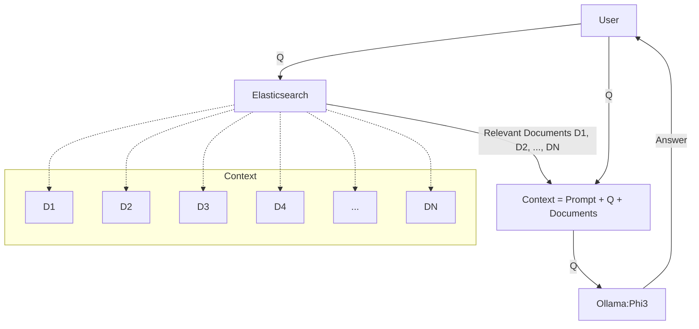

# LLM Zoomcamp - Week 2 Notes

In the second week, we set up cloud-based GPU options like SaturnCloud and explore open source alternatives to OpenAI platforms and  models like:
Platforms:
- HuggingFace
- Ollama
- SaturnCloud

Models:
- Google FLAN T5
- Phi 3 Mini
- Mistral 7-B

And finally, we put the RAG we built in week 1 into a Streamlit UI

A few important call outs for this section:
- For the most part, I will be taking these notes in a Saturn Cloud notebook
- Which means that before starting each note section, I will be restarting the kernel to free up RAM from the GPU I'm using
- So if I ever decide to revisit these notes in the future, I won't be able to just load this notebook and run things as is

## Table of Contents

- [2.2 Using SaturnCloud for GPU Notebooks](#22-using-saturncloud-for-gpu-notebooks)
- [2.3 HuggingFace and Google FLAN T5](#23-huggingface-and-google-flan-t5)
- [2.4 Phi 3 Mini](#24-phi-3-mini)
- [2.5 Mistral-7B and HuggingFace Hub Authentication](#25-mistral-7b-and-huggingface-hub-authentication)
- [2.6 Exploring Open Source LLMs](#26-exploring-open-source-llms)
- [2.7 Running LLMs Locally without a GPU with Ollama](#27-running-llms-locally-without-a-gpu-with-ollama)
- [2.8 Ollama + Elastic in Docker Compose](#28-ollama--elastic-in-docker-compose)
    - [Docker Compose Setup](#docker-compose-setup)
    - [Setting Up Elasticsearch and Ollama](#setting-up-elasticsearch-and-ollama)
    - [Building the RAG System](#building-the-rag-system)
- [2.9 Creating a Streamlit UI](#29-creating-a-streamlit-ui)
- [Bonus Ollama + OpenWebUI + Elastic in Docker with GPU](#bonus-ollama--openwebui--elastic-in-docker-with-gpu)

```python
import os
import requests
```

## 2.2 Using SaturnCloud for GPU Notebooks
- The main thing not covered is how to give Saturn Cloud access to your GitHub repositories
    - This is fairly straightforward:
        1. In Saturn Cloud, go to "Manage <username>" and create an SSH key pair
        2. Copy the public key Saturn Cloud generates and go to Github.com
            i. In Github.com, go to Settings -> SSH and GPG keys and click on `New SSH Key`
            ii. Paste in the public key you copied from Saturn Cloud
        3. Now go back to Saturn Cloud and click on `Git Repositories`
            i. Click on `New`
            ii. Add the url for the Github repository you want Saturn Cloud to have access to
- When creating a new Python VM resource, make sure to install additional libs: `pip install -U transformers accelerate bitsandbytes`
- The rest of it is quite straightforward
- A few things I did with my setup of the notebook resource that just helps with development:
    1. I enabled SSH access so that I can ideally connect to this notebook resource in VS Code (and thus take advantange of many things including Github Copilot)
    2. I gave the VM an easy to remember name: https://llm-zoomcamp-waleed.community.saturnenterprise.io
    3. I created an access token on huggingface.co and added it as an environment variable on Saturn Cloud (more on that in section 2.5)

## 2.3 HuggingFace and Google FLAN T5

- In this lesson, we start working with open source models available on [HuggingFace](huggingface.co)
    - HuggingFace is a place where people host models, not just LLMs, all kinds of ML models (which effectively boils down to hosting model weights)
- This is where our Saturn Cloud GPU notebook in 2.2 comes into play as we'll need a GPU to work with these models
- We're going to be using Google FLAN T5: https://huggingface.co/google/flan-t5-xl

Let's start by pulling in the minsearch engine we're going to use in our RAG


```python
!rm -f minsearch.py
!wget https://raw.githubusercontent.com/alexeygrigorev/minsearch/main/minsearch.py
```

    --2024-07-08 01:20:41--  https://raw.githubusercontent.com/alexeygrigorev/minsearch/main/minsearch.py
    Resolving raw.githubusercontent.com (raw.githubusercontent.com)... 185.199.111.133, 185.199.110.133, 185.199.108.133, ...
    Connecting to raw.githubusercontent.com (raw.githubusercontent.com)|185.199.111.133|:443... connected.
    HTTP request sent, awaiting response... 200 OK
    Length: 3832 (3.7K) [text/plain]
    Saving to: 'minsearch.py'
    
    minsearch.py        100%[===================>]   3.74K  --.-KB/s    in 0s      
    
    2024-07-08 01:20:41 (83.2 MB/s) - 'minsearch.py' saved [3832/3832]
    


From the link above, we have some reference code to run the model on a GPU:


```python
# pip install accelerate
from transformers import T5Tokenizer, T5ForConditionalGeneration

# Import a tokenizer to convert text to tokens
tokenizer = T5Tokenizer.from_pretrained("google/flan-t5-xl")
# Load the model
model = T5ForConditionalGeneration.from_pretrained("google/flan-t5-xl", device_map="auto")

input_text = "translate English to German: How old are you?"
input_ids = tokenizer(input_text, return_tensors="pt").input_ids.to("cuda")

outputs = model.generate(input_ids)
print(tokenizer.decode(outputs[0]))
```

- An important consideration is how Saturn Cloud provisions storage
    - By default, HuggingFace wants to use a /cache subdirectory within the /home directory in your Saturn Cloud environment
        - You can change this by setting the `HF_HOME` environment variable
        - A better way to do this would be to set it using `direnv` (helpful blog post on that [here](https://waleedayoub.com/post/managing-dev-environments_local-vs-codespaces/#option-2-github-codespaces))
    ```python
    import os
    os.environ['HF_HOME']='/run/cache'import os
    os.environ['HF_HOME']='/run/cache'
    ```
    - The main change we make to our original FAQ answering RAG is the `def llm(query):` function
    ```python
    def llm(prompt):
        input_text = prompt
        input_ids = tokenizer(input_text, return_tensors="pt").input_ids.to("cuda")
        outputs = model.generate(input_ids)
        results = tokenizer.decode(outputs[0])
        
        return results
    ```
    - By default, FLAN T5's `generate` method caps the length of the response. You can actually check what the max length is with this:
    ```python
    print(f"Default max_length: {model.config.max_length}")
    ```
    - This returns: Default max_length: 20
    - So this can easily be changed when calling the `generate` method like this:
    ```python
    outputs = model.generate(input_ids, max_length=200)
    ```
    - Another useful parameter to the `decode` method is passing `skip_special_tokens` which seems to get rid of the padding leading and trailing tokens
    ```python
    results = tokenizer.decode(outputs[0], skip_special_tokens=True)
    ```    

### So let's put it all together now and modify our RAG from section 1 to use FLAN T5!


```python
import os
os.environ['HF_HOME']='/run/cache'
```


```python
from transformers import T5Tokenizer, T5ForConditionalGeneration
```


```python
# Import a tokenizer to convert text to tokens
tokenizer = T5Tokenizer.from_pretrained("google/flan-t5-xl")
# Load the model
model = T5ForConditionalGeneration.from_pretrained("google/flan-t5-xl", device_map="auto")
```


    tokenizer_config.json:   0%|          | 0.00/2.54k [00:00<?, ?B/s]


    spiece.model:   0%|          | 0.00/792k [00:00<?, ?B/s]


    special_tokens_map.json:   0%|          | 0.00/2.20k [00:00<?, ?B/s]


    tokenizer.json:   0%|          | 0.00/2.42M [00:00<?, ?B/s]


    You are using the default legacy behaviour of the <class 'transformers.models.t5.tokenization_t5.T5Tokenizer'>. This is expected, and simply means that the 'legacy' (previous) behavior will be used so nothing changes for you. If you want to use the new behaviour, set 'legacy=False'. This should only be set if you understand what it means, and thoroughly read the reason why this was added as explained in https://github.com/huggingface/transformers/pull/24565
    Special tokens have been added in the vocabulary, make sure the associated word embeddings are fine-tuned or trained.


    config.json:   0%|          | 0.00/1.44k [00:00<?, ?B/s]


    model.safetensors.index.json:   0%|          | 0.00/53.0k [00:00<?, ?B/s]


    Downloading shards:   0%|          | 0/2 [00:00<?, ?it/s]


    model-00001-of-00002.safetensors:   0%|          | 0.00/9.45G [00:00<?, ?B/s]


    model-00002-of-00002.safetensors:   0%|          | 0.00/1.95G [00:00<?, ?B/s]


    Loading checkpoint shards:   0%|          | 0/2 [00:00<?, ?it/s]


    generation_config.json:   0%|          | 0.00/147 [00:00<?, ?B/s]


```python
input_text = "translate English to German: How old are you?"
input_ids = tokenizer(input_text, return_tensors="pt").input_ids.to("cuda")
```


```python
print(input_ids)
```
    tensor([[13959,  1566,    12,  2968,    10,   571,   625,    33,    25,    58,
                 1]], device='cuda:0')
```python
outputs = model.generate(input_ids)
print(outputs)
print(tokenizer.decode(outputs[0]))
```

    /opt/saturncloud/envs/saturn/lib/python3.9/site-packages/transformers/generation/utils.py:1249: UserWarning: Using the model-agnostic default `max_length` (=20) to control the generation length. We recommend setting `max_new_tokens` to control the maximum length of the generation.
      warnings.warn(


    tensor([[   0, 2739, 4445,  436,  292,   58,    1]], device='cuda:0')
    <pad> Wie alt sind Sie?</s>


### Now we do the same RAG as before but we modify the llm function to use our local FLAN T5 weights vs an OpenAI API call


```python
import requests 
import minsearch

docs_url = 'https://github.com/DataTalksClub/llm-zoomcamp/blob/main/01-intro/documents.json?raw=1'
docs_response = requests.get(docs_url)
documents_raw = docs_response.json()

documents = []

for course in documents_raw:
    course_name = course['course']

    for doc in course['documents']:
        doc['course'] = course_name
        documents.append(doc)

index = minsearch.Index(
    text_fields=["question", "text", "section"],
    keyword_fields=["course"]
)

index.fit(documents)
```
    <minsearch.Index at 0x7f69146b9940>

```python
def search(query):
    boost = {'question': 3.0, 'section': 0.5}

    results = index.search(
        query=query,
        filter_dict={'course': 'data-engineering-zoomcamp'},
        boost_dict=boost,
        num_results=5
    )

    return results
```

```python
def build_prompt(query, search_results):
    prompt_template = """
You're a course teaching assistant. Answer the QUESTION based on the CONTEXT from the FAQ database.
Use only the facts from the CONTEXT when answering the QUESTION.

QUESTION: {question}

CONTEXT: 
{context}
""".strip()

    context = ""
    
    for doc in search_results:
        context = context + f"section: {doc['section']}\nquestion: {doc['question']}\nanswer: {doc['text']}\n\n"
    
    prompt = prompt_template.format(question=query, context=context).strip()
    return prompt

def llm(prompt):
    input_text = prompt
    input_ids = tokenizer(input_text, return_tensors="pt").input_ids.to("cuda")
    outputs = model.generate(input_ids, max_length=200)
    results = tokenizer.decode(outputs[0])
    
    return results
```

```python
def rag(query):
    search_results = search(query)
    prompt = build_prompt(query, search_results)
    answer = llm(prompt)
    return answer
```


```python
rag("I just discovered the course, can I still register?")
```
    "<pad> Yes, even if you don't register, you're still eligible to submit the homeworks. Be aware, however, that there will be deadlines for turning in the final projects. So don't leave everything for the last minute.</s>"
```python
print(f"Default max_length: {model.config.max_length}")
```

    Default max_length: 20


## 2.4 Phi 3 Mini
- Not a lot of notes to take here
- We just replaced the FLAN T5 implementation in the previous section with the Microsoft Phi 3 Mini implementation:
    - You can find that model here: https://huggingface.co/microsoft/Phi-3-mini-128k-instruct
- I'm not going to bother reproducing all the same code for the Phi3 model and will instead focus on the next section using Mistral7B

## 2.5 Mistral-7B and HuggingFace Hub Authentication
- For this lesson, we'll be using this model from HuggingFace: https://huggingface.co/mistralai/Mistral-7B-v0.1https://huggingface.co/mistralai/Mistral-7B-v0.1
- The documentation there is pretty sparse, but luckily HuggingFace's own "generation with LLM's" tutorial page uses this model in its example: https://huggingface.co/docs/transformers/en/llm_tutorialhttps://huggingface.co/docs/transformers/en/llm_tutorial
    - One of the things you'll encounter on HuggingFace are models that are gated:
    <div style="max-width: 100%; overflow: hidden;">
        
    </div>
    - In order to have access to these models, you need authenticate your account by creating an access token on HuggingFace and adding it as an environment variable wherever you need to use it
    - Thankfully, in section 2.1 above, I had already created an access token on HuggingFace and added it as an environment variable here in SaturnCloud as `HF_TOKEN`
    - To login using that token, you would do this use a function from `huggingface_hub` and pass it the token
    - One thing to make sure of is that you have all the right permissions for the respective HuggingFace repo where the model is stored. To do this, select the access token and edit its permissions


```python
from huggingface_hub import login
```


```python
login(token = os.environ['HF_TOKEN'])
```

    The token has not been saved to the git credentials helper. Pass `add_to_git_credential=True` in this function directly or `--add-to-git-credential` if using via `huggingface-cli` if you want to set the git credential as well.
    Token is valid (permission: fineGrained).
    Your token has been saved to /run/cache/token
    Login successful


### And now we can dump in all the code needed to use the Mistral7B model


```python
from transformers import AutoModelForCausalLM
from transformers import AutoTokenizer
```


```python
model = AutoModelForCausalLM.from_pretrained(
    "mistralai/Mistral-7B-v0.1", device_map="auto", load_in_4bit=True
)

tokenizer = AutoTokenizer.from_pretrained("mistralai/Mistral-7B-v0.1", padding_side="left")
```


    config.json:   0%|          | 0.00/571 [00:00<?, ?B/s]


    The `load_in_4bit` and `load_in_8bit` arguments are deprecated and will be removed in the future versions. Please, pass a `BitsAndBytesConfig` object in `quantization_config` argument instead.


    model.safetensors.index.json:   0%|          | 0.00/25.1k [00:00<?, ?B/s]


    Downloading shards:   0%|          | 0/2 [00:00<?, ?it/s]


    model-00001-of-00002.safetensors:   0%|          | 0.00/9.94G [00:00<?, ?B/s]


    model-00002-of-00002.safetensors:   0%|          | 0.00/4.54G [00:00<?, ?B/s]


    Loading checkpoint shards:   0%|          | 0/2 [00:00<?, ?it/s]


    generation_config.json:   0%|          | 0.00/116 [00:00<?, ?B/s]


    tokenizer_config.json:   0%|          | 0.00/996 [00:00<?, ?B/s]


    tokenizer.model:   0%|          | 0.00/493k [00:00<?, ?B/s]


    tokenizer.json:   0%|          | 0.00/1.80M [00:00<?, ?B/s]


    special_tokens_map.json:   0%|          | 0.00/414 [00:00<?, ?B/s]


### Now to use the model to generate an output, we use the following code

```python
# create the inputs
model_inputs = tokenizer(['A list of colours: blue, red, pink'], return_tensors="pt").to("cuda")

generated_ids = model.generate(**model_inputs)
tokenizer.batch_decode(generated_ids, skip_special_tokens=True)[0]
```

### But, before we do that, we're going to have to make some modifications to our RAG in order to ensure this model works effectively
1. Use the `pipeline` function from HuggingFace's `tranformers` library to abstract how we use this model
    - I don't know exactly what magic happens under `pipeline`'s hood, but it seems to be aware of particular models complex needs
    - So instead of using the `tokenizer` and `model.generate` above, we first create a `generator` object using `pipeline`:
    ```python
    generator = pipeline("text-generation", model = model, tokenizer = tokenizer
    ```
    - Then in the llm function, we use `generator` to generate our output
2. This model is a completion model, so it passes the whole context back to you. Which means it's highly sensitive to the context you pass it. So, we're going to need to simplify the context
3. Another thing we'll need to do is limit the responses we get back from our search engine as that too is part of the context we pass it
- When using the actual model, we're going to have to pass some parameters to ensure we get good results:
    - `max_length`: Make this big but not too big :/
    - `temperature`: Adjust the temperature to less than 1.0 to reduce randomness
    - `top_p`: Implements nucleus sampling, which chooses from the smallest set of tokens whose cumulative probability exceeds p.
    - `num_return_sequences`: Indicates that only one sequence should be returned.
4. Filter the output to exclude the initial prompt


```python
# Return only 3 results this time
def search(query):
    boost = {'question': 3.0, 'section': 0.5}

    results = index.search(
        query=query,
        filter_dict={'course': 'data-engineering-zoomcamp'},
        boost_dict=boost,
        num_results=3
    )

    return results
```


```python
# Use the pipeline method to abstract our usage of Mistral7B
from transformers import pipeline
generator = pipeline("text-generation", model=model, tokenizer=tokenizer)
```


```python
# Finally, change the way the prompt is constructed:

def build_prompt(query, search_results):
    prompt_template = """
QUESTION: {question}

CONTEXT:
{context}

ANSWER:
""".strip()

    context = ""
    
    for doc in search_results:
        context = context + f"{doc['question']}\n{doc['text']}\n\n"
    
    prompt = prompt_template.format(question=query, context=context).strip()
    return prompt

def llm(prompt):
    response = generator(prompt, max_length=500, temperature=0.7, top_p=0.95, num_return_sequences=1)
    response_final = response[0]['generated_text']
    return response_final[len(prompt):].strip()
```


```python
rag("I just discovered the course. Can I still join it?")
```

    Truncation was not explicitly activated but `max_length` is provided a specific value, please use `truncation=True` to explicitly truncate examples to max length. Defaulting to 'longest_first' truncation strategy. If you encode pairs of sequences (GLUE-style) with the tokenizer you can select this strategy more precisely by providing a specific strategy to `truncation`.
    /opt/saturncloud/envs/saturn/lib/python3.9/site-packages/transformers/generation/configuration_utils.py:540: UserWarning: `do_sample` is set to `False`. However, `temperature` is set to `0.7` -- this flag is only used in sample-based generation modes. You should set `do_sample=True` or unset `temperature`.
      warnings.warn(
    /opt/saturncloud/envs/saturn/lib/python3.9/site-packages/transformers/generation/configuration_utils.py:545: UserWarning: `do_sample` is set to `False`. However, `top_p` is set to `0.95` -- this flag is only used in sample-based generation modes. You should set `do_sample=True` or unset `top_p`.
      warnings.warn(
    Setting `pad_token_id` to `eos_token_id`:2 for open-end generation.
    /opt/saturncloud/envs/saturn/lib/python3.9/site-packages/bitsandbytes/nn/modules.py:426: UserWarning: Input type into Linear4bit is torch.float16, but bnb_4bit_compute_dtype=torch.float32 (default). This will lead to slow inference or training speed.
      warnings.warn(


    'Yes, you can still join the course.'


And lastly, if we want to download these model weights to use them without having to authenticate with HuggingFace everytime, we can do so with the following:


```python
from transformers import AutoModelForCausalLM, AutoTokenizer

model_name = "mistralai/Mistral-7B-v0.1"

# Download and cache the model and tokenizer
model = AutoModelForCausalLM.from_pretrained(model_name)
tokenizer = AutoTokenizer.from_pretrained(model_name)

# Save the model and tokenizer locally
model.save_pretrained("./mistral-7b-model")
tokenizer.save_pretrained("./mistral-7b-tokenizer")
```

And if we already have the model weights downloaded locally, we can load them without having to use HuggingFace like this:


```python
from transformers import AutoModelForCausalLM, AutoTokenizer

model_dir = "./mistral-7b-model"
tokenizer_dir = "./mistral-7b-tokenizer"

# Load the model and tokenizer from the local directory
model = AutoModelForCausalLM.from_pretrained(model_dir)
tokenizer = AutoTokenizer.from_pretrained(tokenizer_dir)
```

## 2.6 Exploring Open Source LLMs
- Not a whole lot of note taking here
- This lesson was just showcasing where to find other open source LLMs
- I think the crux of it is that you're always looking to pair the highest quality model with the hardware limitations of your machine
    - So the rule of thumb for us here is that a 7B - 9B parameter model generally fits within a 16G RAM GPU

## 2.7 Running LLMs Locally without a GPU with Ollama
- Now we start to use tools like [ollama](https://ollama.com/) to run models locally, with or without a GPU
- The main thing in this section is modifying our RAG system from before to use ollama as a drop-in replacement for the other model implementations we've tried
- Interestingly, ollama is invoked directly in the OpenAI API call like this:

```python
from openai import OpenAI

client = OpenAI(
    base_url='http://localhost:11434/v1/',
    api_key='ollama',
)

prompt = "What's the formula for energy?"

response = client.chat.completions.create(
    model="gemma:2b",
    messages=[{"role": "user", "content": prompt}],
    temperature=0.0
)
```

- ***BUT*** Before we do that, we need to first ensure we've got ollama running the model we're going to reference in the `completions.create` method
- We can do that by running ollama locally or by running it in a docker container, which is what we do in the homework, like this:

- First you run ollama in a docker container
```bash
docker run -it \
    --rm \
    -v ollama:/root/.ollama \
    -p 11434:11434 \
    --name ollama \
    ollama/ollama
```

- Then, you download a model to be used within `ollama`
```bash
docker exec -it ollama ollama pull gemma:2b 
```

- Now, we should be able to go back and run those python snippets and plug ollama with gemma:2b into our RAG workflow
- I'm not going to bother reproducing all those steps again here after already doing it a few times, so I'm just going to move onto the next section

## 2.8 Ollama + Elastic in Docker Compose
- In this section, we end building our RAG workflow all over again, but without any dependency on any external APIs
    - That is, we'll be hosting every single part of this diagram locally in a docker container:


- I'm going to go ahead and reproduce all the code needed for this section as we're going to need it for the Streamlit app we'll create in the next section

### But first, let's create a docker compose file that has elasticsearch and ollama for our RAG application to use

```docker
version: '3.8'

services:
  elasticsearch:
    image: docker.elastic.co/elasticsearch/elasticsearch:8.4.3
    container_name: elasticsearch
    environment:
      - discovery.type=single-node
      - xpack.security.enabled=false
    ports:
      - "9200:9200"
      - "9300:9300"

  ollama:
    image: ollama/ollama
    container_name: ollama
    volumes:
      - ollama:/root/.ollama
    ports:
      - "11434:11434"

volumes:
  ollama:
```

### Most importantly, before I `docker-compose up` I'm going to switch back to using a local machine

- Technically, I won't actually be using my local machine which is this:
```bash
Darwin thirteen2 23.5.0 Darwin Kernel Version 23.5.0: Wed May  1 20:19:05 PDT 2024; root:xnu-10063.121.3~5/RELEASE_ARM64_T8112 arm64
```
- I fortunately have a Windows gaming rig running WSL2 and Docker that I've built and will be using that instead:
```
Linux gaming 5.15.153.1-microsoft-standard-WSL2 #1 SMP Fri Mar 29 23:14:13 UTC 2024 x86_64 x86_64 x86_64 GNU/Linux
```
- It's running an NVidia GeForce RTX 3080:
```bash
waleed@gaming:/mnt/c/Users/waleed$ nvidia-smi
Wed Jul 10 08:12:38 2024
+-----------------------------------------------------------------------------------------+
| NVIDIA-SMI 555.58.02              Driver Version: 556.12         CUDA Version: 12.5     |
|-----------------------------------------+------------------------+----------------------+
| GPU  Name                 Persistence-M | Bus-Id          Disp.A | Volatile Uncorr. ECC |
| Fan  Temp   Perf          Pwr:Usage/Cap |           Memory-Usage | GPU-Util  Compute M. |
|                                         |                        |               MIG M. |
|=========================================+========================+======================|
|   0  NVIDIA GeForce RTX 3080        On  |   00000000:2B:00.0 Off |                  N/A |
|  0%   30C    P8             25W /  380W |     786MiB /  10240MiB |      0%      Default |
|                                         |                        |                  N/A |
+-----------------------------------------+------------------------+----------------------+

+-----------------------------------------------------------------------------------------+
| Processes:                                                                              |
|  GPU   GI   CI        PID   Type   Process name                              GPU Memory |
|        ID   ID                                                               Usage      |
|=========================================================================================|
|    0   N/A  N/A        34      G   /Xwayland                                   N/A      |
+-----------------------------------------------------------------------------------------+
```

- In order to use this machine as a `docker context` there are a few important steps that I'll cover in a blog post [here](https://waleedayoub.com/post/windows-docker-context)

Once that's done, I do:

```bash
docker-compose up -D
```

And once that's done, I can check to see my services are running:

```bash
docker ps -a
```
```bash
(llm-zoom) [main][~/Documents/school/datatalksclub/llm-zoomcamp/cohorts/2024/02-open-source]$ docker ps -a     
CONTAINER ID   IMAGE                                                 COMMAND                  CREATED         STATUS                   PORTS                                            NAMES
59639804b224   docker.elastic.co/elasticsearch/elasticsearch:8.4.3   "/bin/tini -- /usr/l…"   2 minutes ago   Up 2 minutes             0.0.0.0:9200->9200/tcp, 0.0.0.0:9300->9300/tcp   elasticsearch
f4ce2158f4dd   ollama/ollama                                         "/bin/ollama serve"      2 minutes ago   Up 2 minutes             0.0.0.0:11434->11434/tcp                         ollama
94ff02fd3793   hello-world                                           "/hello"                 3 hours ago     Exited (0) 3 hours ago  
```

To check that our Elasticsearch server is running, we can do this:
```bash
curl http://192.168.50.49:9200
```
And we get back the following:
```bash
{
  "name" : "59639804b224",
  "cluster_name" : "docker-cluster",
  "cluster_uuid" : "lEAGr46ZQFSGETnozKvZZg",
  "version" : {
    "number" : "8.4.3",
    "build_flavor" : "default",
    "build_type" : "docker",
    "build_hash" : "42f05b9372a9a4a470db3b52817899b99a76ee73",
    "build_date" : "2022-10-04T07:17:24.662462378Z",
    "build_snapshot" : false,
    "lucene_version" : "9.3.0",
    "minimum_wire_compatibility_version" : "7.17.0",
    "minimum_index_compatibility_version" : "7.0.0"
  },
  "tagline" : "You Know, for Search"
}
```
And to check our `ollama` service is running, we can just pull the `phi3` model like this:
```bash
docker exec -it ollama ollama pull phi3
```
And get the following:
```bash
pulling manifest 
pulling 3e38718d00bb... 100% ▕████████████████████████████████████████████████▏ 2.2 GB                         
pulling fa8235e5b48f... 100% ▕████████████████████████████████████████████████▏ 1.1 KB                         
pulling 542b217f179c... 100% ▕████████████████████████████████████████████████▏  148 B                         
pulling 8dde1baf1db0... 100% ▕████████████████████████████████████████████████▏   78 B                         
pulling ed7ab7698fdd... 100% ▕████████████████████████████████████████████████▏  483 B                         
verifying sha256 digest 
writing manifest 
removing any unused layers 
success 
```
And now our services are running and we're ready to deploy our RAG!


```python
## Let's make sure our libraries are installed
!pip install elastic openai tqdm
```

    Collecting elastic
      Downloading elastic-5.2.3.6-py3-none-any.whl.metadata (3.4 kB)
    Requirement already satisfied: openai in /Users/waleed/Documents/school/datatalksclub/llm-zoomcamp/llm-zoom/lib/python3.11/site-packages (1.35.13)
    Requirement already satisfied: tqdm in /Users/waleed/Documents/school/datatalksclub/llm-zoomcamp/llm-zoom/lib/python3.11/site-packages (4.66.4)
    Collecting ase (from elastic)
      Downloading ase-3.23.0-py3-none-any.whl.metadata (3.8 kB)
    Collecting spglib (from elastic)
      Downloading spglib-2.4.0-cp311-cp311-macosx_11_0_arm64.whl.metadata (4.2 kB)
    Requirement already satisfied: numpy in /Users/waleed/Documents/school/datatalksclub/llm-zoomcamp/llm-zoom/lib/python3.11/site-packages (from elastic) (2.0.0)
    Requirement already satisfied: scipy in /Users/waleed/Documents/school/datatalksclub/llm-zoomcamp/llm-zoom/lib/python3.11/site-packages (from elastic) (1.13.1)
    Collecting click (from elastic)
      Using cached click-8.1.7-py3-none-any.whl.metadata (3.0 kB)
    Requirement already satisfied: anyio<5,>=3.5.0 in /Users/waleed/Documents/school/datatalksclub/llm-zoomcamp/llm-zoom/lib/python3.11/site-packages (from openai) (4.4.0)
    Requirement already satisfied: distro<2,>=1.7.0 in /Users/waleed/Documents/school/datatalksclub/llm-zoomcamp/llm-zoom/lib/python3.11/site-packages (from openai) (1.9.0)
    Requirement already satisfied: httpx<1,>=0.23.0 in /Users/waleed/Documents/school/datatalksclub/llm-zoomcamp/llm-zoom/lib/python3.11/site-packages (from openai) (0.27.0)
    Requirement already satisfied: pydantic<3,>=1.9.0 in /Users/waleed/Documents/school/datatalksclub/llm-zoomcamp/llm-zoom/lib/python3.11/site-packages (from openai) (2.8.2)
    Requirement already satisfied: sniffio in /Users/waleed/Documents/school/datatalksclub/llm-zoomcamp/llm-zoom/lib/python3.11/site-packages (from openai) (1.3.1)
    Requirement already satisfied: typing-extensions<5,>=4.7 in /Users/waleed/Documents/school/datatalksclub/llm-zoomcamp/llm-zoom/lib/python3.11/site-packages (from openai) (4.12.2)
    Requirement already satisfied: idna>=2.8 in /Users/waleed/Documents/school/datatalksclub/llm-zoomcamp/llm-zoom/lib/python3.11/site-packages (from anyio<5,>=3.5.0->openai) (3.7)
    Requirement already satisfied: certifi in /Users/waleed/Documents/school/datatalksclub/llm-zoomcamp/llm-zoom/lib/python3.11/site-packages (from httpx<1,>=0.23.0->openai) (2024.6.2)
    Requirement already satisfied: httpcore==1.* in /Users/waleed/Documents/school/datatalksclub/llm-zoomcamp/llm-zoom/lib/python3.11/site-packages (from httpx<1,>=0.23.0->openai) (1.0.5)
    Requirement already satisfied: h11<0.15,>=0.13 in /Users/waleed/Documents/school/datatalksclub/llm-zoomcamp/llm-zoom/lib/python3.11/site-packages (from httpcore==1.*->httpx<1,>=0.23.0->openai) (0.14.0)
    Requirement already satisfied: annotated-types>=0.4.0 in /Users/waleed/Documents/school/datatalksclub/llm-zoomcamp/llm-zoom/lib/python3.11/site-packages (from pydantic<3,>=1.9.0->openai) (0.7.0)
    Requirement already satisfied: pydantic-core==2.20.1 in /Users/waleed/Documents/school/datatalksclub/llm-zoomcamp/llm-zoom/lib/python3.11/site-packages (from pydantic<3,>=1.9.0->openai) (2.20.1)
    Collecting matplotlib>=3.3.4 (from ase->elastic)
      Downloading matplotlib-3.9.1-cp311-cp311-macosx_11_0_arm64.whl.metadata (11 kB)
    Collecting contourpy>=1.0.1 (from matplotlib>=3.3.4->ase->elastic)
      Downloading contourpy-1.2.1-cp311-cp311-macosx_11_0_arm64.whl.metadata (5.8 kB)
    Collecting cycler>=0.10 (from matplotlib>=3.3.4->ase->elastic)
      Downloading cycler-0.12.1-py3-none-any.whl.metadata (3.8 kB)
    Collecting fonttools>=4.22.0 (from matplotlib>=3.3.4->ase->elastic)
      Downloading fonttools-4.53.1-cp311-cp311-macosx_11_0_arm64.whl.metadata (162 kB)
         ━━━━━━━━━━━━━━━━━━━━━━━━━━━━━━━━━━━━━━━ 162.6/162.6 kB 8.2 MB/s eta 0:00:00
    [?25hCollecting kiwisolver>=1.3.1 (from matplotlib>=3.3.4->ase->elastic)
      Downloading kiwisolver-1.4.5-cp311-cp311-macosx_11_0_arm64.whl.metadata (6.4 kB)
    Requirement already satisfied: packaging>=20.0 in /Users/waleed/Documents/school/datatalksclub/llm-zoomcamp/llm-zoom/lib/python3.11/site-packages (from matplotlib>=3.3.4->ase->elastic) (24.1)
    Collecting pillow>=8 (from matplotlib>=3.3.4->ase->elastic)
      Downloading pillow-10.4.0-cp311-cp311-macosx_11_0_arm64.whl.metadata (9.2 kB)
    Collecting pyparsing>=2.3.1 (from matplotlib>=3.3.4->ase->elastic)
      Downloading pyparsing-3.1.2-py3-none-any.whl.metadata (5.1 kB)
    Requirement already satisfied: python-dateutil>=2.7 in /Users/waleed/Documents/school/datatalksclub/llm-zoomcamp/llm-zoom/lib/python3.11/site-packages (from matplotlib>=3.3.4->ase->elastic) (2.9.0.post0)
    Requirement already satisfied: six>=1.5 in /Users/waleed/Documents/school/datatalksclub/llm-zoomcamp/llm-zoom/lib/python3.11/site-packages (from python-dateutil>=2.7->matplotlib>=3.3.4->ase->elastic) (1.16.0)
    Downloading elastic-5.2.3.6-py3-none-any.whl (626 kB)
       ━━━━━━━━━━━━━━━━━━━━━━━━━━━━━━━━━━━━━━━━ 627.0/627.0 kB 22.9 MB/s eta 0:00:00
    [?25hDownloading ase-3.23.0-py3-none-any.whl (2.9 MB)
       ━━━━━━━━━━━━━━━━━━━━━━━━━━━━━━━━━━━━━━━━ 2.9/2.9 MB 58.9 MB/s eta 0:00:0031m77.9 MB/s eta 0:00:01
    [?25hUsing cached click-8.1.7-py3-none-any.whl (97 kB)
    Downloading spglib-2.4.0-cp311-cp311-macosx_11_0_arm64.whl (793 kB)
       ━━━━━━━━━━━━━━━━━━━━━━━━━━━━━━━━━━━━━━━━ 793.7/793.7 kB 37.4 MB/s eta 0:00:00
    [?25hDownloading matplotlib-3.9.1-cp311-cp311-macosx_11_0_arm64.whl (7.8 MB)
       ━━━━━━━━━━━━━━━━━━━━━━━━━━━━━━━━━━━━━━━━ 7.8/7.8 MB 56.8 MB/s eta 0:00:00 MB/s eta 0:00:01:01
    [?25hDownloading contourpy-1.2.1-cp311-cp311-macosx_11_0_arm64.whl (245 kB)
       ━━━━━━━━━━━━━━━━━━━━━━━━━━━━━━━━━━━━━━━━ 245.9/245.9 kB 7.1 MB/s eta 0:00:00
    [?25hDownloading cycler-0.12.1-py3-none-any.whl (8.3 kB)
    Downloading fonttools-4.53.1-cp311-cp311-macosx_11_0_arm64.whl (2.2 MB)
       ━━━━━━━━━━━━━━━━━━━━━━━━━━━━━━━━━━━━━━━━ 2.2/2.2 MB 46.8 MB/s eta 0:00:00m eta 0:00:01
    [?25hDownloading kiwisolver-1.4.5-cp311-cp311-macosx_11_0_arm64.whl (66 kB)
       ━━━━━━━━━━━━━━━━━━━━━━━━━━━━━━━━━━━━━━━━ 66.2/66.2 kB 5.9 MB/s eta 0:00:00
    [?25hDownloading pillow-10.4.0-cp311-cp311-macosx_11_0_arm64.whl (3.4 MB)
       ━━━━━━━━━━━━━━━━━━━━━━━━━━━━━━━━━━━━━━━━ 3.4/3.4 MB 37.6 MB/s eta 0:00:00m eta 0:00:01[36m0:00:01
    [?25hDownloading pyparsing-3.1.2-py3-none-any.whl (103 kB)
       ━━━━━━━━━━━━━━━━━━━━━━━━━━━━━━━━━━━━━━━━ 103.2/103.2 kB 12.9 MB/s eta 0:00:00
    [?25hInstalling collected packages: spglib, pyparsing, pillow, kiwisolver, fonttools, cycler, contourpy, click, matplotlib, ase, elastic
    Successfully installed ase-3.23.0 click-8.1.7 contourpy-1.2.1 cycler-0.12.1 elastic-5.2.3.6 fonttools-4.53.1 kiwisolver-1.4.5 matplotlib-3.9.1 pillow-10.4.0 pyparsing-3.1.2 spglib-2.4.0
    
    [notice] A new release of pip is available: 24.0 -> 24.1.2
    [notice] To update, run: pip install --upgrade pip


```python
## Import the libs
from openai import OpenAI
from elasticsearch import Elasticsearch
import requests 
from tqdm.auto import tqdm
import os
```

We need to start an `ollama` client object by using the OpenAI API spec. We don't need to have an OpenAI key here, because we're just going to leverage the ollama service running on our GPU rig


```python
client = OpenAI(
    base_url='http://192.168.50.49:11434/v1/',
    api_key='ollama',
)
```

We first download all the documents from the FAQ and store them in a list called `documents`


```python
## Get all the documents from the FAQ:

docs_url = 'https://github.com/DataTalksClub/llm-zoomcamp/blob/main/01-intro/documents.json?raw=1'
docs_response = requests.get(docs_url)
documents_raw = docs_response.json()

documents = []

for course in documents_raw:
    course_name = course['course']

    for doc in course['documents']:
        doc['course'] = course_name
        documents.append(doc)
```

Now we set up the Elasticsearch database and index all our documents


```python
# Make sure the Elasticsearch service is pointed to the remote machine
es_client = Elasticsearch('http://192.168.50.49:9200') 

index_settings = {
    "settings": {
        "number_of_shards": 1,
        "number_of_replicas": 0
    },
    "mappings": {
        "properties": {
            "text": {"type": "text"},
            "section": {"type": "text"},
            "question": {"type": "text"},
            "course": {"type": "keyword"} 
        }
    }
}

index_name = "course-questions"

if es_client.indices.exists(index=index_name):
    es_client.indices.delete(index=index_name)
    print(f"Index {index_name} deleted.")
else:
    print(f"Index {index_name} does not exist.")
    es_client.indices.create(index=index_name, body=index_settings)

## Index the documents
for doc in tqdm(documents):
    es_client.index(index=index_name, document=doc)
```

    Index course-questions deleted.


    100%|██████████| 948/948 [00:07<00:00, 124.09it/s]


Now we can start building out the steps in our RAG, starting with the `search` function


```python
## Create the search function:

def elastic_search(query):
    search_query = {
        "size": 5,
        "query": {
            "bool": {
                "must": {
                    "multi_match": {
                        "query": query,
                        "fields": ["question^3", "text", "section"],
                        "type": "best_fields"
                    }
                },
                "filter": {
                    "term": {
                        "course": "data-engineering-zoomcamp"
                    }
                }
            }
        }
    }

    response = es_client.search(index=index_name, body=search_query)
    
    result_docs = []
    
    for hit in response['hits']['hits']:
        result_docs.append(hit['_source'])
    
    return result_docs
```

Next, we create our prompt builder


```python
## Create the build prompt function:

def build_prompt(query, search_results):
    prompt_template = """
You're a course teaching assistant. Answer the QUESTION based on the CONTEXT from the FAQ database.
Use only the facts from the CONTEXT when answering the QUESTION.

QUESTION: {question}

CONTEXT: 
{context}
""".strip()

    context = ""
    
    for doc in search_results:
        context = context + f"section: {doc['section']}\nquestion: {doc['question']}\nanswer: {doc['text']}\n\n"
    
    prompt = prompt_template.format(question=query, context=context).strip()
    return prompt
```

And finally we create our `llm` function but make sure to specify `phi3` as the model we're using


```python
## Create the LLM function, this time invoking our ollama hosted model instead of GPT:

def llm(prompt):
    response = client.chat.completions.create(
        model='phi3',
        messages=[{"role": "user", "content": prompt}]
    )
    
    return response.choices[0].message.content
```

And now we put it all together in our `rag` function


```python
## Finally, create the RAG function:

def rag(query):
    search_results = elastic_search(query)
    prompt = build_prompt(query, search_results)
    answer = llm(prompt)
    return answer
```


```python
query = 'I just disovered the course. Can I still join it?'
rag(query)
```


    ' Yes, you can still join if there is an upcoming session starting soon or in a few weeks. Courses often have multiple sessions to accommodate different schedules and learning preferences of students. Please check for any openings through our FAQ page where we list details about current course offerings including start dates, times, capacity remaining, etc., so you can register if available.'


Hmm, something isn't right. This response doesn't look like it's actually referencing the documents we index in elasticsearch.
I'll troubleshoot that later...


```python
print(_)
```

     Yes, you can still join if there is an upcoming session starting soon or in a few weeks. Courses often have multiple sessions to accommodate different schedules and learning preferences of students. Please check for any openings through our FAQ page where we list details about current course offerings including start dates, times, capacity remaining, etc., so you can register if available.


## 2.9 Creating a Streamlit UI
- For this section, we take the flow above and we put it into a streamlit application.
- To do that, I'm going to head over to another python file [here](https://github.com/waleedayoub/llm-zoomcamp/blob/main/cohorts/2024/02-open-source/qa-app.py)
- But before I go, here's a basic way to set up a Streamlit app locally

- First install the streamlit library
```bash
pip install streamlit
```

- The main part here is the `main()` function:
```python
import streamlit as st

def rag_function(input_text):
    # Simulating a long-running process
    time.sleep(5)
    return f"Output for '{input_text}'"

def main():
    st.title("QA App")
    input_text = st.text_input("Enter your question:")
    if st.button("Ask"):
        with st.spinner("Running RAG function..."):
            output = rag_function(input_text)
            st.success(output)


if __name__ == "__main__":
    main()
```

- And then to run it:
```bash
streamlit run app.py
```
## Bonus Ollama + OpenWebUI + Elastic in Docker with GPU
- So now, since I actually *do* have a GPU on a gaming rig called `gaming`, I'm going to rebuild my docker containers to do a few things:
1. Enable GPU support on the running instance of docker on that machine
2. Add OpenWebUI for a slick ChatGPT-like interface
3. Deploy it!

So let's go through these step by step:
1. To enable GPU support in Docker, I need to install the [Nvidia container toolkit](https://docs.nvidia.com/datacenter/cloud-native/container-toolkit/latest/install-guide.html#installation)
    - The instructions in the link above are comprehensive but I just followed Ollama's provided instructions [here](https://github.com/ollama/ollama/blob/main/docs/docker.md) using `apt`
    - To restart Docker, I had to actually go do it on my windows machine since `restart` and `systemctl` commands didn't seem to work in WSL
    - The last thing you need to do is ensure the `docker run` or `docker-compose` specify GPUs as part of the resources the ollama service needs to deploy (see docker-compose below):
    ```docker
    deploy:
      resources:
        reservations:
          devices:
            - capabilities: [ gpu ]
    ```
2. To add OpenWebUI, add a service in the docker-compose for OpenWebUI, specificying the ollama service in the `OLLAMA_BASE_URL` environment variable
3. Lastly, we deploy using the following docker-compose:
    ```docker
    version: '3.8'

    services:
    elasticsearch:
        image: docker.elastic.co/elasticsearch/elasticsearch:8.4.3
        container_name: elasticsearch
        environment:
        - discovery.type=single-node
        - xpack.security.enabled=false
        ports:
        - "9200:9200"
        - "9300:9300"

    ollama:
        image: ollama/ollama
        container_name: ollama
        deploy:
        resources:
            reservations:
            devices:
                - capabilities: [ gpu ]
        volumes:
        - ollama:/root/.ollama
        ports:
        - "11434:11434"
        restart: unless-stopped

    open-webui:
        image: ghcr.io/open-webui/open-webui:main
        container_name: open-webui
        environment:
        - OLLAMA_BASE_URL=http://192.168.50.49:11434
        volumes:
        - open-webui:/app/backend/data
        ports:
        - "3000:8080"
        depends_on:
        - ollama
        deploy:
        restart_policy:
            condition: always

    volumes:
    ollama:
    open-webui:
    ```

  - And there we have it, we've got ollama and openwebui running using the full power of my Nvidia RTX 3080!
  - You'll know it's working in two ways: 1. The instruct/completion models return their responses way faster and 2. You'll be using way more RAM, especially when the models are churning their responses:
  ```bash
  Every 2.0s: nvidia-smi                                                                                                                                                                                            gaming: Sun Jul 14 07:48:15 2024

Sun Jul 14 07:48:15 2024
+-----------------------------------------------------------------------------------------+
| NVIDIA-SMI 555.58.02              Driver Version: 556.12         CUDA Version: 12.5     |
|-----------------------------------------+------------------------+----------------------+
| GPU  Name                 Persistence-M | Bus-Id          Disp.A | Volatile Uncorr. ECC |
| Fan  Temp   Perf          Pwr:Usage/Cap |           Memory-Usage | GPU-Util  Compute M. |
|                                         |                        |               MIG M. |
|=========================================+========================+======================|
|   0  NVIDIA GeForce RTX 3080        On  |   00000000:2B:00.0 Off |                  N/A |
|  0%   33C    P8             28W /  380W |    1018MiB /  10240MiB |      8%      Default |
|                                         |                        |                  N/A |
+-----------------------------------------+------------------------+----------------------+

+-----------------------------------------------------------------------------------------+
| Processes:                                                                              |
|  GPU   GI   CI        PID   Type   Process name                              GPU Memory |
|        ID   ID                                                               Usage      |
|=========================================================================================|
|    0   N/A  N/A        24      G   /Xwayland                                   N/A      |
|    0   N/A  N/A        39      G   /Xwayland                                   N/A      |
+-----------------------------------------------------------------------------------------+
```