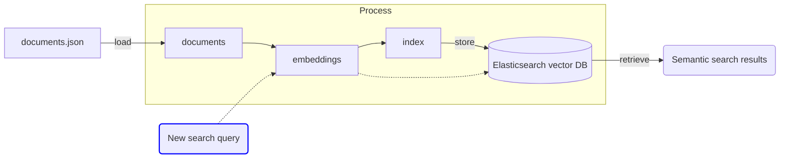

# LLM Zoomcamp - Week 3 Notes <!-- omit from toc -->

In this section the focus is on the following:
- Applying Vector Databases as an alternative to Elasticsearch in the previous two models.
    - Important to note that Elasticsearch has the ability to operate as a Vector DB as an alternative to Lucene and will be covered as well
- Vector embeddings and their role in building RAG applications
- Evaluation methods for search / query retrieval performance

## Table of Contents <!-- omit from toc -->
- [3.1 Introduction to Vector Search](#31-introduction-to-vector-search)
- [3.2 How to do Vectorized Search with Elasticsearch](#32-how-to-do-vectorized-search-with-elasticsearch)
  - [3.2.1 Let's start with Semantic Search](#321-lets-start-with-semantic-search)
    - [Step 1 - Load our documents](#step-1---load-our-documents)
    - [Step 2 - Create embeddings using pre-trained models](#step-2---create-embeddings-using-pre-trained-models)
    - [Step 3 - Set up Elasticsearch connection](#step-3---set-up-elasticsearch-connection)
    - [Step 4 Create Elasticsearch mappings and index](#step-4-create-elasticsearch-mappings-and-index)
    - [Step 5 Add documents to the index](#step-5-add-documents-to-the-index)
    - [Step 6 Create the user query](#step-6-create-the-user-query)
    - [Step 7 Perform a semantic search using Elasticsearch VectorDB](#step-7-perform-a-semantic-search-using-elasticsearch-vectordb)
  - [3.2.2 Now let's try Advanced Semantic Search](#322-now-lets-try-advanced-semantic-search)
- [3.3 Evaluation](#33-evaluation)
  - [3.3.1 Evaluation metrics for retrieval](#331-evaluation-metrics-for-retrieval)
  - [3.3.2 Ground truth generation for retrieval evaluation](#332-ground-truth-generation-for-retrieval-evaluation)
  - [3.3.3 Evaluation of text retrieval techniques for RAG](#333-evaluation-of-text-retrieval-techniques-for-rag)
  - [3.3.4 Evaluation vector retrieval](#334-evaluation-vector-retrieval)
  
## 3.1 Introduction to Vector Search
- Vector search has been around for a while and is getting popular again largely because LLMs lack long-term memory and have limited context windows
    - Vector DBs are an economical and effective way to store data for use with LLMs
- Elastic.co does a good job of explaining what vector embeddings are [here](https://www.elastic.co/what-is/vector-embedding)
    - Here's their definition:
    - ```Vector embeddings are a way to convert words and sentences and other data into numbers that capture their meaning and relationships. They represent different data types as points in a multidimensional space, where similar data points are clustered closer together. These numerical representations help machines understand and process this data more effectively.```
- Vector databases are databases that index and store vector embeddings
    - Which means you can easily store them, reference them, compare different vectors semantically (using various distance measures, etc.)
- Here's what it would look like when put together with an LLM:


## 3.2 How to do Vectorized Search with Elasticsearch
- Let's start with the architecture of the Semantic Search system we're going to build:


- The way this system works is as follows:
    - our `documents.json` file is converted into an Elasticsearch `documents` object which is then vectorized into `embeddings`
    - Those vector embeddings are the things we convert into another Elasticsearch concept called an `index`
        - We already used indexes in the previous sections
    - The `embeddings` and the `index` are what are stored in our vector database
    - And when a user passes a query, that query is first vectorized into an embedding and compared against the existing embeddings in order to produce a search result

- Let's implement this thing!

### 3.2.1 Let's start with Semantic Search

#### Step 1 - Load our documents


```python
import requests

docs_url = 'https://github.com/DataTalksClub/llm-zoomcamp/blob/main/01-intro/documents.json?raw=1'
docs_response = requests.get(docs_url)
documents_raw = docs_response.json()

documents = []

for course in documents_raw:
    course_name = course['course']

    for doc in course['documents']:
        doc['course'] = course_name
        documents.append(doc)

# write documents to a json file
import json
with open('documents.json', 'w') as f:
    json.dump(documents, f, indent=2)

```

`documents_raw` is a list having the course and the data corresponding to that course 

#### Step 2 - Create embeddings using pre-trained models
- We're going to use the `sentence_transformers` library to access pre-trained embedding models
    - You can learn more about that here: https://sbert.net/
- Before going into the rest of the tutorial, I asked ChatGPT to explain what this library does in simple terms. It's basically a library with various sentence embedding models you can use to create sentence embeddings with transformer-based models
- Here's an example of how it's used when wanting to compare sentence similarity:


```python
from sentence_transformers import SentenceTransformer, util

# Load a pre-trained model
model = SentenceTransformer('all-mpnet-base-v2')

# Encode sentences to get embeddings
sentences = ["How are you?", "What is your name?", "Hello! How do you do?"]
embeddings = model.encode(sentences)

# Compute similarity between the first sentence and the others
similarities = util.pytorch_cos_sim(embeddings[0], embeddings[1:])

print(similarities)

```

    tensor([[0.3600, 0.6323]])


- This is computing cosine similarity betwen the first word `embeddings[0]` and the other 2 words `embeddings[1:]`
    - It's telling us the 3rd sentence is almost 2x more similar to the first sentence than the second
- Intuitively, this makes sense!
- Ok, let's forge ahead and see how we apply this to our FAQ document
    - Let's create embeddings out of the `'text'` field in the documents list


```python
documents_embedding = []

for doc in documents:
    doc['text_embedding'] = model.encode(doc['text']).tolist()
    documents_embedding.append(doc)

documents_embedding[0]
```


    {'text': "The purpose of this document is to capture frequently asked technical questions\nThe exact day and hour of the course will be 15th Jan 2024 at 17h00. The course will start with the first  “Office Hours'' live.1\nSubscribe to course public Google Calendar (it works from Desktop only).\nRegister before the course starts using this link.\nJoin the course Telegram channel with announcements.\nDon’t forget to register in DataTalks.Club's Slack and join the channel.",
     'section': 'General course-related questions',
     'question': 'Course - When will the course start?',
     'course': 'data-engineering-zoomcamp',
     'text_embedding': [-0.03570355847477913,
      -0.06891412287950516,
      -0.044483352452516556,
      0.0062501393258571625,
      -0.042247142642736435,
      -0.006454026326537132,
      0.02754812128841877,
      -0.018610356375575066,
      -0.052037592977285385,
      -0.0024046804755926132,
      0.057454537600278854,
      -0.015592586249113083,
      0.015488773584365845,
      0.09870164841413498,
      0.015649642795324326,
      -0.06126251816749573,
      0.04107651114463806,
      0.02171727456152439,
      -0.09465396404266357,
      0.0032482503447681665,
      0.004476544912904501,
      -0.00765905762091279,
      -0.05192878097295761,
      -0.00733577786013484,
      0.013766376301646233,
      -0.02536006085574627,
      -0.009448722936213017,
      -0.0006134374416433275,
      0.0013490780256688595,
      0.003572787856683135,
      0.046750135719776154,
      0.031674738973379135,
      0.01830063946545124,
      0.03280366212129593,
      2.2712199552188395e-06,
      -0.040923893451690674,
      -0.05484960973262787,
      0.060452647507190704,
      -0.06583882868289948,
      0.10414968430995941,
      -0.018308093771338463,
      0.0365937165915966,
      0.0035047598648816347,
      0.03438081964850426,
      -0.009004827588796616,
      0.044905394315719604,
      -0.004431077279150486,
      -0.01674080081284046,
      0.041833579540252686,
      0.040366072207689285,
      -0.008579114452004433,
      0.01425823662430048,
      -0.04291043430566788,
      -0.0008289453107863665,
      -0.00858971755951643,
      -0.051431164145469666,
      -0.02147863060235977,
      0.03048926778137684,
      0.040753673762083054,
      0.04439159855246544,
      -0.012325071729719639,
      -0.013521295040845871,
      -0.020070599392056465,
      -0.007066761143505573,
      0.06169421970844269,
      0.04866284132003784,
      -0.03241453692317009,
      0.04746868461370468,
      -0.03913342207670212,
      -0.012922549620270729,
      0.13613362610340118,
      -0.019954631105065346,
      0.019223887473344803,
      0.033115312457084656,
      -0.028972871601581573,
      -0.025618990883231163,
      -0.01954161375761032,
      -0.057289306074380875,
      -0.0317559689283371,
      0.023747067898511887,
      -0.026486622169613838,
      0.0005027022561989725,
      -0.039672523736953735,
      0.0044318148866295815,
      0.06732939928770065,
      0.06481926888227463,
      0.00016537275223527104,
      0.0016485812375321984,
      0.012411649338901043,
      -0.01881866343319416,
      0.047563545405864716,
      -0.004610348492860794,
      0.017463959753513336,
      0.04083332046866417,
      -0.00045038587995804846,
      -0.04472321271896362,
      0.013693747110664845,
      0.04450003057718277,
      0.021642478182911873,
      -0.028507733717560768,
      -0.014562364667654037,
      -0.003969247918576002,
      0.07588788121938705,
      0.0464458242058754,
      0.01100881863385439,
      0.01129972841590643,
      -0.031406220048666,
      -0.007918033748865128,
      -0.017799096181988716,
      0.04584133252501488,
      -0.01172488834708929,
      0.007408771198242903,
      -0.015789827331900597,
      0.032580506056547165,
      0.011755464598536491,
      0.02318803407251835,
      -0.001956273801624775,
      0.007297836244106293,
      -0.006346086505800486,
      0.019955739378929138,
      0.045843519270420074,
      -0.012632830068469048,
      -0.01036592572927475,
      -0.030491245910525322,
      -0.06264270842075348,
      0.0015064754988998175,
      -0.005355647299438715,
      -0.011035271920263767,
      0.003442969871684909,
      -0.0254698283970356,
      -0.03389197587966919,
      -0.026435181498527527,
      -0.0008822939707897604,
      -0.0028838359285146,
      -0.013822994194924831,
      0.04014681652188301,
      -0.04120602458715439,
      0.04643746837973595,
      -0.036299169063568115,
      -0.021803468465805054,
      0.04071292281150818,
      -0.005953120533376932,
      -0.008099389262497425,
      0.007590505760163069,
      -0.017324864864349365,
      -0.03574071452021599,
      -0.02562858536839485,
      0.0979931578040123,
      -0.016164179891347885,
      0.01055184192955494,
      0.012563321739435196,
      0.04254316911101341,
      -0.05220148712396622,
      0.011930830776691437,
      0.05376163497567177,
      0.019651807844638824,
      0.011321347206830978,
      0.0002891390467993915,
      -0.026045043021440506,
      -0.02152514085173607,
      -0.0042561013251543045,
      -0.03637959435582161,
      0.032920096069574356,
      0.01954568363726139,
      0.008819697424769402,
      -0.011037252843379974,
      -0.015590650029480457,
      0.01274928916245699,
      0.011405348777770996,
      -0.02629820443689823,
      -0.049422137439250946,
      0.024165455251932144,
      -0.0008384071988984942,
      0.03720332682132721,
      -0.003810910042375326,
      -0.05668574199080467,
      0.026180200278759003,
      -0.0115136643871665,
      -0.007842971943318844,
      0.05726991966366768,
      0.0021789593156427145,
      -0.07969391345977783,
      -0.01063038595020771,
      0.03241248056292534,
      -0.042896632105112076,
      0.015569471754133701,
      0.008742461912333965,
      0.031401973217725754,
      -0.025820085778832436,
      -0.021699877455830574,
      -0.04233887791633606,
      0.02184426784515381,
      -0.01578153483569622,
      0.037040963768959045,
      0.01289969589561224,
      0.017236661165952682,
      -0.02467152290046215,
      0.0525905080139637,
      0.033487468957901,
      -0.027480073273181915,
      -0.04399547353386879,
      -0.05372260510921478,
      0.01287069357931614,
      -0.015324189327657223,
      0.03372133895754814,
      -0.033334460109472275,
      -0.08258944004774094,
      -0.035683322697877884,
      0.024025851860642433,
      0.02445284090936184,
      0.09823132306337357,
      0.009678325615823269,
      -0.008267246186733246,
      -0.02866535261273384,
      -0.007044163998216391,
      0.01248087827116251,
      -0.006459895521402359,
      0.012319556437432766,
      -0.029936309903860092,
      0.0320858433842659,
      -0.03808188810944557,
      0.04985044151544571,
      -0.0891076996922493,
      -0.01957271434366703,
      0.04299863055348396,
      -0.015248472802340984,
      -0.010823255404829979,
      0.06211378052830696,
      -0.046116266399621964,
      0.05916633829474449,
      0.004631536081433296,
      -0.028969822451472282,
      0.023580322042107582,
      -0.019979337230324745,
      0.03215726464986801,
      -0.024238288402557373,
      0.012571927160024643,
      0.04712355509400368,
      0.07921471446752548,
      -0.04386748746037483,
      -0.02912602387368679,
      0.0032849907875061035,
      -0.02354339323937893,
      -0.02247876487672329,
      0.041405558586120605,
      -0.023993704468011856,
      -0.018947342410683632,
      -0.01967930607497692,
      -0.02534681186079979,
      0.00830440130084753,
      0.011795404367148876,
      0.007304895669221878,
      -0.010010343044996262,
      0.045602135360240936,
      0.03625515103340149,
      0.010817786678671837,
      -0.0036140515003353357,
      0.05882913991808891,
      -0.043241869658231735,
      -0.0049366457387804985,
      0.04691645875573158,
      -0.07418803870677948,
      -0.020891211926937103,
      -0.009605894796550274,
      0.030490662902593613,
      -0.002377977827563882,
      0.08378124982118607,
      0.013812561519443989,
      -0.017655527219176292,
      0.0332309827208519,
      0.04766730219125748,
      0.05171167850494385,
      -0.03904860094189644,
      0.003959652502089739,
      -0.01736200787127018,
      -0.038692545145750046,
      0.01407456025481224,
      -0.004467864986509085,
      -0.10962073504924774,
      0.04609554633498192,
      -0.0035110258031636477,
      -0.0438363179564476,
      0.014936073683202267,
      0.005344913806766272,
      0.000363917468348518,
      0.008625810034573078,
      0.043066009879112244,
      -0.05693932995200157,
      -0.043384112417697906,
      0.035930272191762924,
      0.02045276388525963,
      -0.016468746587634087,
      0.022879062220454216,
      -0.021613797172904015,
      -0.0737733393907547,
      -0.012006801553070545,
      -0.0020902431569993496,
      0.07330900430679321,
      0.011786269024014473,
      0.044496241956949234,
      -0.025973835960030556,
      0.0507001094520092,
      -0.01828954927623272,
      0.019180074334144592,
      -0.008144008927047253,
      0.029938988387584686,
      0.016040844842791557,
      -0.01241729874163866,
      -0.04342096298933029,
      -0.002091798232868314,
      -0.06678426265716553,
      0.01552053727209568,
      0.03193896636366844,
      -0.010612756945192814,
      -0.016193173825740814,
      0.022836551070213318,
      -0.012567798607051373,
      0.047443412244319916,
      -0.03238235414028168,
      0.05147313326597214,
      0.007528411224484444,
      -0.014673957601189613,
      0.023375246673822403,
      -0.025067158043384552,
      -0.026619521901011467,
      -0.08299335837364197,
      -0.0930776298046112,
      -0.016167903319001198,
      0.006870810873806477,
      -0.06108640506863594,
      0.04320525377988815,
      0.02274470403790474,
      -0.05321309715509415,
      -0.026104819029569626,
      -0.03232186287641525,
      -0.02046632394194603,
      -0.025705914944410324,
      -0.07189735770225525,
      0.016136569902300835,
      0.0018306655110791326,
      -0.05124654620885849,
      0.017527440562844276,
      -0.0034118436742573977,
      0.05079178512096405,
      0.020580731332302094,
      -0.002767820144072175,
      -0.030148133635520935,
      0.0026528569869697094,
      0.011982033029198647,
      -0.006923304405063391,
      0.01633593812584877,
      0.0046558743342757225,
      -0.05733904242515564,
      -0.017982039600610733,
      0.005941750481724739,
      0.04060802236199379,
      -0.015225273557007313,
      0.025196347385644913,
      -0.038118161261081696,
      0.04556652903556824,
      0.013319640420377254,
      -0.0005947211175225675,
      -0.005097121931612492,
      0.0057114302180707455,
      -0.012777070514857769,
      0.0025279505643993616,
      0.028775664046406746,
      -0.02555818110704422,
      0.043691352009773254,
      0.027935564517974854,
      -0.029291855171322823,
      0.018506428226828575,
      -0.050020117312669754,
      0.0019224106799811125,
      0.014415555633604527,
      -0.006224849261343479,
      -0.00460438709706068,
      0.012116722762584686,
      -0.004539163783192635,
      0.017040468752384186,
      0.04041892662644386,
      -0.04216603934764862,
      0.0915738195180893,
      0.029489723965525627,
      0.09274889528751373,
      -0.06378591805696487,
      -0.0010773284593597054,
      -0.0229503121227026,
      0.0027610831893980503,
      0.030170269310474396,
      0.003850143402814865,
      -0.03599106892943382,
      -0.05439826846122742,
      0.022288843989372253,
      -0.041423387825489044,
      -0.01199144683778286,
      0.01941654272377491,
      0.00345318834297359,
      0.01806015335023403,
      0.014212535694241524,
      0.08533839136362076,
      -0.06710377335548401,
      -0.013068147003650665,
      0.03215502202510834,
      -0.010530446656048298,
      0.02036459557712078,
      0.07244909554719925,
      0.028010791167616844,
      -0.04857883229851723,
      -0.06059574335813522,
      0.02773144282400608,
      0.027668636292219162,
      -0.0062785702757537365,
      -0.07663335651159286,
      -0.016406454145908356,
      0.001988752745091915,
      0.0005374332540668547,
      0.02050795964896679,
      0.09072154760360718,
      -0.0013974488247185946,
      0.04074319452047348,
      0.04290252923965454,
      0.05638573691248894,
      -0.021741226315498352,
      0.0260319784283638,
      -0.022878961637616158,
      0.02996078133583069,
      0.03423713892698288,
      -0.01649636961519718,
      -0.017685627564787865,
      0.014501452445983887,
      -0.018361113965511322,
      -0.024286584928631783,
      0.05129150301218033,
      -0.03868134319782257,
      0.0029752126429229975,
      -0.028656980022788048,
      0.04573856294155121,
      -0.03480978682637215,
      0.01830768585205078,
      -0.0026097025256603956,
      0.01090408954769373,
      0.08691837638616562,
      -0.0032851635478436947,
      -0.02297576703131199,
      0.023459142073988914,
      0.061844393610954285,
      -0.06221677362918854,
      -0.046179015189409256,
      -0.02573249489068985,
      0.050674788653850555,
      -0.08671675622463226,
      0.014549686573445797,
      -0.013476542197167873,
      -0.016695594415068626,
      -0.06551452726125717,
      -0.05522563308477402,
      -0.022909270599484444,
      -0.04475897178053856,
      0.03921162709593773,
      0.056073691695928574,
      0.05006128549575806,
      -0.017225036397576332,
      0.020288599655032158,
      0.08056609332561493,
      -0.04967014119029045,
      0.014707963913679123,
      -0.03747479245066643,
      -0.017933577299118042,
      -0.029651537537574768,
      0.019183671101927757,
      -0.013628172688186169,
      -0.01312121283262968,
      0.006325979251414537,
      0.00047470704885199666,
      -0.007091264706104994,
      -0.04439233988523483,
      0.03843819722533226,
      0.011651871725916862,
      0.009595477022230625,
      0.06725585460662842,
      0.020184557884931564,
      0.0428168848156929,
      -0.02510898746550083,
      0.03342107683420181,
      0.042251043021678925,
      0.04143117740750313,
      -0.001152589451521635,
      -0.00697624497115612,
      -0.024690119549632072,
      -0.010284093208611012,
      -0.00938122346997261,
      0.010199467651546001,
      -0.010524568147957325,
      0.04697320610284805,
      -0.0036127972416579723,
      -0.0002756160101853311,
      -0.022547738626599312,
      0.016097739338874817,
      0.01598021388053894,
      -0.037876442074775696,
      -0.007319939788430929,
      0.025225026533007622,
      -0.01961737871170044,
      -0.03709045425057411,
      -0.018917379900813103,
      -0.05299784243106842,
      0.0379960797727108,
      -0.01690162718296051,
      0.045291513204574585,
      -0.05304273962974548,
      0.0034387896303087473,
      -0.025999225676059723,
      -0.029440484941005707,
      0.02056572586297989,
      0.015456169843673706,
      -0.007428403943777084,
      0.050172578543424606,
      -0.0438615120947361,
      -0.026278004050254822,
      0.04261014237999916,
      0.0017998976400122046,
      0.05654967203736305,
      -0.06821384280920029,
      0.019974971190094948,
      -0.0066602518782019615,
      0.011786646209657192,
      -0.0043419948779046535,
      0.03468403220176697,
      0.04580388590693474,
      0.002969964174553752,
      -0.05566493049263954,
      0.022846747189760208,
      -0.0022307124454528093,
      -0.0038578894454985857,
      0.04347711801528931,
      0.01856510527431965,
      0.022350503131747246,
      0.008432501927018166,
      0.0004781374300364405,
      -0.000639457895886153,
      -0.016027530655264854,
      0.04646898806095123,
      0.01071582268923521,
      0.02026153914630413,
      -0.0391775444149971,
      0.07468660920858383,
      -0.009102796204388142,
      0.017102843150496483,
      0.009239490143954754,
      0.021527230739593506,
      0.030133051797747612,
      -0.0005732238641940057,
      0.04799291491508484,
      0.002354249358177185,
      -6.669125322404e-33,
      -0.02776162512600422,
      -0.011437445878982544,
      -0.02379010245203972,
      0.07755991071462631,
      -0.03838706761598587,
      0.003722355468198657,
      0.039208389818668365,
      -0.004138322081416845,
      -0.046741336584091187,
      -0.06526819616556168,
      -0.025901567190885544,
      0.020166855305433273,
      0.034861255437135696,
      0.05535876378417015,
      -0.00930858589708805,
      -0.018934158608317375,
      0.011226547881960869,
      0.021392758935689926,
      0.007518897298723459,
      0.0017264665802940726,
      -0.04366544634103775,
      0.03661501035094261,
      0.031864751130342484,
      0.009257448837161064,
      -0.011130597442388535,
      -0.009033563546836376,
      -0.016387898474931717,
      -0.016086803749203682,
      -0.025922250002622604,
      -0.03432733193039894,
      0.012562225572764874,
      -0.0027771354652941227,
      -0.018025673925876617,
      -0.015290768817067146,
      0.01297894585877657,
      0.010485074482858181,
      -0.09403695911169052,
      -0.025393296033143997,
      -0.07192352414131165,
      0.03785913437604904,
      0.0006912197568453848,
      -0.041800856590270996,
      0.024589693173766136,
      -0.03218337148427963,
      -0.06971006095409393,
      -0.025870781391859055,
      -0.006107314024120569,
      0.06396312266588211,
      -0.023242957890033722,
      0.029915057122707367,
      -0.035685766488313675,
      -0.025951946154236794,
      -0.059629887342453,
      0.049571238458156586,
      0.012544794008135796,
      0.0011647812789306045,
      0.002853090176358819,
      -0.0726393535733223,
      -0.03398216515779495,
      0.041041385382413864,
      0.035340145230293274,
      -0.0014340425841510296,
      0.04698103666305542,
      -0.04911309480667114,
      0.0048082927241921425,
      -0.028787769377231598,
      -0.04020581766963005,
      0.0340643934905529,
      0.05006244778633118,
      0.004526900593191385,
      -0.04888178035616875,
      0.07393600046634674,
      -0.03976337984204292,
      -0.0671442523598671,
      0.019262807443737984,
      -0.054270751774311066,
      -0.04287363588809967,
      0.015150393359363079,
      0.07324287295341492,
      0.03887028619647026,
      -0.026770778000354767,
      -0.042351286858320236,
      -0.01650295965373516,
      -0.032063912600278854,
      0.04834777116775513,
      0.024371590465307236,
      0.006155537907034159,
      -0.014747540466487408,
      -0.0033652212005108595,
      -0.017326034605503082,
      0.0021510771475732327,
      0.05014312267303467,
      -0.04567454010248184,
      -0.0047120628878474236,
      0.054522208869457245,
      -0.0056192949414253235,
      0.052002448588609695,
      -0.017812112346291542,
      -0.0038288249634206295,
      0.019900795072317123,
      -0.04634324833750725,
      -0.03960710018873215,
      -0.05374475196003914,
      0.013533770106732845,
      0.037158042192459106,
      0.011771118268370628,
      -0.05636263266205788,
      0.02198752760887146,
      -0.02596944570541382,
      0.015303067862987518,
      0.026266254484653473,
      -0.024728313088417053,
      0.011960094794631004,
      -0.0025528359692543745,
      0.013147816993296146,
      0.023525025695562363,
      0.00540921650826931,
      0.032842982560396194,
      -0.03745207190513611,
      -0.0322340689599514,
      0.009349838830530643,
      0.0018672071164473891,
      -0.03069288469851017,
      0.04909645766019821,
      -0.0229179784655571,
      -0.021522874012589455,
      -0.027377424761652946,
      -0.059852756559848785,
      -0.010745042003691196,
      -0.0026879364158958197,
      -0.02607761137187481,
      0.0059889634139835835,
      2.989152108057169e-07,
      -0.017357084900140762,
      0.05204235762357712,
      0.010894770734012127,
      0.0718187615275383,
      -0.0035477292258292437,
      -0.06723110377788544,
      -0.042778804898262024,
      0.028780629858374596,
      0.010034812614321709,
      0.049914464354515076,
      0.0014659843873232603,
      -0.06393126398324966,
      0.017589841037988663,
      -0.031978607177734375,
      -0.018320273607969284,
      -0.12946151196956635,
      -0.012786372564733028,
      0.03877765312790871,
      -0.0261592585593462,
      -0.0032542243134230375,
      0.05587396398186684,
      0.03684099391102791,
      0.015002548694610596,
      0.007876263000071049,
      0.001364944502711296,
      -0.05735653638839722,
      0.02619590237736702,
      0.014979313127696514,
      0.0533815436065197,
      0.018932390958070755,
      0.018473146483302116,
      0.016741827130317688,
      -0.005128342658281326,
      0.048677824437618256,
      0.0007265694439411163,
      -0.002668551867827773,
      0.028365107253193855,
      0.020629379898309708,
      0.04678468033671379,
      -0.0030444939620792866,
      -0.04956277459859848,
      -0.027629006654024124,
      -0.02061142772436142,
      -0.0035905600525438786,
      0.05782283842563629,
      -0.012550774961709976,
      -0.07465916872024536,
      0.012133541516959667,
      -0.06597527116537094,
      -0.04186369478702545,
      -0.008240267634391785,
      0.03289835900068283,
      0.058451417833566666,
      -0.043439995497465134,
      -0.003960366826504469,
      -0.040477581322193146,
      -0.02558075450360775,
      0.039681319147348404,
      0.04254946485161781,
      0.01962818019092083,
      0.004698580596596003,
      -0.087740957736969,
      0.00829249992966652,
      0.024664996191859245,
      0.07733553647994995,
      -0.01745411939918995,
      -0.021829206496477127,
      3.2785763448307308e-34,
      -0.023155128583312035,
      -0.023059329017996788,
      0.010065172798931599,
      0.0814749151468277,
      -0.0421689935028553,
      -0.019860634580254555,
      0.06590517610311508,
      -0.028543761000037193,
      -0.023729316890239716,
      -0.06122387573122978,
      -0.03779273107647896]}


#### Step 3 - Set up Elasticsearch connection


```python
from elasticsearch import Elasticsearch

es_client = Elasticsearch('http://192.168.50.49:9200')

es_client.info()
```


    ObjectApiResponse({'name': 'b3a351c3296c', 'cluster_name': 'docker-cluster', 'cluster_uuid': 'OJZEGlS9RR6yoR11cShgug', 'version': {'number': '8.4.3', 'build_flavor': 'default', 'build_type': 'docker', 'build_hash': '42f05b9372a9a4a470db3b52817899b99a76ee73', 'build_date': '2022-10-04T07:17:24.662462378Z', 'build_snapshot': False, 'lucene_version': '9.3.0', 'minimum_wire_compatibility_version': '7.17.0', 'minimum_index_compatibility_version': '7.0.0'}, 'tagline': 'You Know, for Search'})


#### Step 4 Create Elasticsearch mappings and index
- The mapping is some metadata telling Elasticsearch how the fields and content in the documents should be typed
    - Each document in the is a collection of fields, each having a different data type
    - And we've now added a new one, which is the embedding of the `text` field
- This is similar to setting a database schema
- We are just going to take the `index_settings` from week 1 and add the embedding
- When adding the new embeddings field to the `properties` section, we are specifying a type `dense_vector` in addition to some other parameters:
    - A `dense vector` is a type of vector used to represent data in high-dimensional space and each element of the is stored and non-zero (contrast to a sparse vector)
    - The `dims` are just the dimension of the vector which can be found by finding the length of the encoding `len(encoded_field)`
        - Different models you choose will create vectors of the varying dimensions, but the same model will create vectors of the same length
    - Specifying `index:True` just lets us efficiently store and query it
    - And lastly setting `similarities` to `cosine` will just allow us to efficiently calculate cosine similarity between different fields efficiently


```python
len(documents_embedding[4]['text_embedding'])
```


    768


```python
index_settings = {
    "settings": {
        "number_of_shards": 1,
        "number_of_replicas": 0
    },
    "mappings": {
        "properties": {
            "text": {"type": "text"},
            "section": {"type": "text"},
            "question": {"type": "text"},
            "course": {"type": "keyword"},
            "text_embedding": {"type": "dense_vector", "dims": 768, "index": True, "similarity": "cosine"}
        }
    }
}

index_name = "course-questions"

if es_client.indices.exists(index=index_name):
    es_client.indices.delete(index=index_name)
    print(f"Index {index_name} deleted.")
else:
    print(f"Index {index_name} does not exist.")
    es_client.indices.create(index=index_name, body=index_settings)
```

    Index course-questions does not exist.


#### Step 5 Add documents to the index
- I'm just pulling the same code from the previous weeks to do this


```python
from tqdm.auto import tqdm

## Index the documents
for doc in tqdm(documents_embedding):
    try:
        es_client.index(index=index_name, document=doc)
    except Exception as e:
        print(e)
```

    100%|██████████| 948/948 [00:11<00:00, 84.76it/s]


#### Step 6 Create the user query
- Main thing to note here is the question we're asking isn't enough. We must also:
    - Convert the text question into an embedding: `model.encode`
    - Specify how many of the k-nearest neighbours to return back once we do a similarity calc: `k` parameter
    - Specify the total documents to consider: `num_candidates` parameter


```python
question = "windows or mac?"
vector_question = model.encode(question)

query = {
    "field": "text_embedding",
    "query_vector": vector_question,
    "k": 5,
    "num_candidates": 10000,
}
```

#### Step 7 Perform a semantic search using Elasticsearch VectorDB


```python
res= es_client.search(index=index_name, knn=query, source=["text", "section", "question", "course"])
res["hits"]["hits"]
```


    [{'_index': 'course-questions',
      '_id': 'Vn0ytJABBRmP4y361Shn',
      '_score': 0.71479183,
      '_source': {'question': 'Environment - Is the course [Windows/mac/Linux/...] friendly?',
       'course': 'data-engineering-zoomcamp',
       'section': 'General course-related questions',
       'text': 'Yes! Linux is ideal but technically it should not matter. Students last year used all 3 OSes successfully'}},
     {'_index': 'course-questions',
      '_id': 'aX0ytJABBRmP4y36-SuG',
      '_score': 0.61347365,
      '_source': {'question': 'WSL instructions',
       'course': 'mlops-zoomcamp',
       'section': 'Module 1: Introduction',
       'text': 'If you wish to use WSL on your windows machine, here are the setup instructions:\nCommand: Sudo apt install wget\nGet Anaconda download address here. wget <download address>\nTurn on Docker Desktop WFree Download | AnacondaSL2\nCommand: git clone <github repository address>\nVSCODE on WSL\nJupyter: pip3 install jupyter\nAdded by Gregory Morris (gwm1980@gmail.com)\nAll in all softwares at one shop:\nYou can use anaconda which has all built in services like pycharm, jupyter\nAdded by Khaja Zaffer (khajazaffer@aln.iseg.ulisboa.pt)\nFor windows “wsl --install” in Powershell\nAdded by Vadim Surin (vdmsurin@gmai.com)'}},
     {'_index': 'course-questions',
      '_id': 'Kn0ytJABBRmP4y366iqy',
      '_score': 0.60555583,
      '_source': {'question': "The answer I get for one of the homework questions doesn't match any of the options. What should I do?",
       'course': 'machine-learning-zoomcamp',
       'section': '2. Machine Learning for Regression',
       'text': 'That’s normal. We all have different environments: our computers have different versions of OS and different versions of libraries — even different versions of Python.\nIf it’s the case, just select the option that’s closest to your answer'}},
     {'_index': 'course-questions',
      '_id': 'g30ytJABBRmP4y367iqy',
      '_score': 0.6028962,
      '_source': {'question': 'How to install WSL on Windows 10 and 11 ?',
       'course': 'machine-learning-zoomcamp',
       'section': '5. Deploying Machine Learning Models',
       'text': 'It is quite simple, and you can follow these instructions here:\nhttps://www.youtube.com/watch?v=qYlgUDKKK5A&ab_channel=NeuralNine\nMake sure that you have “Virtual Machine Platform” feature activated in your Windows “Features”. To do that, search “features” in the research bar and see if the checkbox is selected. You also need to make sure that your system (in the bios) is able to virtualize. This is usually the case.\nIn the Microsoft Store: look for ‘Ubuntu’ or ‘Debian’ (or any linux distribution you want) and install it\nOnce it is downloaded, open the app and choose a username and a password (secured one). When you type your password, nothing will show in the window, which is normal: the writing is invisible.\nYou are now inside of your linux system. You can test some commands such as “pwd”. You are not in your Windows system.\nTo go to your windows system: you need to go back two times with cd ../.. And then go to the “mnt” directory with cd mnt. If you list here your files, you will see your disks. You can move to the desired folder, for example here I moved to the ML_Zoomcamp folder:\nPython should be already installed but you can check it by running sudo apt install python3 command.\nYou can make your actual folder your default folder when you open your Ubuntu terminal with this command : echo "cd ../../mnt/your/folder/path" >> ~/.bashrc\nYou can disable bell sounds (when you type something that does not exist for example) by modifying the inputrc file with this command: sudo vim /etc/inputrc\nYou have to uncomment the set bell-style none line -> to do that, press the “i” keyboard letter (for insert) and go with your keyboard to this line. Delete the # and then press the Escape keyboard touch and finally press “:wq” to write (it saves your modifications) then quit.\nYou can check that your modifications are taken into account by opening a new terminal (you can pin it to your task bar so you do not have to go to the Microsoft app each time).\nYou will need to install pip by running this command sudo apt install python3-pip\nNB: I had this error message when trying to install pipenv (https://github.com/microsoft/WSL/issues/5663):\n/sbin/ldconfig.real: Can\'t link /usr/lib/wsl/lib/libnvoptix_loader.so.1 to libnvoptix.so.1\n/sbin/ldconfig.real: /usr/lib/wsl/lib/libcuda.so.1 is not a symbolic link\nSo I had to create the following symbolic link:\nsudo ln -s /usr/lib/wsl/lib/libcuda.so.1 /usr/lib64/libcuda.so\n(Mélanie Fouesnard)'}},
     {'_index': 'course-questions',
      '_id': 'R30ytJABBRmP4y361Cik',
      '_score': 0.5985867,
      '_source': {'question': 'Environment - Should I use my local machine, GCP, or GitHub Codespaces for my environment?',
       'course': 'data-engineering-zoomcamp',
       'section': 'General course-related questions',
       'text': 'You can set it up on your laptop or PC if you prefer to work locally from your laptop or PC.\nYou might face some challenges, especially for Windows users. If you face cnd2\nIf you prefer to work on the local machine, you may start with the week 1 Introduction to Docker and follow through.\nHowever, if you prefer to set up a virtual machine, you may start with these first:\nUsing GitHub Codespaces\nSetting up the environment on a cloudV Mcodespace\nI decided to work on a virtual machine because I have different laptops & PCs for my home & office, so I can work on this boot camp virtually anywhere.'}}]


### 3.2.2 Now let's try Advanced Semantic Search
- In order to do a more advanced semantic search using Elasticsearch, we can take the query from the user, encode it and then pass a few other parameters that we saw in the previous sessions
    - The way we do this is by passing the original encoded query to the `knn` parameter
    - And, passing the filter to the `query` parameter
- When doing advanced semantic search this way, the scoring mechanism isn't normalized to [0:1]. You can get scores greater than 1
    - To find out how that score is calculated, you can pass the Elasticsearch `search` method a parameter `explain = True`


```python
question = "windows or mac?"
vector_question = model.encode(question)

# Pass the embedded version of the question to the Elasticsearch search function
knn_query = {
    "field": "text_embedding",
    "query_vector": vector_question,
    "k": 5,
    "num_candidates": 10000,
}

## Add a filter to the search
query = {"match": 
         {"course": "data-engineering-zoomcamp"}
         }

res = es_client.search(index=index_name, 
                       query = query,
                       knn=knn_query, 
                       source=["text", "section", "question", "course"],
                       size=3,
                       explain=True)

res["hits"]["hits"]
```


    [{'_shard': '[course-questions][0]',
      '_node': 'lxwBTO3-R-e0G28Pi0OWpQ',
      '_index': 'course-questions',
      '_id': 'Vn0ytJABBRmP4y361Shn',
      '_score': 1.4937057,
      '_source': {'question': 'Environment - Is the course [Windows/mac/Linux/...] friendly?',
       'course': 'data-engineering-zoomcamp',
       'section': 'General course-related questions',
       'text': 'Yes! Linux is ideal but technically it should not matter. Students last year used all 3 OSes successfully'},
      '_explanation': {'value': 1.4937057,
       'description': 'sum of:',
       'details': [{'value': 0.71479183,
         'description': 'within top k documents',
         'details': []},
        {'value': 0.778914,
         'description': 'weight(course:data-engineering-zoomcamp in 35) [PerFieldSimilarity], result of:',
         'details': [{'value': 0.778914,
           'description': 'score(freq=1.0), computed as boost * idf * tf from:',
           'details': [{'value': 2.2, 'description': 'boost', 'details': []},
            {'value': 0.778914,
             'description': 'idf, computed as log(1 + (N - n + 0.5) / (n + 0.5)) from:',
             'details': [{'value': 435,
               'description': 'n, number of documents containing term',
               'details': []},
              {'value': 948,
               'description': 'N, total number of documents with field',
               'details': []}]},
            {'value': 0.45454544,
             'description': 'tf, computed as freq / (freq + k1 * (1 - b + b * dl / avgdl)) from:',
             'details': [{'value': 1.0,
               'description': 'freq, occurrences of term within document',
               'details': []},
              {'value': 1.2,
               'description': 'k1, term saturation parameter',
               'details': []},
              {'value': 0.75,
               'description': 'b, length normalization parameter',
               'details': []},
              {'value': 1.0, 'description': 'dl, length of field', 'details': []},
              {'value': 1.0,
               'description': 'avgdl, average length of field',
               'details': []}]}]}]}]}},
     {'_shard': '[course-questions][0]',
      '_node': 'lxwBTO3-R-e0G28Pi0OWpQ',
      '_index': 'course-questions',
      '_id': 'R30ytJABBRmP4y361Cik',
      '_score': 1.3775007,
      '_source': {'question': 'Environment - Should I use my local machine, GCP, or GitHub Codespaces for my environment?',
       'course': 'data-engineering-zoomcamp',
       'section': 'General course-related questions',
       'text': 'You can set it up on your laptop or PC if you prefer to work locally from your laptop or PC.\nYou might face some challenges, especially for Windows users. If you face cnd2\nIf you prefer to work on the local machine, you may start with the week 1 Introduction to Docker and follow through.\nHowever, if you prefer to set up a virtual machine, you may start with these first:\nUsing GitHub Codespaces\nSetting up the environment on a cloudV Mcodespace\nI decided to work on a virtual machine because I have different laptops & PCs for my home & office, so I can work on this boot camp virtually anywhere.'},
      '_explanation': {'value': 1.3775007,
       'description': 'sum of:',
       'details': [{'value': 0.5985867,
         'description': 'within top k documents',
         'details': []},
        {'value': 0.778914,
         'description': 'weight(course:data-engineering-zoomcamp in 20) [PerFieldSimilarity], result of:',
         'details': [{'value': 0.778914,
           'description': 'score(freq=1.0), computed as boost * idf * tf from:',
           'details': [{'value': 2.2, 'description': 'boost', 'details': []},
            {'value': 0.778914,
             'description': 'idf, computed as log(1 + (N - n + 0.5) / (n + 0.5)) from:',
             'details': [{'value': 435,
               'description': 'n, number of documents containing term',
               'details': []},
              {'value': 948,
               'description': 'N, total number of documents with field',
               'details': []}]},
            {'value': 0.45454544,
             'description': 'tf, computed as freq / (freq + k1 * (1 - b + b * dl / avgdl)) from:',
             'details': [{'value': 1.0,
               'description': 'freq, occurrences of term within document',
               'details': []},
              {'value': 1.2,
               'description': 'k1, term saturation parameter',
               'details': []},
              {'value': 0.75,
               'description': 'b, length normalization parameter',
               'details': []},
              {'value': 1.0, 'description': 'dl, length of field', 'details': []},
              {'value': 1.0,
               'description': 'avgdl, average length of field',
               'details': []}]}]}]}]}},
     {'_shard': '[course-questions][0]',
      '_node': 'lxwBTO3-R-e0G28Pi0OWpQ',
      '_index': 'course-questions',
      '_id': 'M30ytJABBRmP4y360yh_',
      '_score': 0.778914,
      '_source': {'question': 'Course - When will the course start?',
       'course': 'data-engineering-zoomcamp',
       'section': 'General course-related questions',
       'text': "The purpose of this document is to capture frequently asked technical questions\nThe exact day and hour of the course will be 15th Jan 2024 at 17h00. The course will start with the first  “Office Hours'' live.1\nSubscribe to course public Google Calendar (it works from Desktop only).\nRegister before the course starts using this link.\nJoin the course Telegram channel with announcements.\nDon’t forget to register in DataTalks.Club's Slack and join the channel."},
      '_explanation': {'value': 0.778914,
       'description': 'sum of:',
       'details': [{'value': 0.778914,
         'description': 'weight(course:data-engineering-zoomcamp in 0) [PerFieldSimilarity], result of:',
         'details': [{'value': 0.778914,
           'description': 'score(freq=1.0), computed as boost * idf * tf from:',
           'details': [{'value': 2.2, 'description': 'boost', 'details': []},
            {'value': 0.778914,
             'description': 'idf, computed as log(1 + (N - n + 0.5) / (n + 0.5)) from:',
             'details': [{'value': 435,
               'description': 'n, number of documents containing term',
               'details': []},
              {'value': 948,
               'description': 'N, total number of documents with field',
               'details': []}]},
            {'value': 0.45454544,
             'description': 'tf, computed as freq / (freq + k1 * (1 - b + b * dl / avgdl)) from:',
             'details': [{'value': 1.0,
               'description': 'freq, occurrences of term within document',
               'details': []},
              {'value': 1.2,
               'description': 'k1, term saturation parameter',
               'details': []},
              {'value': 0.75,
               'description': 'b, length normalization parameter',
               'details': []},
              {'value': 1.0, 'description': 'dl, length of field', 'details': []},
              {'value': 1.0,
               'description': 'avgdl, average length of field',
               'details': []}]}]}]}]}}]


## 3.3 Evaluation
- Evaluating the quality of a particular RAG pipeline can be subjective
- There are many techniques you can employ to determine whether the responses you're getting are "good"
    - Often, these techniques require a "ground truth dataset"
- In the next series of exercises, we'll be exploring a few things:
    - Metrics to evaluate a RAG
    - How to create ground truth or gold standard data by which to run evaluations
        - For example, for a given query, you may have already labeled documents which are considered "correct"
        - You can run tests to ensure these documents are in the result set your RAG returns
        - You might even be able to use LLMs to generate these ground truth datasets
    - How to put them together to evaluate results based on ground truth and the metrics
- Let's go!

### 3.3.1 Evaluation metrics for retrieval
- If you think back to the different searches we've done, there are many parameters that can be tuned in order to generate different results.
- Take, for example, the `keyword search` we did with Elasticsearch, with the following search query:
```python
search_query = {
        "size": 5,
        "query": {
            "bool": {
                "must": {
                    "multi_match": {
                        "query": query,
                        "fields": ["question^3", "text", "section"],
                        "type": "best_fields"
                    }
                },
                "filter": {
                    "term": {
                        "course": "data-engineering-zoomcamp"
                    }
                }
            }
        }
    }
```

- Here you can see, we can change `field` weights, we can change the `type`, we can change the `filter`
- In the advanced vector search example, we had even more things:
```python
model = SentenceTransformer('all-mpnet-base-v2')

index_settings = {
    "settings": {
        "number_of_shards": 1,
        "number_of_replicas": 0
    },
    "mappings": {
        "properties": {
            "text": {"type": "text"},
            "section": {"type": "text"},
            "question": {"type": "text"},
            "course": {"type": "keyword"},
            "text_embedding": {"type": "dense_vector", "dims": 768, "index": True, "similarity": "cosine"}
        }
    }
}

question = "windows or mac?"
vector_question = model.encode(question)

knn_query = {
    "field": "text_embedding",
    "query_vector": vector_question,
    "k": 5,
    "num_candidates": 10000,
}

## Add a filter to the search
query = {"match": 
         {"course": "data-engineering-zoomcamp"}
         }
```

- We can change the `model` we used to encode the question, we can change the kin dof `similarity` in the index settings, etc.
- Here is a whole bunch of evaluation metrics from ChatGPT. We'll probably end up using only two of them: `Hit rate` and `MRR`:
    1. **Precision at k (P@k)**:
    - Measures the number of relevant documents in the top k results.
    - Formula: `P@k = (Number of relevant documents in top k results) / k`

    2. **Recall**:
    - Measures the number of relevant documents retrieved out of the total number of relevant documents available.
    - Formula: `Recall = (Number of relevant documents retrieved) / (Total number of relevant documents)`

    3. **Mean Average Precision (MAP)**:
    - Computes the average precision for each query and then averages these values over all queries.
    - Formula: `MAP = (1 / |Q|) * Σ (Average Precision(q))` for q in Q

    4. **Normalized Discounted Cumulative Gain (NDCG)**:
    - Measures the usefulness, or gain, of a document based on its position in the result list.
    - Formula: `NDCG = DCG / IDCG`
        - `DCG = Σ ((2^rel_i - 1) / log2(i + 1))` for i = 1 to p
        - `IDCG` is the ideal DCG, where documents are perfectly ranked by relevance.

    5. **Mean Reciprocal Rank (MRR)**:
    - Evaluates the rank position of the first relevant document.
    - Formula: `MRR = (1 / |Q|) * Σ (1 / rank_i)` for i = 1 to |Q|

    6. **F1 Score**:
    - Harmonic mean of precision and recall.
    - Formula: `F1 = 2 * (Precision * Recall) / (Precision + Recall)`

    7. **Area Under the ROC Curve (AUC-ROC)**:
    - Measures the ability of the model to distinguish between relevant and non-relevant documents.
    - AUC is the area under the Receiver Operating Characteristic (ROC) curve, which plots true positive rate (TPR) against false positive rate (FPR).

    8. **Mean Rank (MR)**:
    - The average rank of the first relevant document across all queries.
    - Lower values indicate better performance.

    9. **Hit Rate (HR) or Recall at k**:
    - Measures the proportion of queries for which at least one relevant document is retrieved in the top k results.
    - Formula: `HR@k = (Number of queries with at least one relevant document in top k) / |Q|`

    10. **Expected Reciprocal Rank (ERR)**:
        - Measures the probability that a user finds a relevant document at each position in the ranked list, assuming a cascading model of user behavior.
        - Formula: `ERR = Σ (1 / i) * Π (1 - r_j) * r_i` for j = 1 to i-1
        - Where `r_i` is the relevance probability of the document at position i.

### 3.3.2 Ground truth generation for retrieval evaluation
- In order to construct a ground truth document, we need to create a set of questions for each record that are similar to the question the user will ask
    - TODO: I don't fully understand how this is going to work!
- But here's the pseudo code for what we need to create:

    - ```python
        for each record in FAQ:
            generate 5 questions
      ```
    - This will turn a 1000 question document into a 5000 question document
    - Then we will compare the answer our retrieval system gave us with the record in the ground truth document and ... {I DON"T GET THIS PART}
- Anyway, let's implement it!


```python
## Let's re-import our documents list from above
import requests

docs_url = 'https://github.com/DataTalksClub/llm-zoomcamp/blob/main/01-intro/documents.json?raw=1'
docs_response = requests.get(docs_url)
documents_raw = docs_response.json()

documents = []

for course in documents_raw:
    course_name = course['course']

    for doc in course['documents']:
        doc['course'] = course_name
        documents.append(doc)
```


```python
print(documents[1])
print(len(documents))
```

    {'text': 'GitHub - DataTalksClub data-engineering-zoomcamp#prerequisites', 'section': 'General course-related questions', 'question': 'Course - What are the prerequisites for this course?', 'course': 'data-engineering-zoomcamp'}
    948


- Note that after processing the document, we end up with a list called `documents` that is just a set of dictionaries, each containing the question (`question`), response (`text`) and the section and course.
- In order to create a ground truth dataset, we need to uniquely identify these with some kind of id
    - We could do this by just assigning a new field `documents['id'] = for i in range(len(documents)): documents[i]['id'] = i` and we'll get a number corresponding to each record
    - The problem with this is that the source document iself isn't static, it gets added to all the time 
    - So if we generate a ground_truth dataset based on this data and the source data changes, then the ground_truth will no longer correspond to the records
- The optimal solution to this problem is to use the record google docs generated that references each question (as they are stored in headers):

    - However, when we pull the data in using `requests.get(url)` we don't capture that header. If we use some google docs API, maybe we can???
- The next best option is to generate an `id` based on the contents of the actual question
    - While this is not immune to someone editing the question / response, that rarely happens as most of the time questions just get appended
    - So let's do that!
        - We'll combine the contents of the question, concatenate them and create an MD5 hash:


```python
import hashlib

def generate_doc_id(doc):
    text = f"{doc['course']}|{doc['question']}|{doc['text'][:10]}"
    hash_object = hashlib.sha256(text.encode())
    hash_hex = hash_object.hexdigest()
    doc_id = hash_hex[:10]
    return doc_id
```


```python
for doc in documents:
    doc['id'] = generate_doc_id(doc)
```


```python
documents[4]
```


    {'text': 'You can start by installing and setting up all the dependencies and requirements:\nGoogle cloud account\nGoogle Cloud SDK\nPython 3 (installed with Anaconda)\nTerraform\nGit\nLook over the prerequisites and syllabus to see if you are comfortable with these subjects.',
     'section': 'General course-related questions',
     'question': 'Course - What can I do before the course starts?',
     'course': 'data-engineering-zoomcamp',
     'id': 'ffb90e86f4'}


- Let's check to see if our `id` are actually unique across all the records in the document


```python
from collections import defaultdict

hashes = defaultdict(list)

for doc in documents:
    hashes[doc['id']].append(doc)

print(f"len(hashes): {len(hashes)} and len(documents): {len(documents)}")
```

    len(hashes): 947 and len(documents): 948


```python
for k, values in hashes.items():
    if len(values) > 1:
        print(k, len(values))
```

    6712932b49 2


```python
hashes['6712932b49']
```


    [{'text': "They both do the same, it's just less typing from the script.\nAsked by Andrew Katoch, Added by Edidiong Esu",
      'section': '6. Decision Trees and Ensemble Learning',
      'question': 'Does it matter if we let the Python file create the server or if we run gunicorn directly?',
      'course': 'machine-learning-zoomcamp',
      'id': '6712932b49'},
     {'text': "They both do the same, it's just less typing from the script.",
      'section': '6. Decision Trees and Ensemble Learning',
      'question': 'Does it matter if we let the Python file create the server or if we run gunicorn directly?',
      'course': 'machine-learning-zoomcamp',
      'id': '6712932b49'}]


- Now that every record in our set has an id (except for one of them that's duplicated), we can do the part where we create five new questions that correspond to each answer in order to build a ground truth dataset
- Let's start by dumping the file we created above with ids into a .json file.


```python
import json
with open('documents-with-ids.json', 'wt') as f:
    json.dump(documents, f, indent=2)
```


```python
!head documents-with-ids.json
```

    [
      {
        "text": "The purpose of this document is to capture frequently asked technical questions\nThe exact day and hour of the course will be 15th Jan 2024 at 17h00. The course will start with the first  \u201cOffice Hours'' live.1\nSubscribe to course public Google Calendar (it works from Desktop only).\nRegister before the course starts using this link.\nJoin the course Telegram channel with announcements.\nDon\u2019t forget to register in DataTalks.Club's Slack and join the channel.",
        "section": "General course-related questions",
        "question": "Course - When will the course start?",
        "course": "data-engineering-zoomcamp",
        "id": "6211ca3c99"
      },
      {
        "text": "GitHub - DataTalksClub data-engineering-zoomcamp#prerequisites",


    huggingface/tokenizers: The current process just got forked, after parallelism has already been used. Disabling parallelism to avoid deadlocks...
    To disable this warning, you can either:
    	- Avoid using `tokenizers` before the fork if possible
    	- Explicitly set the environment variable TOKENIZERS_PARALLELISM=(true | false)


- Next, we want to create a prompt that will ask the LLM to emulate a student asking five questions for which the answer is provided in each record:


```python
prompt_template = """

You emulate a student who is taking our course.
Formulate 5 questions this student might ask based on the FAQ record. The record should contain the answer to the questions, and the questions should be complete and not too short. If possible, use as few words from the FAQ record as possible.

The record:

section: {section}
question: {question}
answer: {text}

Provide the output in parsable JSON without using code blocks:

["question1", "question2", "question3", "question4", "question5"]

""".strip()
```


```python
from openai import OpenAI
client = OpenAI()
```

- Let's now go through this step by step for one example record before iterating through all records to produce questions
    - Step 1: create a prompt based on a record in the document
    - Step 2: pass the prompt to OpenAI's completions API
    - Step 3: get the parsable json object back and parse it to see what five questions it created based on the record


```python
prompt = prompt_template.format(**documents[4])
print(prompt)
```

    You emulate a student who is taking our course.
    Formulate 5 questions this student might ask based on the FAQ record. The record should contain the answer to the questions, and the questions should be complete and not too short. If possible, use as few words from the FAQ record as possible.
    
    The record:
    
    section: General course-related questions
    question: Course - What can I do before the course starts?
    answer: You can start by installing and setting up all the dependencies and requirements:
    Google cloud account
    Google Cloud SDK
    Python 3 (installed with Anaconda)
    Terraform
    Git
    Look over the prerequisites and syllabus to see if you are comfortable with these subjects.
    
    Provide the output in parsable JSON without using code blocks:
    
    ["question1", "question2", "question3", "question4", "question5"]


```python
response = client.chat.completions.create(
    model="gpt-4o",
    messages=[
        {"role": "user", "content": prompt}
    ]
)

json_response = response.choices[0].message.content

print(json.loads(json_response))
```

    ['What should I do to prepare before the course starts?', 'How can I set up my environment before the course begins?', 'What tools and software do I need to install prior to starting the course?', 'Is there anything I need to check regarding my knowledge and comfort level before the course?', 'Which prerequisites and subjects should I review before the course starts?']


- Ok, so now we're ready to iterate over all records in the document and fill a dictionary called `results` that will look like this:
    - `{
        doc_id1: '[question1, question2, question3, question4, question5]',
        doc_id2: '[question1, question2, question3, question4, question5]',
        doc_idn: '[question1, question2, question3, question4, question5]'
    }`


```python
def generate_questions(doc):
    prompt = prompt_template.format(**doc)
    response = client.chat.completions.create(
        model="gpt-4o",
        messages=[
            {"role": "user", "content": prompt}
        ]
    )
    json_response = response.choices[0].message.content
    return json_response
```


```python
from tqdm.auto import tqdm

results = {}
```

    /Users/waleed/Documents/school/datatalksclub/llm-zoomcamp/llm-zoom/lib/python3.11/site-packages/tqdm/auto.py:21: TqdmWarning: IProgress not found. Please update jupyter and ipywidgets. See https://ipywidgets.readthedocs.io/en/stable/user_install.html
      from .autonotebook import tqdm as notebook_tqdm


```python
for doc in tqdm(documents):
    doc_id = doc['id']

    if doc_id in results:
        continue

    questions = generate_questions(doc)
    results[doc_id] = questions
```

    100%|██████████| 948/948 [44:45<00:00,  2.83s/it]  


- Notice that in the `generate_questions` function, we didn't return a parsed json.
- What's odd is that in the youtube lecture, the questions the LLM returns were still strings, whereas in my case, it appears the LLM returned the questions in the form of a list
    - Which I assume means I don't have to parse them with `json.loads()`?
- We can check this by checking to see whether the value in the k:v pair of the results dictionary are all of type list:


```python
first_value = type(next(iter(results.values())))

for doc_id, json_questions in results.items():
    if type(json_questions) != first_value:
        print(doc_id, type(json_questions))
```

    7671536536 <class 'dict'>
    894d8ce09c <class 'str'>
    0472c382d4 <class 'str'>
    42b4d84708 <class 'str'>
    55dcff4cf4 <class 'str'>
    29cfee5a3e <class 'str'>
    ab25edb0b9 <class 'str'>
    059eaeeb02 <class 'str'>
    cc6c02553a <class 'str'>
    dfa9da1a10 <class 'str'>
    c2df75394c <class 'str'>
    b9812f520f <class 'str'>
    6029da3a58 <class 'str'>
    b80a00d004 <class 'str'>
    50210049e8 <class 'str'>
    e2c864a9e0 <class 'str'>
    f3f3929996 <class 'str'>
    5114172eb3 <class 'str'>
    50a4f1869c <class 'str'>
    9dfbf0120a <class 'str'>
    a97d507fb4 <class 'str'>
    62f441fed0 <class 'str'>
    cfe9851eed <class 'str'>
    a58e31f4dd <class 'str'>
    81c60bd243 <class 'str'>
    a535c30e6a <class 'str'>
    f0c3836a13 <class 'str'>
    bdf8115220 <class 'str'>
    7d9d119b28 <class 'str'>
    974e5aab70 <class 'str'>
    411da8cc5d <class 'str'>
    ad319494ec <class 'str'>
    757ba10dab <class 'str'>
    4d43512131 <class 'str'>
    fc8fb0e075 <class 'str'>
    575746c8d0 <class 'str'>
    f511bbce11 <class 'str'>
    19dd528bbf <class 'str'>
    abaec25cb1 <class 'str'>
    7efa7a9ccf <class 'str'>
    163f2ab205 <class 'str'>
    4db8b45191 <class 'str'>
    004771a9be <class 'str'>
    a566b93eaf <class 'str'>
    b80b462785 <class 'str'>
    ae85e45958 <class 'str'>
    c45f018664 <class 'str'>
    73c95cc792 <class 'str'>
    dca57388b9 <class 'str'>
    a8e4f62296 <class 'str'>
    5ade791d32 <class 'str'>
    447c54a302 <class 'str'>
    3e787fb0e1 <class 'str'>
    e059b4ad38 <class 'str'>
    36e040f238 <class 'str'>
    3d35b56d93 <class 'str'>
    03fbe710f2 <class 'str'>
    3ad6d8d388 <class 'str'>
    1b10db2642 <class 'str'>
    15ce2ddffa <class 'str'>
    50968e75d1 <class 'str'>
    12f1e01c06 <class 'str'>
    96b35b44f5 <class 'str'>
    59b7e15001 <class 'str'>
    0f56ca670a <class 'str'>
    bd7bd41017 <class 'str'>
    4ac98e91e2 <class 'str'>
    a109143658 <class 'str'>
    2fef0b7e89 <class 'str'>
    d2cc02e385 <class 'str'>
    86142cac36 <class 'str'>
    4aa1840a55 <class 'str'>
    9212713f38 <class 'str'>
    72e344a723 <class 'str'>
    664251f5b0 <class 'str'>
    8d6a04adc4 <class 'str'>
    b9028bd80a <class 'str'>
    5c92a6a7a3 <class 'str'>
    7c2d4ec155 <class 'str'>
    1234f9b566 <class 'str'>
    a834dad340 <class 'str'>
    a6e553cb4d <class 'str'>
    0b08f97363 <class 'str'>
    6b1e6bebea <class 'str'>
    7bb6a5e2ac <class 'str'>
    2ed3511bbf <class 'str'>
    4480b15330 <class 'str'>
    1a5bb30714 <class 'str'>
    d955abf04b <class 'str'>
    aede12f5b2 <class 'str'>
    8a937de27d <class 'str'>
    ee8ab8918b <class 'str'>
    6bd6a14ccf <class 'str'>
    49a27b19e5 <class 'str'>
    40fc819e6d <class 'str'>
    dd90cf7590 <class 'str'>
    c2acb92c14 <class 'str'>
    5cae6265f0 <class 'str'>
    30f7c20716 <class 'str'>
    d900b2eef0 <class 'str'>
    e3eabfa0fb <class 'str'>
    b2e7eb6b8c <class 'str'>
    3f6da91b05 <class 'str'>
    80a0a6b986 <class 'str'>
    e992948e1b <class 'str'>
    fdd6a78a96 <class 'str'>
    e5b280e1cc <class 'str'>
    7c561fb747 <class 'str'>
    af0538ff4d <class 'str'>
    44556d597a <class 'str'>
    289fd0eb6d <class 'str'>
    f9b8334348 <class 'str'>
    cfffb3cca2 <class 'str'>
    6b7a06f09f <class 'str'>
    607c9e948f <class 'str'>
    3d9b9127a5 <class 'str'>
    56284bb841 <class 'str'>
    bbbd85584f <class 'str'>
    bc823a144a <class 'str'>
    5f4446383d <class 'str'>
    45e87dafc0 <class 'str'>
    b99246ecbe <class 'str'>
    3867897869 <class 'str'>
    1170db872b <class 'str'>
    335d693330 <class 'str'>
    de7ab52c7f <class 'str'>
    cd62dd2ce5 <class 'str'>
    9fe84fdff9 <class 'str'>
    3e6267c5df <class 'str'>
    811ea94913 <class 'str'>
    b709361e31 <class 'str'>
    e557063cb4 <class 'str'>
    219e6943a9 <class 'str'>
    c9ed22475d <class 'str'>
    e723a9d03c <class 'str'>
    9477bb275e <class 'str'>
    0eac4d1e28 <class 'str'>
    d297e69b7e <class 'str'>
    7416fcbbd4 <class 'str'>
    c0736632d7 <class 'str'>
    c5c148a158 <class 'str'>
    15c9e47649 <class 'str'>
    fdd6bb5fa0 <class 'str'>
    a97b870075 <class 'str'>
    702bfec08a <class 'str'>
    91387ec2c2 <class 'str'>
    1e71179586 <class 'str'>
    60b5e791f2 <class 'str'>
    b96e824887 <class 'str'>
    2479157ebc <class 'str'>
    0caf9c5373 <class 'str'>
    8823f3a864 <class 'str'>
    9f3403b872 <class 'str'>
    4751c3c6c6 <class 'str'>
    784e1c2996 <class 'str'>
    e45ca37d11 <class 'str'>
    3ed0c73b12 <class 'str'>
    826966a7ee <class 'str'>
    67010130c2 <class 'str'>
    2fe34e0f61 <class 'str'>
    ebb040fbfd <class 'str'>
    c5f5eae0f4 <class 'str'>
    f2a2c530b9 <class 'str'>
    2896bb85bb <class 'str'>
    d06af2776b <class 'str'>
    fcf846f0b2 <class 'str'>
    0996310e8e <class 'str'>
    f92558757e <class 'str'>
    5576437a14 <class 'str'>
    f229a75489 <class 'str'>
    c55f7ceefb <class 'str'>
    9557c2df5a <class 'str'>
    9a5f1667de <class 'str'>
    fb89c71e03 <class 'str'>
    d97642be27 <class 'str'>
    4d9620f9e2 <class 'str'>
    dc4df5601c <class 'str'>
    b98aa30b7b <class 'str'>
    4c79fa569c <class 'str'>
    a076c10abc <class 'str'>
    959a5fcfc1 <class 'str'>
    74d17a7840 <class 'str'>
    30e298c6c7 <class 'str'>
    d4eacd50ec <class 'str'>
    ff3d78f003 <class 'str'>
    957c2cea4d <class 'str'>
    5ae909cbbc <class 'str'>
    7b85b8e2ee <class 'str'>
    0c11465c35 <class 'str'>
    5eda5c7d5e <class 'str'>
    954abc4009 <class 'str'>
    032c3f3357 <class 'str'>
    b310e52db7 <class 'str'>
    bd9e4eb151 <class 'str'>
    682aefac1c <class 'str'>
    9cf1703614 <class 'str'>
    4b40e1633d <class 'str'>
    38a2370fd1 <class 'str'>
    7971d947d9 <class 'str'>
    d0a8756d60 <class 'str'>
    7849361728 <class 'str'>
    af7b767cf2 <class 'str'>
    839e2636e0 <class 'str'>
    54d73711a1 <class 'str'>
    9cd9d09a07 <class 'str'>
    7fb67d36d4 <class 'str'>
    1d494dab8d <class 'str'>
    b17f3460b9 <class 'str'>
    80f1375cc7 <class 'str'>
    ee56c361a8 <class 'str'>
    d856556f64 <class 'str'>
    f499540bcd <class 'str'>
    6a8c08e57b <class 'str'>
    4c53f4fbde <class 'str'>
    1c85ffafaa <class 'str'>
    f995823e7b <class 'str'>
    d4f8283223 <class 'str'>
    5a7097394b <class 'str'>
    8f352c7366 <class 'str'>
    88b7f105ff <class 'str'>
    388887c9c2 <class 'str'>
    d99cd5268f <class 'str'>
    11f3648790 <class 'str'>
    5acee5454f <class 'str'>
    a7c469eb1d <class 'str'>
    1ef09f658e <class 'str'>
    53ebd7b501 <class 'str'>
    6cb3c2521e <class 'str'>
    ad9f7f1453 <class 'str'>
    34a6efdc47 <class 'str'>
    6334511d21 <class 'str'>
    4606018505 <class 'str'>
    a69c69e921 <class 'str'>
    4103e32ff7 <class 'str'>
    12463f2bf1 <class 'str'>
    4274824b30 <class 'str'>
    82993ecff9 <class 'str'>
    526c124101 <class 'str'>
    4584899e40 <class 'str'>
    d6ace305e9 <class 'str'>
    e92df6e27c <class 'str'>
    cec38df127 <class 'str'>
    2b73273ca3 <class 'str'>
    b7a2f4cb2f <class 'str'>
    eb1bacee65 <class 'str'>
    342dbbe2fd <class 'str'>
    f091627a3b <class 'str'>
    96a13ede0b <class 'str'>
    aea751db80 <class 'str'>
    00214cf118 <class 'str'>
    e77f3403a6 <class 'str'>
    15f7c800ce <class 'str'>
    c85ca6ca50 <class 'str'>
    3c90d137d6 <class 'str'>
    415c6770aa <class 'str'>
    69f3a9233e <class 'str'>
    b8d6f74149 <class 'str'>
    8f35c8738b <class 'str'>
    683b04507b <class 'str'>
    c941886c11 <class 'str'>
    02954100bf <class 'str'>
    4de5cfa316 <class 'str'>
    2bc2771edd <class 'str'>
    1bf1e44df5 <class 'str'>
    27102d9b85 <class 'str'>
    8edf114450 <class 'str'>
    a4d2452870 <class 'str'>
    71477fba2c <class 'str'>
    73e626ad99 <class 'str'>
    298348b540 <class 'str'>
    3e47a7b5cd <class 'str'>
    612b5baea9 <class 'str'>
    76914a78d5 <class 'str'>
    273b1ffbe8 <class 'str'>
    d1abf8664f <class 'str'>
    c868cde3ff <class 'str'>
    578d0d60ee <class 'str'>
    58e37688d5 <class 'str'>
    2578ee6d8e <class 'str'>
    621899e289 <class 'str'>
    e445931610 <class 'str'>
    f5eda314a5 <class 'str'>
    67031a929c <class 'str'>
    067e439ae7 <class 'str'>
    c957a65aa0 <class 'str'>
    acdfb71663 <class 'str'>
    c585cc6ed3 <class 'str'>
    8e5092c3a3 <class 'str'>
    7fd186eef1 <class 'str'>
    ba9bb9bb7e <class 'str'>
    0d61a8b773 <class 'str'>
    cc877a4f73 <class 'str'>
    d3cc6a116f <class 'str'>
    900ef73cb4 <class 'str'>
    d0194b1800 <class 'str'>
    40ae4fd9b9 <class 'str'>
    0512465853 <class 'str'>
    c0b8cc21fa <class 'str'>
    0b0a91d3f4 <class 'str'>
    aef43f1975 <class 'str'>
    4493c4beda <class 'str'>
    4bca599dcf <class 'str'>
    433fa57580 <class 'str'>
    f4d2f594a0 <class 'str'>
    63d64bbbee <class 'str'>
    038cb69cd1 <class 'str'>
    bff91e6ac1 <class 'str'>
    69d559f8e2 <class 'str'>
    8bdae10199 <class 'str'>
    9d1c8f4ea9 <class 'str'>
    356ee8a942 <class 'str'>
    c0e93ad7e0 <class 'str'>
    ac61e6814d <class 'str'>
    c03536439b <class 'str'>
    aa640b3e98 <class 'str'>
    eaf8c199bd <class 'str'>
    281a2a25c9 <class 'str'>
    c79e0fc2a6 <class 'str'>
    f9a6d8aea8 <class 'str'>
    a26629d977 <class 'str'>
    c0e695256d <class 'str'>
    63993ee287 <class 'str'>
    63d86624e5 <class 'str'>
    049c201c22 <class 'str'>
    fbb2e36e2e <class 'str'>
    a5dbf12e8f <class 'str'>
    92e9cff541 <class 'str'>
    547a9eed35 <class 'str'>
    cbb409b340 <class 'str'>
    6278224352 <class 'str'>
    32d5aed5c2 <class 'str'>
    f786ac6d21 <class 'str'>
    0d9beaff68 <class 'str'>
    df16065469 <class 'str'>
    38b1be050e <class 'str'>
    44a8d9979d <class 'str'>
    9b3742fb6e <class 'str'>
    9d93acd403 <class 'str'>
    b7507ca0c3 <class 'str'>
    15314779eb <class 'str'>
    67e26600d0 <class 'str'>
    00ca437be7 <class 'str'>
    39274076c6 <class 'str'>
    9f3e225a4a <class 'str'>
    c0aa2d5011 <class 'str'>
    a28820bd9e <class 'str'>
    2ae82dac0e <class 'str'>
    d37c8be9f7 <class 'str'>
    8794af1812 <class 'str'>
    fb4b084c59 <class 'str'>
    15c2f0e652 <class 'str'>
    8ac2f19fe8 <class 'str'>
    8e978cfc33 <class 'str'>
    dbf6c7716c <class 'str'>
    cf66316f97 <class 'str'>
    f4113c9de2 <class 'str'>
    5100f9db0d <class 'str'>
    51116aca06 <class 'str'>
    6b58878491 <class 'str'>
    58062ebe1f <class 'str'>
    999c658aa4 <class 'str'>
    72bebc6c6d <class 'str'>
    d76e2d816e <class 'str'>
    359504b33a <class 'str'>
    d1ddf729ac <class 'str'>
    e7df972647 <class 'str'>
    a3567acbce <class 'str'>
    c1bf8ce221 <class 'str'>
    15c99bfe04 <class 'str'>
    b6dba72fca <class 'str'>
    1094a3e783 <class 'str'>
    691150aded <class 'str'>
    4bee9ad579 <class 'str'>
    76043c88d7 <class 'str'>
    e364fbe3b6 <class 'str'>
    9c43ee1f55 <class 'str'>
    c579258f65 <class 'str'>
    32eae0c560 <class 'str'>
    d3704e9287 <class 'str'>
    408711ef22 <class 'str'>
    d21199084d <class 'str'>
    bd9a903cf2 <class 'str'>
    56f3b8f4fe <class 'str'>
    dcb7850c0e <class 'str'>
    b3b6155e95 <class 'str'>
    14b1297308 <class 'str'>
    528d57fa38 <class 'str'>
    d5717a8907 <class 'str'>
    3ee5b150b4 <class 'str'>
    7a78fd6683 <class 'str'>
    c184463997 <class 'str'>
    d994cec11c <class 'str'>
    5ad2ce91c2 <class 'str'>
    c3749bbadc <class 'str'>
    96430cf09c <class 'str'>
    490434a8d1 <class 'str'>
    5ae5b16cf0 <class 'str'>
    6f2b385c43 <class 'str'>
    e014b93577 <class 'str'>
    da0cbb940a <class 'str'>
    764534ffd5 <class 'str'>
    8978fab608 <class 'str'>
    30db22a488 <class 'str'>
    da41fa069d <class 'str'>
    4d9f6bbb54 <class 'str'>
    4ff19e2aca <class 'str'>
    9a454e08b9 <class 'str'>
    1465482fa5 <class 'str'>
    29b709128c <class 'str'>
    6a377846b5 <class 'str'>
    ad1c64b1be <class 'str'>
    ebaae5ca26 <class 'str'>
    8669561563 <class 'str'>
    1f46625b0a <class 'str'>
    cae524e7a6 <class 'str'>
    a1d1909554 <class 'str'>
    5b2d350c48 <class 'str'>
    b73d5efe40 <class 'str'>
    5bff5ee377 <class 'str'>
    c0f4f7d04f <class 'str'>
    194ae99a54 <class 'str'>
    c9a63a72e6 <class 'str'>
    e3bff481fc <class 'str'>
    1b4451b9d2 <class 'str'>
    bdaa431a07 <class 'str'>
    94e989d167 <class 'str'>
    016b94b7db <class 'str'>
    39967b965c <class 'str'>
    e89f0e36a2 <class 'str'>
    0677364cc5 <class 'str'>
    5feefad1e8 <class 'str'>
    313db47247 <class 'str'>
    597f8e4714 <class 'str'>
    e042ca1314 <class 'str'>
    d8ba06d509 <class 'str'>
    28ccfc910c <class 'str'>
    4e5c89b9ba <class 'str'>
    e4e482b8c2 <class 'str'>
    8a99b08e40 <class 'str'>
    29298206ed <class 'str'>
    d0980655bd <class 'str'>
    781eaa937a <class 'str'>
    b96b1e8a1e <class 'str'>
    bdcc56eedc <class 'str'>
    b0b6ca8468 <class 'str'>
    0f604a974f <class 'str'>
    838caa7870 <class 'str'>
    5c78d28bd0 <class 'str'>
    57683df1c4 <class 'str'>
    cb66c16538 <class 'str'>
    88b5a6138e <class 'str'>
    4d4c104251 <class 'str'>
    81505ccc8b <class 'str'>
    e4cf38728f <class 'str'>
    8bb3f567f3 <class 'str'>
    df90ef2a39 <class 'str'>
    492a630c38 <class 'str'>
    61a4db7b3c <class 'str'>
    143b59ace1 <class 'str'>
    3e1c7995cb <class 'str'>
    785cda799f <class 'str'>
    4ef1271814 <class 'str'>
    f04cda8821 <class 'str'>
    1855cfe451 <class 'str'>
    86e70d590a <class 'str'>
    8970d75ff6 <class 'str'>
    292356874d <class 'str'>
    eb1617359b <class 'str'>
    15d2ef0baf <class 'str'>
    a8dce81f96 <class 'str'>
    8875e81261 <class 'str'>
    377e898c9e <class 'str'>
    bb961bf425 <class 'str'>
    86babba824 <class 'str'>
    5642789cc1 <class 'str'>
    6213cbc2fc <class 'str'>
    c2ecf2b82a <class 'str'>
    5ef7bd29c9 <class 'str'>
    d6384030c2 <class 'str'>
    309d1f54ea <class 'str'>
    50502a9009 <class 'str'>
    280c28dcc9 <class 'str'>
    14d8892746 <class 'str'>
    2a6b06d218 <class 'str'>
    6f3fe68a48 <class 'str'>
    ed46f94d27 <class 'str'>
    cf6265e263 <class 'str'>
    047baf8e5b <class 'str'>
    8a25998a53 <class 'str'>
    ec03626c63 <class 'str'>
    2971a772a4 <class 'str'>
    2baa3c530e <class 'str'>
    dc7d9f8057 <class 'str'>
    07aacd7444 <class 'str'>
    37f90b62a3 <class 'str'>
    a71b4dfa3c <class 'str'>
    a58dbeea0b <class 'str'>
    859a9f6dd6 <class 'str'>
    783d09db19 <class 'str'>
    25a824b4ab <class 'str'>
    881b7760ea <class 'str'>
    590fdfd356 <class 'str'>
    518f1fbbfb <class 'str'>
    66d5bf7327 <class 'str'>
    e85c2efbf1 <class 'str'>
    783f4ef57f <class 'str'>
    36f54837c3 <class 'str'>
    7ea6cb5909 <class 'str'>
    2730fd75d4 <class 'str'>
    468b1ccfb4 <class 'str'>
    702b8c45c4 <class 'str'>
    4ad6c0aea9 <class 'str'>
    2314925c2a <class 'str'>
    3125da7bd8 <class 'str'>
    58cc21a969 <class 'str'>
    03e0077296 <class 'str'>
    9745c804f1 <class 'str'>
    988ee7e63b <class 'str'>
    17a65dfd29 <class 'str'>
    c3a70262d6 <class 'str'>
    de5f77febc <class 'str'>
    4cee6ec056 <class 'str'>
    115942da5c <class 'str'>
    ab7f3eb42c <class 'str'>
    8272ee1ad8 <class 'str'>
    cf10581927 <class 'str'>
    4d5265cf7d <class 'str'>
    8b066b1230 <class 'str'>
    ca68d940cd <class 'str'>
    d937790167 <class 'str'>
    8529bb987a <class 'str'>
    fe178efda7 <class 'str'>
    544be04e07 <class 'str'>
    b4a605f7b5 <class 'str'>
    06e7dc448c <class 'str'>
    290d780e77 <class 'str'>
    eb7e857d5e <class 'str'>
    7aeb20ce6c <class 'str'>
    ad7c32df77 <class 'str'>
    2e5e5964bd <class 'str'>
    93170f8e9a <class 'str'>
    a0de6b1474 <class 'str'>
    49b689a32f <class 'str'>
    94c28663a8 <class 'str'>
    badc0efd81 <class 'str'>
    13d182cae1 <class 'str'>
    18371a9815 <class 'str'>
    af7a3b375b <class 'str'>
    fc24e4a445 <class 'str'>
    570374e509 <class 'str'>
    f174524fc5 <class 'str'>
    aa9f67c6e7 <class 'str'>
    a77aa6602a <class 'str'>
    c790502d46 <class 'str'>
    7eee388ca6 <class 'str'>
    518ab7be94 <class 'str'>
    14807a3117 <class 'str'>
    44cbb91431 <class 'str'>
    d7cff9b063 <class 'str'>
    71bd8408b8 <class 'str'>
    ce7a5ae231 <class 'str'>
    a6e6dcca44 <class 'str'>
    f43b02210c <class 'str'>
    1f88de02d9 <class 'str'>
    0f4add9944 <class 'str'>
    8a94e11cff <class 'str'>
    949cb76a42 <class 'str'>
    198eb7afaa <class 'str'>
    11f9635e08 <class 'str'>
    94a7dcd5f4 <class 'str'>
    453930a241 <class 'str'>
    4a01f53b7a <class 'str'>
    0b5688566f <class 'str'>
    81d03c99c4 <class 'str'>
    e0b91dbe83 <class 'str'>
    be81017390 <class 'str'>
    c5f65bf0c3 <class 'str'>
    93d0423849 <class 'str'>
    b60dcf39f7 <class 'str'>
    54afd8fb16 <class 'str'>
    21b104210c <class 'str'>
    45a51d9cea <class 'str'>
    16f145bae6 <class 'str'>
    7334bd2196 <class 'str'>
    02917717fb <class 'str'>
    e8ea838bf1 <class 'str'>
    593fd4ece6 <class 'str'>
    10a0fd4f2d <class 'str'>
    45dca1949d <class 'str'>
    b42239476b <class 'str'>
    ec6f18f35f <class 'str'>
    68f2258ee2 <class 'str'>
    a05d8a08f4 <class 'str'>
    9c8ed6a682 <class 'str'>
    4fd3764836 <class 'str'>
    fd998f6027 <class 'str'>
    0105af43f9 <class 'str'>
    290c8cc6df <class 'str'>
    59deb8b7e4 <class 'str'>
    92bf2ed091 <class 'str'>
    4fa7ef36b6 <class 'str'>
    a89e59ea2c <class 'str'>
    c7b5ffa407 <class 'str'>
    1c0e3ee08e <class 'str'>
    c12fbf5692 <class 'str'>
    8545ef8509 <class 'str'>
    ed77696c3f <class 'str'>
    f1e8be4143 <class 'str'>
    6bccb57e92 <class 'str'>
    084e30e82b <class 'str'>
    edc08d1f0c <class 'str'>
    e69bf8befc <class 'str'>
    0a54f64b14 <class 'str'>
    1eed11f8ae <class 'str'>
    f3e1afd6c2 <class 'str'>
    4571a02ae4 <class 'str'>
    5657a649cd <class 'str'>
    b104f0fce0 <class 'str'>
    40cb9df2d5 <class 'str'>
    e2acad4132 <class 'str'>
    114614fd60 <class 'str'>
    146613fb24 <class 'str'>
    d52b086788 <class 'str'>
    742c7dc42d <class 'str'>
    eed1bee35f <class 'str'>
    7f6d68b432 <class 'str'>
    f0ddcc245c <class 'str'>
    670a336f67 <class 'str'>
    c93e6d807f <class 'str'>
    f2d50aebdb <class 'str'>
    e7e0be04af <class 'str'>
    71e5e64a92 <class 'str'>
    00041b8ab9 <class 'str'>
    838f88e2e1 <class 'str'>
    be103a2ad0 <class 'str'>
    8a9c81d874 <class 'str'>
    fb84049c90 <class 'str'>
    14319f3b22 <class 'str'>
    ca2e423c1f <class 'str'>
    c3a088bb5b <class 'str'>
    0f7cb1a9e5 <class 'str'>
    59c0ffcc8b <class 'str'>
    00c475ec18 <class 'str'>
    eab2eced61 <class 'str'>
    dc98b1422c <class 'str'>
    dd3f4f23a6 <class 'str'>
    723f8ba43f <class 'str'>
    77f3dc1b2e <class 'str'>
    0269f84be7 <class 'str'>
    6712932b49 <class 'str'>
    0a16309068 <class 'str'>
    f3835e185c <class 'str'>
    c7b1611816 <class 'str'>
    d572b10bcd <class 'str'>
    538e3c454a <class 'str'>
    829e9561a5 <class 'str'>
    1b239b0763 <class 'str'>
    bf12082031 <class 'str'>
    02cacc463e <class 'str'>
    634562c22f <class 'str'>
    017e91be75 <class 'str'>
    7e88d394f5 <class 'str'>
    de25aef0be <class 'str'>
    e546e0e137 <class 'str'>
    3d381d0372 <class 'str'>
    85205266a9 <class 'str'>
    6b6d8ac1c9 <class 'str'>
    cd0c85a939 <class 'str'>
    fc6d5bddd5 <class 'str'>
    cfb59284eb <class 'str'>
    59c905f3dc <class 'str'>
    a8da683c7d <class 'str'>
    839069004c <class 'str'>
    0c50201d59 <class 'str'>
    c1cbbdee53 <class 'str'>
    4953794078 <class 'str'>
    bb035e0030 <class 'str'>
    26ab9daacd <class 'str'>
    cb8f4dea46 <class 'str'>
    6692802c50 <class 'str'>
    9b636e10c9 <class 'str'>
    3a9a1f04bd <class 'str'>
    0059b1c5a7 <class 'str'>
    b9d80b0a82 <class 'str'>
    e02397f518 <class 'str'>
    84a08dc3c9 <class 'str'>
    ffcd46b69a <class 'str'>
    20138eb28a <class 'str'>
    38e39ca7da <class 'str'>
    8d7850c753 <class 'str'>
    33f47848ab <class 'str'>
    6081c0b641 <class 'str'>
    8d9e231163 <class 'str'>
    995d05a3b0 <class 'str'>
    203dd31c49 <class 'str'>
    59a0b5cb0d <class 'str'>
    618ba93fc3 <class 'str'>
    20c06f36b4 <class 'str'>
    bb8a434c7a <class 'str'>
    0191d21f1c <class 'str'>
    643ab3e877 <class 'str'>
    2e51f14508 <class 'str'>
    a15806f9c7 <class 'str'>
    a098b5ebe7 <class 'str'>
    5342360c6f <class 'str'>
    5b624932cf <class 'str'>
    f92a46037f <class 'str'>
    0addb17289 <class 'str'>
    ff15e4aae7 <class 'str'>
    811f20038e <class 'str'>
    c21acd9c14 <class 'str'>
    81bf7d5e25 <class 'str'>
    2aa1f73332 <class 'str'>
    564ff6eb1c <class 'str'>
    49b0589288 <class 'str'>
    fc1aee4d29 <class 'str'>
    804b4bda44 <class 'str'>
    2f5b82f66b <class 'str'>
    20f0d17fc7 <class 'str'>
    b818a50cc9 <class 'str'>
    82530370d1 <class 'str'>
    447fe537b1 <class 'str'>
    bbecf80a5b <class 'str'>
    5cb4538022 <class 'str'>
    745d0e732b <class 'str'>
    9221bdc673 <class 'str'>
    ebcc2676d6 <class 'str'>
    ea680fb1ef <class 'str'>
    2fe000871f <class 'str'>
    a602672c78 <class 'str'>
    3dc4a924d6 <class 'str'>
    4fc52e22f1 <class 'str'>
    e82e7adf1d <class 'str'>
    fd368fc6d8 <class 'str'>
    1f2eca7b0e <class 'str'>
    97f5428d3c <class 'str'>
    b2ba628ece <class 'str'>
    da6296f80f <class 'str'>
    d0e0bd88ef <class 'str'>
    6964de34d3 <class 'str'>
    928d59da5f <class 'str'>
    e4930c10f8 <class 'str'>
    1bd42c741c <class 'str'>
    a94f8bb0e5 <class 'str'>
    9aa60c19c0 <class 'str'>
    4f9d47cfea <class 'str'>
    c33e1f1cc6 <class 'str'>
    f6d82764ba <class 'str'>
    16244774fa <class 'str'>
    f374b5ca85 <class 'str'>
    03a3278fca <class 'str'>
    fba5a29df9 <class 'str'>
    2252261448 <class 'str'>
    e60c7bbfed <class 'str'>
    a41ec86c19 <class 'str'>
    a5bfdebfbc <class 'str'>
    067b860f53 <class 'str'>
    86d2fe5932 <class 'str'>
    22c16fb166 <class 'str'>
    7339ca2531 <class 'str'>
    2169dc50ad <class 'str'>
    a71033b3cb <class 'str'>
    769c2faa66 <class 'str'>
    c8862df5b7 <class 'str'>
    8460790efe <class 'str'>
    a362d71a5b <class 'str'>
    d4df474a3b <class 'str'>
    072f896f33 <class 'str'>
    fb30a06c31 <class 'str'>
    32642db48e <class 'str'>
    af8ef0a326 <class 'str'>
    62314b2f7f <class 'str'>
    11a0d138bf <class 'str'>
    e33ce61dab <class 'str'>
    5462dd04d8 <class 'str'>
    745a1fcb6f <class 'str'>
    4ee2cd85d5 <class 'str'>
    496d94877a <class 'str'>
    234e96b1d9 <class 'str'>
    08132f1d81 <class 'str'>
    002e8a190f <class 'str'>
    273726138c <class 'str'>
    58fea04345 <class 'str'>
    ab7653e678 <class 'str'>
    c45130a2ae <class 'str'>
    67cc35c375 <class 'str'>
    6a93767bd3 <class 'str'>
    d2583dfb6e <class 'str'>
    03889125ef <class 'str'>
    f5c48f2fe1 <class 'str'>
    a333b6de97 <class 'str'>
    0f8953136b <class 'str'>
    a1aec17dc9 <class 'str'>
    b914498cb6 <class 'str'>
    a0a8d566c6 <class 'str'>
    4c3f4e3e95 <class 'str'>
    fc5b81cdc4 <class 'str'>
    b958aa0f03 <class 'str'>
    54f5e2036b <class 'str'>
    c5c99242b3 <class 'str'>
    9dee5647af <class 'str'>
    6564481931 <class 'str'>
    46480f9779 <class 'str'>
    e7bf70184c <class 'str'>
    11fe917b34 <class 'str'>
    ca36156cad <class 'str'>
    0441107b80 <class 'str'>
    57ca4de6f3 <class 'str'>
    6b1ba66bfd <class 'str'>
    51d48490b4 <class 'str'>
    9caca4c00f <class 'str'>
    e3452ef39e <class 'str'>
    d49c5c6adc <class 'str'>
    fc166cd94a <class 'str'>
    871f327d06 <class 'str'>
    00ffc48109 <class 'str'>
    e2f34cde20 <class 'str'>
    6ace9eabf5 <class 'str'>
    814b04250d <class 'str'>
    b32780615a <class 'str'>
    834ed98450 <class 'str'>
    3745146326 <class 'str'>
    73815105c5 <class 'str'>
    a93624bf2a <class 'str'>
    7d22c28d14 <class 'str'>
    6b0c7ce428 <class 'str'>
    f5dacec9c0 <class 'str'>
    eca1e9152e <class 'str'>
    a56e33bb99 <class 'str'>
    55b331a3ef <class 'str'>
    54104d9054 <class 'str'>
    b17e35c4d8 <class 'str'>
    4192261b01 <class 'str'>
    86652158a1 <class 'str'>
    ab8279cb14 <class 'str'>
    3645e456f2 <class 'str'>
    ff0d62074e <class 'str'>
    5269a41f94 <class 'str'>
    68fa7d418e <class 'str'>
    2f439d2833 <class 'str'>
    fc3be1d9fd <class 'str'>
    fce1692233 <class 'str'>
    afcde86c04 <class 'str'>
    447144d8de <class 'str'>
    f634d45048 <class 'str'>
    d902ceee0f <class 'str'>
    a74ad89ab1 <class 'str'>
    647bc8c458 <class 'str'>
    ee1b5d4f2d <class 'str'>
    47b0e99b3d <class 'str'>
    deb846d933 <class 'str'>
    83d64ee75d <class 'str'>
    e67e8da8e7 <class 'str'>
    03da904e21 <class 'str'>
    d4db54d09e <class 'str'>
    fbe36d3f96 <class 'str'>
    fe1ae36614 <class 'str'>
    f8293e2f86 <class 'str'>
    897ea5d4b9 <class 'str'>
    f9b679e4ac <class 'str'>
    cb44e9f448 <class 'str'>
    ba3b49ab91 <class 'str'>
    d2e540a4a9 <class 'str'>
    eb180d6aa2 <class 'str'>
    8b3cf769ef <class 'str'>
    f5350dc153 <class 'str'>
    3ed921a448 <class 'str'>
    19f0b4add6 <class 'str'>
    23a4c9c858 <class 'str'>
    2045e74181 <class 'str'>
    5c9846d588 <class 'str'>
    72decc2e26 <class 'str'>
    e97fdf7a55 <class 'str'>
    579dca3c7e <class 'str'>
    daf669459b <class 'str'>
    3c52e3bd23 <class 'str'>
    9a34c763d4 <class 'str'>
    d8813f778c <class 'str'>
    ced09f44de <class 'str'>
    dcc3a16510 <class 'str'>
    0cff5e4cb3 <class 'str'>
    66db9d7f47 <class 'str'>
    498bdf4a5c <class 'str'>
    4da08a3faa <class 'str'>
    5399b525fd <class 'str'>
    dae573b36d <class 'str'>
    09c00ced99 <class 'str'>
    3d7e509dca <class 'str'>
    f32b2249f5 <class 'str'>
    ffdca662ec <class 'str'>
    a25df38482 <class 'str'>
    926d1987c6 <class 'str'>
    70b3d94b81 <class 'str'>
    cca63be44a <class 'str'>
    e847251cf4 <class 'str'>
    03081623be <class 'str'>
    88f096e8a1 <class 'str'>
    d2529b30e8 <class 'str'>
    7ac3316c22 <class 'str'>
    96a7f22f8c <class 'str'>
    e2868ed92e <class 'str'>
    9101f3decb <class 'str'>
    c968fe0365 <class 'str'>
    dbb2eb6295 <class 'str'>
    8199f6be8a <class 'str'>
    935353c67d <class 'str'>
    34e1060161 <class 'str'>
    597e003081 <class 'str'>
    5d690d0996 <class 'str'>
    5ff777f351 <class 'str'>
    1c3dda1549 <class 'str'>
    904431a6c5 <class 'str'>
    3b9246c142 <class 'str'>
    812e0c882f <class 'str'>
    55ac03e59d <class 'str'>
    cb090d78d3 <class 'str'>
    fbfc53e1d3 <class 'str'>
    1e59e9bc31 <class 'str'>
    71098f7c6d <class 'str'>
    dbe831be6b <class 'str'>
    4d46b7354d <class 'str'>
    f6e3140c75 <class 'str'>
    8ce91c7f2f <class 'str'>
    bfda84c3ee <class 'str'>
    d2ccd9ab15 <class 'str'>
    69667c1f5d <class 'str'>
    eff67e5a40 <class 'str'>
    9214bb45e8 <class 'str'>
    c3164776c6 <class 'str'>
    1a96479334 <class 'str'>
    650f213855 <class 'str'>
    cd1da92dbd <class 'str'>
    764e026d8a <class 'str'>
    aa9bb7ce79 <class 'str'>
    e23c8db0d3 <class 'str'>
    0be500e996 <class 'str'>
    bf407a7533 <class 'str'>
    53426c12e8 <class 'str'>
    74c93e1939 <class 'str'>
    8ee4e9ceb0 <class 'str'>
    c2bf9f7f29 <class 'str'>
    8b65ee0785 <class 'str'>


- Ok so it looks like I"m super wrong and a whole bunch of values in my results dictionary are in fact NOT lists
- So we'll need to use json.loads() after all


```python
# parsed_results = {k: json.loads(v) for k, v in results.items()}

parsed_results = {}

for doc_id, json_questions in results.items():
    if isinstance(json_questions, str):
        parsed_results[doc_id] = json.loads(json_questions)
    else:
        parsed_results[doc_id] = json_questions


```


    ---------------------------------------------------------------------------

    JSONDecodeError                           Traceback (most recent call last)

    Cell In[31], line 7
          5 for doc_id, json_questions in results.items():
          6     if isinstance(json_questions, str):
    ----> 7         parsed_results[doc_id] = json.loads(json_questions)
          8     else:
          9         parsed_results[doc_id] = json_questions


    File /opt/homebrew/Cellar/python@3.11/3.11.9/Frameworks/Python.framework/Versions/3.11/lib/python3.11/json/__init__.py:346, in loads(s, cls, object_hook, parse_float, parse_int, parse_constant, object_pairs_hook, **kw)
        341     s = s.decode(detect_encoding(s), 'surrogatepass')
        343 if (cls is None and object_hook is None and
        344         parse_int is None and parse_float is None and
        345         parse_constant is None and object_pairs_hook is None and not kw):
    --> 346     return _default_decoder.decode(s)
        347 if cls is None:
        348     cls = JSONDecoder


    File /opt/homebrew/Cellar/python@3.11/3.11.9/Frameworks/Python.framework/Versions/3.11/lib/python3.11/json/decoder.py:337, in JSONDecoder.decode(self, s, _w)
        332 def decode(self, s, _w=WHITESPACE.match):
        333     """Return the Python representation of ``s`` (a ``str`` instance
        334     containing a JSON document).
        335 
        336     """
    --> 337     obj, end = self.raw_decode(s, idx=_w(s, 0).end())
        338     end = _w(s, end).end()
        339     if end != len(s):


    File /opt/homebrew/Cellar/python@3.11/3.11.9/Frameworks/Python.framework/Versions/3.11/lib/python3.11/json/decoder.py:353, in JSONDecoder.raw_decode(self, s, idx)
        344 """Decode a JSON document from ``s`` (a ``str`` beginning with
        345 a JSON document) and return a 2-tuple of the Python
        346 representation and the index in ``s`` where the document ended.
       (...)
        350 
        351 """
        352 try:
    --> 353     obj, end = self.scan_once(s, idx)
        354 except StopIteration as err:
        355     raise JSONDecodeError("Expecting value", s, err.value) from None


    JSONDecodeError: Invalid \escape: line 3 column 81 (char 171)


- In the lesson video, the offending record is found and fixed before parsing. In my case, I'm just going to modify my parsing code above to just skip the entry that causes the issue and move on:
- Based on the below, there are three records that cause issues and I'm just going to ignore them!


```python
parsed_results = {}

for doc_id, json_questions in results.items():
    try:
        if isinstance(json_questions, str):
            parsed_results[doc_id] = json.loads(json_questions)
        else:
            parsed_results[doc_id] = json_questions if isinstance(json_questions, list) else [json_questions]
    except json.JSONDecodeError as e:
        print(f"Error decoding JSON for doc_id: {doc_id}")
        print(f"Problematic data: {json_questions}")
        continue
```

    Error decoding JSON for doc_id: 50968e75d1
    Problematic data: [
    "What should I do if I receive an invalid mode error related to Docker mounting paths?",
    "How can I resolve the Docker error response from the daemon regarding the path \Program Files\Git\var\lib\postgresql\data?",
    "What are the correct mounting paths to use in Docker if the original one is invalid?",
    "What is the solution for correcting the Docker mount path when encountering errors?",
    "How do I adjust my Docker mounting path to avoid errors related to var/lib/postgresql/data?"
    ]
    Error decoding JSON for doc_id: 4480b15330
    Problematic data: ```json
    [
      {
        "question": "How can I resolve the Docker-Compose error 'undefined volume' when working on Windows/WSL?",
        "answer": "If you wrote the docker-compose.yaml file exactly like the video, you might run into an error like this: dev service 'pgdatabase' refers to undefined volume dtc_postgres_volume_local: invalid compose project. In order to make it work, you need to include the volume in your docker-compose file. Just add the following: volumes: dtc_postgres_volume_local: (Make sure volumes are at the same level as services.)"
      },
      {
        "question": "What should I do if I get an 'invalid compose project' error due to an undefined volume in Docker-Compose?",
        "answer": "If you wrote the docker-compose.yaml file exactly like the video, you might run into an error like this: dev service 'pgdatabase' refers to undefined volume dtc_postgres_volume_local: invalid compose project. In order to make it work, you need to include the volume in your docker-compose file. Just add the following: volumes: dtc_postgres_volume_local: (Make sure volumes are at the same level as services.)"
      },
      {
        "question": "How do I fix the 'refers to undefined volume' error in my docker-compose.yaml file?",
        "answer": "If you wrote the docker-compose.yaml file exactly like the video, you might run into an error like this: dev service 'pgdatabase' refers to undefined volume dtc_postgres_volume_local: invalid compose project. In order to make it work, you need to include the volume in your docker-compose file. Just add the following: volumes: dtc_postgres_volume_local: (Make sure volumes are at the same level as services.)"
      },
      {
        "question": "What is the solution for the 'undefined volume dtc_postgres_volume_local' error in Docker-Compose?",
        "answer": "If you wrote the docker-compose.yaml file exactly like the video, you might run into an error like this: dev service 'pgdatabase' refers to undefined volume dtc_postgres_volume_local: invalid compose project. In order to make it work, you need to include the volume in your docker-compose file. Just add the following: volumes: dtc_postgres_volume_local: (Make sure volumes are at the same level as services.)"
      },
      {
        "question": "How can I correct the 'invalid compose project' error caused by an undefined volume in my docker-compose.yaml?",
        "answer": "If you wrote the docker-compose.yaml file exactly like the video, you might run into an error like this: dev service 'pgdatabase' refers to undefined volume dtc_postgres_volume_local: invalid compose project. In order to make it work, you need to include the volume in your docker-compose file. Just add the following: volumes: dtc_postgres_volume_local: (Make sure volumes are at the same level as services.)"
      }
    ]
    ```
    Error decoding JSON for doc_id: bf12082031
    Problematic data: ```json
    ["What is information gain in the context of decision trees?", "How do you define information gain due to a variable X?", "What happens if X is completely uninformative about Y?", "What is the mutual information of Y and X in decision trees?", "What is the entropy of Y in relation to information gain?"]
    ```
    Error decoding JSON for doc_id: 447fe537b1
    Problematic data: ```json
    [
      "What is a way to work with Docker in Google Colab?",
      "How can I address the 'Missing Authentication Token' error when using Lambda API Gateway?",
      "What is the solution if I can't run 'pip install tflite_runtime' from GitHub wheel links?",
      "Can you share the steps to install Docker (udocker) in Google Colab?",
      "How do I test invoking a method using boto3 in API Gateway?"
    ]
    ```


- Now that we've parsed our json output, we need to reassemble it into a dataframe that has the following columns: `[question, course, doc_id]`


```python
first_value = type(next(iter(parsed_results.values())))

for doc_id, json_questions in parsed_results.items():
    if type(json_questions) != first_value:
        print(doc_id, json_questions)
```

    50210049e8 {'questions': ['Which version of Python should I use for this course in 2024?', 'Is it better to use Python 3.9 for course consistency?', 'Can I use Python 3.10 or 3.11 for this course?', 'What is the recommended Python version for troubleshooting during this course?', 'Are there newer Python versions that work fine for this course?']}
    9dfbf0120a {'questions': ['How can I open the Run command window on a Windows machine?', 'What steps should I follow to change registry values in Registry Editor?', "Where do I find the 'Autorun' registry value in the Registry Editor?", 'What is an alternative solution to changing registry values for solving the connection issue?', 'Where is the known_hosts file located on a Windows machine?']}
    974e5aab70 {'question1': 'What is the best way to support and promote the course?', 'question2': 'How can I assist in enhancing the course materials?', 'question3': 'Are there any actions students can take to spread awareness of this course?', 'question4': 'If I have suggestions for improving the course, what should I do?', 'question5': 'What are some recommended ways to give back to the course community?'}
    ad319494ec {'questions': [{'question': 'What should Windows users do when they encounter *.sh (shell scripts) in later modules?', 'answer': 'Windows users should set up a WSL environment as shell scripts in modules like module-05 & RisingWave workshop may not run properly even in git bash or MINGW64.'}, {'question': 'Why is the WSL environment set up recommended at the start for Windows users?', 'answer': 'WSL environment setup is recommended because later modules use shell scripts in *.sh files, and Windows users not using WSL might hit a wall and cannot continue.'}, {'question': 'Are there any records of how past cohorts handled the issue with *.sh files on Windows?', 'answer': 'There are no FAQ entries or slack messages available that explain how past cohorts managed to get past the issue with *.sh files on Windows.'}, {'question': 'Which later modules in the course use shell scripts that may cause issues for Windows users?', 'answer': 'Modules such as module-05 & RisingWave workshop use shell scripts that might cause issues for Windows users not using WSL.'}, {'question': 'Can Windows users continue using git bash or MINGW64 for modules with *.sh files?', 'answer': 'Most Windows users will not be able to continue using git bash or MINGW64 for modules with *.sh files and are recommended to use WSL instead.'}]}
    757ba10dab {'question1': 'Are there any recommended books or resources for the course?', 'question2': 'Where can I find additional materials for the course?', 'question3': 'Is there a list of suggested readings or resources for this class?', 'question4': 'Do you have any external resources that can supplement our learning?', 'question5': 'Can you point me to recommended books or other learning materials?'}
    4d43512131 {'question1': 'Can I have more than one chance to submit a project in this course?', 'question2': 'What happens if I miss the first project deadline or fail the first submission?', 'question3': 'Are there multiple attempts allowed for project submissions in this course?', 'question4': 'Is there a second opportunity to submit the project after the first attempt?', 'question5': 'How many tries do I have if my initial project submission is unsuccessful?'}
    7bb6a5e2ac {'questions': ['What should I do if I encounter an error with docker-credential-desktop not found in the PATH when running Docker Compose up?', 'How do I resolve the error regarding \'exec: "docker-credential-desktop" not found\' when using Docker Compose?', 'Where can I find the config.json file for Docker to modify the credsStore setting?', "How can I fix the 'executable file not found in %PATH%' error for Docker Compose on my machine?", 'What modifications are needed in the Docker config.json file to address credential errors in Docker Compose?']}
    44556d597a {'questions': ['In pgAdmin, what should I do if the create server dialog does not show up?', 'How can I register a server in the newest version of pgAdmin?', 'Why might the create server dialog be missing in pgAdmin?', 'What is the alternative to creating a server in the latest pgAdmin update?', 'Is there a change in how servers are added in the updated pgAdmin?']}
    cd62dd2ce5 {'questions': ['Do I need to delete my instance in Google Cloud as shown in the lecture?', 'Is it necessary to remove my Google Cloud instance after the lecture by Alexey?', "Should I follow Alexey's lecture and delete my Google Cloud instance?", "Am I required to delete my instance in Google Cloud for this week's readings?", 'Is it mandatory to delete the Google Cloud instance as demonstrated?'], 'answers': ['No, you do not need to delete your instance in Google Cloud platform. Otherwise, you have to do this twice for the week 1 readings.']}
    c55f7ceefb {'questions': ["What should I do if I encounter a 403 error for 'Permission vpcaccess.connectors.create' when creating a Connector in Module 2?", "How can I fix an 'IAM_PERMISSION_DENIED' error related to vpcaccess.connectors.create in Module 2?", 'What permissions are needed for creating a VPC access connector in Module 2?', "Which IAM role should be assigned to the Service Account to resolve 'Permission: vpcaccess.connectors.create' errors?", "How do I resolve an error that says permission 'vpcaccess.connectors.create' is denied for a resource in Module 2 of the Workflow Orchestration course?"]}
    7971d947d9 {'question1': 'How can I load data from a URL list into a GCS bucket as taught in Module 3 of our data warehousing course?', 'question2': 'Who is the instructor covering the topic on loading data from URL lists into a GCP bucket in Module 3?', 'question3': 'In the context of Module 3 on data warehousing, what is the process to load data from a list of URLs into a GCS bucket?', 'question4': 'What guidance does Krishna Anand provide in Module 3 regarding loading data from URLs into a GCP bucket?', 'question5': 'Which instructor should I refer to for learning about loading data from a URL list into a GCS bucket as per Module 3?'}
    d1abf8664f {'questions': ['How can I resolve a Compilation Error stating a model depends on a missing node in the Production Environment?', 'What steps should I follow if I encounter a Compilation Error caused by a missing seed file in the Production Environment?', 'How do I fix a missing node error for a model when working with dbt in the Production Environment?', 'What should I check in my repository to resolve a Compilation Error related to a seed node not being found in the Production Environment?', "Why might my dbt model show a dependency error on a node named '<seed_name>' in the Production Environment?"]}
    dcb7850c0e {'question1': 'How can I install the dependencies for running the producer.py script with Python 3 in Module 6?', 'question2': 'Is it possible to use the Faust library with the Python version in Module 6?', 'question3': 'Where can I find alternative resources or videos if I do not know Java and am struggling with the Kafka sections in Module 6?', 'question4': 'What is the recommended way to install the fastavro package?', 'question5': 'Are there updated resources or repositories for using Kafka with Python given that the Faust library is no longer maintained?'}
    da0cbb940a {'questions': ["How will reproducibility be evaluated in the project if the peer reviewer doesn't have time to re-run everything?", 'What steps should we take to ensure our project is reproducible for peer reviewers?', 'Is it acceptable for peer reviewers to evaluate reproducibility by just reviewing the code and spotting errors?', 'What happens if a peer reviewer cannot follow the documented steps in our project?', 'Where can I find more information on project evaluation and reproducibility criteria?']}
    b73d5efe40 {'question1': 'What is the recommended disk space needed for all containers and additional operations in Workshop 2?', 'question2': 'How much total disk space is suggested for setting up the containers and running psql in our course?', 'question3': 'What is the minimum disk space required to provision containers and work with the taxi data during Workshop 2?', 'question4': 'Can you tell me the total free disk space needed for provisioning containers and other activities in Workshop 2?', 'question5': 'What is the approximate free disk space necessary to run containers and ingest taxi data in Workshop 2?'}
    d8ba06d509 {'question1': "Can I join the course if I don't have a strong math background?", 'question2': 'What topics in linear algebra will be covered in the course?', 'question3': 'Are there any resources to help me understand linear algebra before starting the course?', 'question4': 'Will the course involve a lot of mathematical formulas or primarily focus on coding?', 'question5': 'What should I do if I have a question related to the course content?'}
    e4e482b8c2 {'questions': ['How many hours per week should I allocate for this course?', 'What are the expected weekly hours for this course?', 'Can you provide an estimate of the weekly time commitment for the course?', 'What is the typical time investment per week for students in this course?', 'How much time did past students spend on this course each week?']}
    292356874d {'questions': ["Why didn't my inversion of the XTX matrix in Week 1 Question 7 return an exact identity matrix when multiplied?", 'Could floating-point precision errors affect the results when inverting matrices in our homework?', 'What might cause minor inaccuracies in the output when I multiply the inverse of XTX by the original matrix?', 'Is there a common issue with floating-point math on computers when performing matrix inversions?', 'Where can I find more information on floating-point mathematics issues similar to those encountered in our homework?']}
    bb961bf425 {'question1': 'What is the process to handle missing values in a dataset?', 'question2': "Can you explain why it's important to keep rows with NaN values?", 'question3': 'What is imputing in the context of handling NaN values?', 'question4': 'How can we calculate the average for a column containing NaN values?', 'question5': 'Why would we replace NaN values rather than removing the rows?'}
    881b7760ea {'0': 'When is it appropriate to apply a logarithmic transformation to the target variable in regression?', '1': 'In what scenarios should we consider transforming the target variable using np.log1p()?', '2': "What are the conditions under which a target variable's long tail distribution warrants a logarithmic transformation?", '3': 'Can np.log1p() be used if the target variable includes negative values?', '4': 'Why might we need to transform the target variable to a logarithmic distribution in cases like price predictions?'}
    c3a70262d6 {'question1': 'Why do we transform continuous target variables into binary format for calculating mutual information score?', 'question2': 'What is the reason for converting median_house_value to a binary format in the homework?', 'question3': 'How does mutual information score handle the relationship between variables?', 'question4': "Why can't mutual information score be used directly with continuous variables?", 'question5': 'What issue arises if we keep continuous variables when calculating the mutual information score?'}
    a0de6b1474 {'questions': ['What should I do with categorical features before using them in a ridge regression model?', 'Can categorical features be used in a ridge regression model after some transformation?', 'Why is it necessary to use sparse=True when applying one-hot encoding for categorical features in ridge regression?', 'Why must all categorical features be dropped before using ridge regression?', 'How can I ensure my ridge regression model only uses numerical features?']}
    0b5688566f {'questions': ['How can I determine where precision and recall curves intersect using numpy?', 'What numpy functions are required to find the intercept between precision and recall curves?', 'At which points do the precision and recall curves intersect, and how can these be printed?', 'How can I find the index of the intercept between precision and recall curves in a dataframe?', 'What is the method to detect where the precision and recall curves change sign?']}
    e0b91dbe83 {'question1': "How does cross-validation help in evaluating a model's performance?", 'question2': 'What is the primary purpose of using cross-validation in model training?', 'question3': 'Can you explain the concept of cross-validation folds and how they are used?', 'question4': "What happens when smaller 'C' values are used in regularization?", 'question5': "What are the effects of larger 'C' values in models like SVM and logistic regression?"}
    93d0423849 {'question1': 'Why would I prefer using ROC curves for balanced datasets over imbalanced ones?', 'question2': 'What are the drawbacks of using ROC curves for imbalanced datasets?', 'question3': 'What does the ROC curve use that makes it less suitable for imbalanced datasets?', 'question4': 'How do metrics like accuracy and precision change with class distribution?', 'question5': 'Why do ROC curves remain unchanged with varying positive to negative instance proportions while other metrics do not?'}
    a89e59ea2c {'questions': ['What should I do if I get the error \'failed to compute cache key: "/model2.bin" not found\' on Windows?', 'How can I load multiple files, such as model2.bin and dv.bin, without encountering an error in Docker?', 'Why am I seeing an error when trying to copy model2.bin and dv.bin into my Docker container using COPY?', 'What is the temporary solution for the error \'failed to compute cache key: "/model2.bin" not found\' in MINGW64?', 'What command can I use to combine all files from the original Docker image with files in my working directory?']}
    084e30e82b {'q1': 'What should I do if I encounter an error while installing Pipfile in a Docker container?', 'q2': 'How can I update Pipfile.lock when facing installation errors in Docker?', 'q3': 'Is there an alternative command to fix Pipfile installation issues within a Docker container?', 'q4': 'What command can replace pipenv to solve installation issues in a Docker environment?', 'q5': "What strategy is recommended if pipenv lock doesn't resolve Pipfile installation problems in Docker?"}
    00041b8ab9 {'question1': "What can I do if I encounter an error with the command 'eb local run --port 9696' when deploying a model on AWS Elastic Beanstalk?", 'question2': "How can I fix the NotSupportedError with the 'eb local' command when using AWS Elastic Beanstalk?", 'question3': 'Is there a specific command to use when initializing the environment on AWS Elastic Beanstalk for deploying a Docker container?', 'question4': "What should I replace the command 'eb init -p docker tumor-diagnosis-serving -r eu-west-1' with for successful deployment?", 'question5': 'Who provided the solution for the AWS Elastic Beanstalk deployment issue with the Docker container?'}
    6712932b49 {'question1': 'Is there a difference between letting a Python script create the server and running gunicorn directly?', 'question2': 'What is the advantage of using a Python file to start the server over running gunicorn manually?', 'question3': 'Do the approaches of creating the server via a Python file and directly with gunicorn achieve the same result?', 'question4': 'Why might one choose to use a script to start the server rather than running gunicorn directly?', 'question5': 'Does using a Python script to create the server reduce the amount of typing compared to running gunicorn manually?'}
    1b239b0763 {'0': 'What should I do if I encounter the error: xgboost.core.XGBoostError: This app has encountered an error?', '1': 'If I see an original error message redacted to prevent data leaks when using XGBoost, what could be the expanded error?', '2': 'Is there a specific library that needs to be installed to avoid xgboost.core.XGBoostError when using XGBoost?', '3': 'What error might indicate that sklearn is missing when working with XGBoost?', '4': 'How was the issue resolved for the error related to xgboost.core.XGBoostError?'}
    de25aef0be {'question1': 'How can I set up my notebook in Google Colab for deep learning?', 'question2': 'What steps should I follow to change the runtime type in Google Colab?', 'question3': 'What is the recommended GPU for deep learning in Google Colab?', 'question4': 'Where do I find the option to change the runtime type in Google Colab?', 'question5': 'What needs to be done to use a T4 GPU in Google Colab?'}
    33f47848ab {'question1': 'Why is tf.keras.preprocessing.image.ImageDataGenerator not recommended for new projects?', 'question2': 'What is the recommended method for loading images in modern Keras projects?', 'question3': 'Can you explain how to load images using tf.keras.utils.image_dataset_from_directory?', 'question4': 'Where can I find more information on loading and augmenting images in Keras?', 'question5': 'What documentation should I refer to for guidance on preprocessing layers in Keras?'}
    6081c0b641 {'questions': ['What is the first step to begin with Week 9 content?', 'How can I initiate my progress for Week 9 materials?', 'What actions should I take to start Week 9?', 'Is there a guide on how to start Week 9?', 'Can you provide instructions for commencing Week 9?']}
    b2ba628ece {'questions': ['What should be specified for CPU and memory in HW10 Q6?', 'Are CPU and memory values for HW10 Q6 considered arbitrary?', 'Does HW10 Q6 require the YAML file to include port values?', "What does HW10 Q6 mean by 'correct value for CPU and memory'?", 'Is there a defined correct value for ports in HW10 Q6?']}
    e4930c10f8 {'question1': 'What is the process for setting up and viewing the Kubernetes Dashboard?', 'question2': 'How can I deploy the Kubernetes Dashboard in my cluster?', 'question3': 'What steps are involved in accessing the Kubernetes Dashboard?', 'question4': 'Can you explain how to deploy the Kubernetes Dashboard?', 'question5': 'How do I access the Kubernetes Dashboard after deployment?'}
    4f9d47cfea {'question1': 'What is the recommended solution if the tensorflow/serving:2.7.0 image fails to run on an Apple M1 Mac with a protobuf error?', 'question2': 'What docker image should I pull to run TensorFlow Serving on an Apple M1 Mac?', 'question3': 'What command should I run to start TensorFlow Serving on an Apple M1 Mac after pulling the correct image?', 'question4': 'Where can I find more details about running TensorFlow Serving on an Apple M1 Mac?', 'question5': 'Who provided the solution for running TensorFlow Serving on an Apple M1 Mac?'}
    a71033b3cb {'questions': ['How do I find the projects assigned to me for peer review in the midterm and capstone projects?', 'What is the process to calculate my hash value for project evaluation?', 'Where can I locate the list of all submitted capstone projects that need to be evaluated?', 'How many peer projects am I expected to review for the capstone project?', 'What do I do once I have my hashed email value to find the projects I need to review?']}
    c8862df5b7 {'question1': 'Why is it necessary to provide a train.py file if we already have a notebook.ipynb file?', 'question2': 'What is the purpose of including the train.py file in our project submissions?', 'question3': 'Can you explain why peers need the train.py file for reviewing the midterm project?', 'question4': 'How does the train.py file assist with project reviews by peers?', 'question5': 'Why must the train.py file be included in the environment setup with conda or pipenv?'}
    072f896f33 {'question1': 'How can I obtain feature importance for an XGBoost model if model.feature_importances_ results in an error?', 'question2': 'What should I do if I encounter an AttributeError when trying to access feature_importances_ on an XGBoost Booster object?', 'question3': 'Why does using model.feature_importances_ with xgb.train cause an error?', 'question4': 'What method should be used instead of feature_importances_ for a model trained with xgb.train?', 'question5': 'If I trained my XGBoost model with xgb.train, how can I get the feature importance?'}
    4ee2cd85d5 {'questions': ["Why am I encountering an error stating 'Could not find a version that satisfies the requirement tflite_runtime' when installing tflite in a pipenv environment?", 'What should I do if tflite_runtime is not working with Python 3.10?', 'Where can I check all available versions of tflite_runtime?', 'Are there any alternative options if I cannot find a matching tflite_runtime version for my setup?', 'What should I do if I cannot install tflite_runtime even after trying different versions and alternatives?']}
    58fea04345 {'question1': "What causes the 'Error decoding JSON response: Expecting value: line 1 column 1 (char 0)' message?", 'question2': "Why does the server have trouble when the format input to the model isn't in the right shape?", 'question3': 'What format does the server expect data to be in for the model?', 'question4': 'How should I convert my data so it’s suitable for the model?', 'question5': 'Who provided the information about the Error decoding JSON response issue?'}
    6a93767bd3 {'questions': ['How do I convert dictionary values into a DataFrame?', 'What function do I use to transform dictionary prediction outputs into a DataFrame?', 'Can you guide me on how to turn a dictionary into a Pandas DataFrame?', 'What is the method for changing dictionary values into a DataFrame in Python?', 'Which command converts prediction dictionary values to a DataFrame table?']}
    ca36156cad {'questions': ['How long will the entire course take to complete?', 'What is the duration allocated for each individual module?', 'How much time is given to work on the capstone project?', 'Is there a scheduled period for peer reviews in the course?', 'Are there any extensions available for module deadlines?']}
    6b1ba66bfd {'0': "What should I do if my answer doesn't quite match any of the provided choices?", '1': 'Is it acceptable to pick the nearest option if my answer is different?', '2': 'Can I discuss different possible answers on the course Slack channel?', '3': 'How should I handle a situation where my response is not listed among the given options?', '4': "What is the appropriate action if my answer isn't an exact match to the choices?"}
    834ed98450 {'questions': ['How can I manage the cost of keeping an AWS instance running during the course?', 'What should I do if I want to limit the spend on AWS services to a predefined budget?', 'Can I get an estimate of AWS costs without logging into my account?', 'What happens to my public IP address every time I restart my AWS instance?', 'Is there a recommended instance type and configuration to use for the course?']}
    68fa7d418e {'question1': 'How do I handle NaN values in PUlocationID and DOlocationID when creating one-hot encodings?', 'question2': 'What should be done with NaN values when converting PUlocationID and DOlocationID to string for one-hot encoding?', 'question3': 'Do I need to use -1 specifically when representing NaN values in PUlocationID and DOlocationID for DictVectorizer?', 'question4': "Will pd.get_dummies convert NaN values in PUlocationID and DOlocationID to the string 'nan'?", 'question5': "Can a string representation other than '-1' be used for NaN values in PUlocationID and DOlocationID when using DictVectorizer?"}
    eb180d6aa2 {'question1': 'What should I do if I encounter an OSError[Errno 28] indicating no space left on device while installing the requirements?', 'question2': 'How can I increase the base EBS volume on my device to resolve the no space left error?', 'question3': 'Can I use an external disk to resolve the no space left on device error, and if so, how should I configure it for conda?', 'question4': 'What steps did Yang Cao follow to confirm the mount of the additional disk on GCP?', 'question5': 'Is it possible to use miniconda instead of Anaconda to resolve disk space issues, and how should it be installed?'}
    2045e74181 {'questions': ['How can I sort my runs in the MLFlow UI?', "What should I do if I can't sort runs in MLFlow?", 'Which view should I use to sort runs in MLFlow?', 'Who provided the solution to sorting runs in MLFlow?', 'Where in the MLFlow UI can I not sort runs?']}
    dae573b36d {'questions': ['Why are we using Jan/Feb/March instead of a random split for train/test/validation purposes?', "What are the benefits of using 'out of time' validations in our model training?", 'How can we detect seasonality in our data using the given train/test/validation split approach?', 'What issues might arise if we use a random sample for train/test splits when predicting future outcomes?', 'How can we resolve the urllib3 and OpenSSL version compatibility error when running the mlflow server on AWS CLI?']}
    70b3d94b81 {'questions': ["What should I do if I see the error 'No module named pip._vendor.six' while installing scikit-learn?", "How can I resolve the ModuleNotFoundError related to 'pip._vendor.six' in module 4?", "Which command should I run to fix the missing 'pip._vendor.six' module error?", "What sequence of commands should I follow to install scikit-learn if 'pip._vendor.six' is not found?", "Who provided the solution for the 'No module named 'pip._vendor.six'' error in the course FAQ?"]}
    935353c67d {'questions': ["What dependency should I add to my Dockerfile to resolve the 'lib_lightgbm.so image not found' error?", 'Which module covers the deployment aspect of the course where Dockerizing is discussed?', 'Who provided the solution for fixing the issue with missing libgomp1 during Dockerizing?', 'Could you explain the steps to dockerize LightGBM including solving any potential library issues?', "If I encounter a 'lib_lightgbm.so not found' error, what is the recommended apt-get command to add to my Dockerfile?"]}
    812e0c882f {'questions': ['What should I do if I am prompted for login credentials when accessing Grafana after running docker-compose up from video 5.2?', 'What are the default username and password for Grafana when accessing it for the first time via http://localhost:3000/?', 'How can I bypass the login window when accessing Grafana during the initial setup?', 'What steps should I follow if I encounter a login screen on Grafana after following the instructions in video 5.2?', 'Is there a default username and password for accessing Grafana locally, and where can I change this password?']}
    dbe831be6b {'question1': 'Why am I receiving a ValueError indicating an array with 0 samples when using LinearRegression in Module 5?', 'question2': "What does the error 'Found array with 0 sample(s) (shape=(0, 6)) while a minimum of 1 is required by LinearRegression' mean in the context of this course?", 'question3': 'What should I adjust when my training dataset is empty due to generated data based on an early date?', 'question4': "Can you explain the solution for a ValueError caused by an empty training dataset in Module 5's monitoring section?", 'question5': 'How do I resolve the issue of an empty training dataset that leads to a ValueError in LinearRegression?'}


- Ok so it looks like what's happening is that the LLM added the key `question` in some cases to its response.
- I'm going to have to write some code to clean this up


```python
parsed_results_fixed = {}

for doc_id, json_questions in parsed_results.items():
    if isinstance(json_questions, dict) and len(json_questions) == 1:
        parsed_results_fixed[doc_id] = next(iter(json_questions.values()))
    else:
        parsed_results_fixed[doc_id] = json_questions
```


```python
results['50210049e8']
```


    '{\n  "questions": [\n    "Which version of Python should I use for this course in 2024?",\n    "Is it better to use Python 3.9 for course consistency?",\n    "Can I use Python 3.10 or 3.11 for this course?",\n    "What is the recommended Python version for troubleshooting during this course?",\n    "Are there newer Python versions that work fine for this course?"\n  ]\n}'


```python
parsed_results['50210049e8']
```


    {'questions': ['Which version of Python should I use for this course in 2024?',
      'Is it better to use Python 3.9 for course consistency?',
      'Can I use Python 3.10 or 3.11 for this course?',
      'What is the recommended Python version for troubleshooting during this course?',
      'Are there newer Python versions that work fine for this course?']}


```python
parsed_results_fixed['50210049e8']
```


    ['Which version of Python should I use for this course in 2024?',
     'Is it better to use Python 3.9 for course consistency?',
     'Can I use Python 3.10 or 3.11 for this course?',
     'What is the recommended Python version for troubleshooting during this course?',
     'Are there newer Python versions that work fine for this course?']


```python
first_value = type(next(iter(parsed_results_fixed.values())))

for doc_id, json_questions in parsed_results_fixed.items():
    if type(json_questions) != first_value:
        print(doc_id, json_questions)
```

    974e5aab70 {'question1': 'What is the best way to support and promote the course?', 'question2': 'How can I assist in enhancing the course materials?', 'question3': 'Are there any actions students can take to spread awareness of this course?', 'question4': 'If I have suggestions for improving the course, what should I do?', 'question5': 'What are some recommended ways to give back to the course community?'}
    757ba10dab {'question1': 'Are there any recommended books or resources for the course?', 'question2': 'Where can I find additional materials for the course?', 'question3': 'Is there a list of suggested readings or resources for this class?', 'question4': 'Do you have any external resources that can supplement our learning?', 'question5': 'Can you point me to recommended books or other learning materials?'}
    4d43512131 {'question1': 'Can I have more than one chance to submit a project in this course?', 'question2': 'What happens if I miss the first project deadline or fail the first submission?', 'question3': 'Are there multiple attempts allowed for project submissions in this course?', 'question4': 'Is there a second opportunity to submit the project after the first attempt?', 'question5': 'How many tries do I have if my initial project submission is unsuccessful?'}
    cd62dd2ce5 {'questions': ['Do I need to delete my instance in Google Cloud as shown in the lecture?', 'Is it necessary to remove my Google Cloud instance after the lecture by Alexey?', "Should I follow Alexey's lecture and delete my Google Cloud instance?", "Am I required to delete my instance in Google Cloud for this week's readings?", 'Is it mandatory to delete the Google Cloud instance as demonstrated?'], 'answers': ['No, you do not need to delete your instance in Google Cloud platform. Otherwise, you have to do this twice for the week 1 readings.']}
    7971d947d9 {'question1': 'How can I load data from a URL list into a GCS bucket as taught in Module 3 of our data warehousing course?', 'question2': 'Who is the instructor covering the topic on loading data from URL lists into a GCP bucket in Module 3?', 'question3': 'In the context of Module 3 on data warehousing, what is the process to load data from a list of URLs into a GCS bucket?', 'question4': 'What guidance does Krishna Anand provide in Module 3 regarding loading data from URLs into a GCP bucket?', 'question5': 'Which instructor should I refer to for learning about loading data from a URL list into a GCS bucket as per Module 3?'}
    dcb7850c0e {'question1': 'How can I install the dependencies for running the producer.py script with Python 3 in Module 6?', 'question2': 'Is it possible to use the Faust library with the Python version in Module 6?', 'question3': 'Where can I find alternative resources or videos if I do not know Java and am struggling with the Kafka sections in Module 6?', 'question4': 'What is the recommended way to install the fastavro package?', 'question5': 'Are there updated resources or repositories for using Kafka with Python given that the Faust library is no longer maintained?'}
    b73d5efe40 {'question1': 'What is the recommended disk space needed for all containers and additional operations in Workshop 2?', 'question2': 'How much total disk space is suggested for setting up the containers and running psql in our course?', 'question3': 'What is the minimum disk space required to provision containers and work with the taxi data during Workshop 2?', 'question4': 'Can you tell me the total free disk space needed for provisioning containers and other activities in Workshop 2?', 'question5': 'What is the approximate free disk space necessary to run containers and ingest taxi data in Workshop 2?'}
    d8ba06d509 {'question1': "Can I join the course if I don't have a strong math background?", 'question2': 'What topics in linear algebra will be covered in the course?', 'question3': 'Are there any resources to help me understand linear algebra before starting the course?', 'question4': 'Will the course involve a lot of mathematical formulas or primarily focus on coding?', 'question5': 'What should I do if I have a question related to the course content?'}
    bb961bf425 {'question1': 'What is the process to handle missing values in a dataset?', 'question2': "Can you explain why it's important to keep rows with NaN values?", 'question3': 'What is imputing in the context of handling NaN values?', 'question4': 'How can we calculate the average for a column containing NaN values?', 'question5': 'Why would we replace NaN values rather than removing the rows?'}
    881b7760ea {'0': 'When is it appropriate to apply a logarithmic transformation to the target variable in regression?', '1': 'In what scenarios should we consider transforming the target variable using np.log1p()?', '2': "What are the conditions under which a target variable's long tail distribution warrants a logarithmic transformation?", '3': 'Can np.log1p() be used if the target variable includes negative values?', '4': 'Why might we need to transform the target variable to a logarithmic distribution in cases like price predictions?'}
    c3a70262d6 {'question1': 'Why do we transform continuous target variables into binary format for calculating mutual information score?', 'question2': 'What is the reason for converting median_house_value to a binary format in the homework?', 'question3': 'How does mutual information score handle the relationship between variables?', 'question4': "Why can't mutual information score be used directly with continuous variables?", 'question5': 'What issue arises if we keep continuous variables when calculating the mutual information score?'}
    e0b91dbe83 {'question1': "How does cross-validation help in evaluating a model's performance?", 'question2': 'What is the primary purpose of using cross-validation in model training?', 'question3': 'Can you explain the concept of cross-validation folds and how they are used?', 'question4': "What happens when smaller 'C' values are used in regularization?", 'question5': "What are the effects of larger 'C' values in models like SVM and logistic regression?"}
    93d0423849 {'question1': 'Why would I prefer using ROC curves for balanced datasets over imbalanced ones?', 'question2': 'What are the drawbacks of using ROC curves for imbalanced datasets?', 'question3': 'What does the ROC curve use that makes it less suitable for imbalanced datasets?', 'question4': 'How do metrics like accuracy and precision change with class distribution?', 'question5': 'Why do ROC curves remain unchanged with varying positive to negative instance proportions while other metrics do not?'}
    084e30e82b {'q1': 'What should I do if I encounter an error while installing Pipfile in a Docker container?', 'q2': 'How can I update Pipfile.lock when facing installation errors in Docker?', 'q3': 'Is there an alternative command to fix Pipfile installation issues within a Docker container?', 'q4': 'What command can replace pipenv to solve installation issues in a Docker environment?', 'q5': "What strategy is recommended if pipenv lock doesn't resolve Pipfile installation problems in Docker?"}
    00041b8ab9 {'question1': "What can I do if I encounter an error with the command 'eb local run --port 9696' when deploying a model on AWS Elastic Beanstalk?", 'question2': "How can I fix the NotSupportedError with the 'eb local' command when using AWS Elastic Beanstalk?", 'question3': 'Is there a specific command to use when initializing the environment on AWS Elastic Beanstalk for deploying a Docker container?', 'question4': "What should I replace the command 'eb init -p docker tumor-diagnosis-serving -r eu-west-1' with for successful deployment?", 'question5': 'Who provided the solution for the AWS Elastic Beanstalk deployment issue with the Docker container?'}
    6712932b49 {'question1': 'Is there a difference between letting a Python script create the server and running gunicorn directly?', 'question2': 'What is the advantage of using a Python file to start the server over running gunicorn manually?', 'question3': 'Do the approaches of creating the server via a Python file and directly with gunicorn achieve the same result?', 'question4': 'Why might one choose to use a script to start the server rather than running gunicorn directly?', 'question5': 'Does using a Python script to create the server reduce the amount of typing compared to running gunicorn manually?'}
    1b239b0763 {'0': 'What should I do if I encounter the error: xgboost.core.XGBoostError: This app has encountered an error?', '1': 'If I see an original error message redacted to prevent data leaks when using XGBoost, what could be the expanded error?', '2': 'Is there a specific library that needs to be installed to avoid xgboost.core.XGBoostError when using XGBoost?', '3': 'What error might indicate that sklearn is missing when working with XGBoost?', '4': 'How was the issue resolved for the error related to xgboost.core.XGBoostError?'}
    de25aef0be {'question1': 'How can I set up my notebook in Google Colab for deep learning?', 'question2': 'What steps should I follow to change the runtime type in Google Colab?', 'question3': 'What is the recommended GPU for deep learning in Google Colab?', 'question4': 'Where do I find the option to change the runtime type in Google Colab?', 'question5': 'What needs to be done to use a T4 GPU in Google Colab?'}
    33f47848ab {'question1': 'Why is tf.keras.preprocessing.image.ImageDataGenerator not recommended for new projects?', 'question2': 'What is the recommended method for loading images in modern Keras projects?', 'question3': 'Can you explain how to load images using tf.keras.utils.image_dataset_from_directory?', 'question4': 'Where can I find more information on loading and augmenting images in Keras?', 'question5': 'What documentation should I refer to for guidance on preprocessing layers in Keras?'}
    e4930c10f8 {'question1': 'What is the process for setting up and viewing the Kubernetes Dashboard?', 'question2': 'How can I deploy the Kubernetes Dashboard in my cluster?', 'question3': 'What steps are involved in accessing the Kubernetes Dashboard?', 'question4': 'Can you explain how to deploy the Kubernetes Dashboard?', 'question5': 'How do I access the Kubernetes Dashboard after deployment?'}
    4f9d47cfea {'question1': 'What is the recommended solution if the tensorflow/serving:2.7.0 image fails to run on an Apple M1 Mac with a protobuf error?', 'question2': 'What docker image should I pull to run TensorFlow Serving on an Apple M1 Mac?', 'question3': 'What command should I run to start TensorFlow Serving on an Apple M1 Mac after pulling the correct image?', 'question4': 'Where can I find more details about running TensorFlow Serving on an Apple M1 Mac?', 'question5': 'Who provided the solution for running TensorFlow Serving on an Apple M1 Mac?'}
    c8862df5b7 {'question1': 'Why is it necessary to provide a train.py file if we already have a notebook.ipynb file?', 'question2': 'What is the purpose of including the train.py file in our project submissions?', 'question3': 'Can you explain why peers need the train.py file for reviewing the midterm project?', 'question4': 'How does the train.py file assist with project reviews by peers?', 'question5': 'Why must the train.py file be included in the environment setup with conda or pipenv?'}
    072f896f33 {'question1': 'How can I obtain feature importance for an XGBoost model if model.feature_importances_ results in an error?', 'question2': 'What should I do if I encounter an AttributeError when trying to access feature_importances_ on an XGBoost Booster object?', 'question3': 'Why does using model.feature_importances_ with xgb.train cause an error?', 'question4': 'What method should be used instead of feature_importances_ for a model trained with xgb.train?', 'question5': 'If I trained my XGBoost model with xgb.train, how can I get the feature importance?'}
    58fea04345 {'question1': "What causes the 'Error decoding JSON response: Expecting value: line 1 column 1 (char 0)' message?", 'question2': "Why does the server have trouble when the format input to the model isn't in the right shape?", 'question3': 'What format does the server expect data to be in for the model?', 'question4': 'How should I convert my data so it’s suitable for the model?', 'question5': 'Who provided the information about the Error decoding JSON response issue?'}
    6b1ba66bfd {'0': "What should I do if my answer doesn't quite match any of the provided choices?", '1': 'Is it acceptable to pick the nearest option if my answer is different?', '2': 'Can I discuss different possible answers on the course Slack channel?', '3': 'How should I handle a situation where my response is not listed among the given options?', '4': "What is the appropriate action if my answer isn't an exact match to the choices?"}
    68fa7d418e {'question1': 'How do I handle NaN values in PUlocationID and DOlocationID when creating one-hot encodings?', 'question2': 'What should be done with NaN values when converting PUlocationID and DOlocationID to string for one-hot encoding?', 'question3': 'Do I need to use -1 specifically when representing NaN values in PUlocationID and DOlocationID for DictVectorizer?', 'question4': "Will pd.get_dummies convert NaN values in PUlocationID and DOlocationID to the string 'nan'?", 'question5': "Can a string representation other than '-1' be used for NaN values in PUlocationID and DOlocationID when using DictVectorizer?"}
    eb180d6aa2 {'question1': 'What should I do if I encounter an OSError[Errno 28] indicating no space left on device while installing the requirements?', 'question2': 'How can I increase the base EBS volume on my device to resolve the no space left error?', 'question3': 'Can I use an external disk to resolve the no space left on device error, and if so, how should I configure it for conda?', 'question4': 'What steps did Yang Cao follow to confirm the mount of the additional disk on GCP?', 'question5': 'Is it possible to use miniconda instead of Anaconda to resolve disk space issues, and how should it be installed?'}
    dbe831be6b {'question1': 'Why am I receiving a ValueError indicating an array with 0 samples when using LinearRegression in Module 5?', 'question2': "What does the error 'Found array with 0 sample(s) (shape=(0, 6)) while a minimum of 1 is required by LinearRegression' mean in the context of this course?", 'question3': 'What should I adjust when my training dataset is empty due to generated data based on an early date?', 'question4': "Can you explain the solution for a ValueError caused by an empty training dataset in Module 5's monitoring section?", 'question5': 'How do I resolve the issue of an empty training dataset that leads to a ValueError in LinearRegression?'}


- You know what, cleaning up all this data that came back from the LLM is going to take a lot of work
- I'm just going to give up and move on
    - If I really want to, I can just delete all the records that can't be easily parsed into a list format but I won't bother

- And now we're ready to start comparing our RAG performance against this ground truth dataset!

### 3.3.3 Evaluation of text retrieval techniques for RAG

- Now we're at the point where we can use our ground truth dataset from above to evaluate how good our semantic search engine using embeddings is working
    - NB.: Since my last few steps to generate a ground truth dataset didn't quite work I'm just going to import the one that was created in the lecture
    - I was getting really varied results from OpenAI for the questions, making it hard to clean and structure in a way that I can use in the evaluation step 
- So the way we're going to evaluate is by doing the following:

```python
for each question in ground_truth_dataset:
    ask the question
    return 5 "documents"
    check if the document_id in the ground_truth_dataset is one of the 5 documents returned
```

- Based on that, we can calculate two important evaluation scores:
    - The `Hit rate` which basically checks whether the document is in the set at all
    - The `Mean reciprical rank (MRR)` which checks how high in the ranking the document appears

- Ok let's go!


```python
# let's first copy over the ground_truth_data.csv from the main DTC repo:
!wget https://raw.githubusercontent.com/DataTalksClub/llm-zoomcamp/main/03-vector-search/eval/ground-truth-data.csv
```

    --2024-07-18 10:02:58--  https://raw.githubusercontent.com/DataTalksClub/llm-zoomcamp/main/03-vector-search/eval/ground-truth-data.csv
    Resolving raw.githubusercontent.com (raw.githubusercontent.com)... 185.199.111.133, 185.199.108.133, 185.199.109.133, ...
    Connecting to raw.githubusercontent.com (raw.githubusercontent.com)|185.199.111.133|:443... connected.
    HTTP request sent, awaiting response... 200 OK
    Length: 504747 (493K) [text/plain]
    Saving to: ‘ground-truth-data.csv’
    
    ground-truth-data.c 100%[===================>] 492.92K  --.-KB/s    in 0.01s   
    
    2024-07-18 10:02:58 (34.4 MB/s) - ‘ground-truth-data.csv’ saved [504747/504747]
    


```python
## Now let's load the document-with-ids.json from DTC so that the doc_ids match

!wget https://raw.githubusercontent.com/DataTalksClub/llm-zoomcamp/main/03-vector-search/eval/documents-with-ids.json

import json

with open('documents-with-ids.json', 'rt') as f:
    documents = json.load(f)
```

    --2024-07-19 12:35:36--  https://raw.githubusercontent.com/DataTalksClub/llm-zoomcamp/main/03-vector-search/eval/documents-with-ids.json
    Resolving raw.githubusercontent.com (raw.githubusercontent.com)... 185.199.109.133, 185.199.110.133, 185.199.108.133, ...
    Connecting to raw.githubusercontent.com (raw.githubusercontent.com)|185.199.109.133|:443... connected.
    HTTP request sent, awaiting response... 200 OK
    Length: 699257 (683K) [text/plain]
    Saving to: ‘documents-with-ids.json.1’
    
    documents-with-ids. 100%[===================>] 682.87K  --.-KB/s    in 0.02s   
    
    2024-07-19 12:35:36 (37.0 MB/s) - ‘documents-with-ids.json.1’ saved [699257/699257]
    


    ---------------------------------------------------------------------------

    JSONDecodeError                           Traceback (most recent call last)

    Cell In[113], line 8
          5 import json
          7 with open('documents-with-ids.json', 'rt') as f:
    ----> 8     documents = json.load(f)


    File /opt/homebrew/Cellar/python@3.11/3.11.9/Frameworks/Python.framework/Versions/3.11/lib/python3.11/json/__init__.py:293, in load(fp, cls, object_hook, parse_float, parse_int, parse_constant, object_pairs_hook, **kw)
        274 def load(fp, *, cls=None, object_hook=None, parse_float=None,
        275         parse_int=None, parse_constant=None, object_pairs_hook=None, **kw):
        276     """Deserialize ``fp`` (a ``.read()``-supporting file-like object containing
        277     a JSON document) to a Python object.
        278 
       (...)
        291     kwarg; otherwise ``JSONDecoder`` is used.
        292     """
    --> 293     return loads(fp.read(),
        294         cls=cls, object_hook=object_hook,
        295         parse_float=parse_float, parse_int=parse_int,
        296         parse_constant=parse_constant, object_pairs_hook=object_pairs_hook, **kw)


    File /opt/homebrew/Cellar/python@3.11/3.11.9/Frameworks/Python.framework/Versions/3.11/lib/python3.11/json/__init__.py:346, in loads(s, cls, object_hook, parse_float, parse_int, parse_constant, object_pairs_hook, **kw)
        341     s = s.decode(detect_encoding(s), 'surrogatepass')
        343 if (cls is None and object_hook is None and
        344         parse_int is None and parse_float is None and
        345         parse_constant is None and object_pairs_hook is None and not kw):
    --> 346     return _default_decoder.decode(s)
        347 if cls is None:
        348     cls = JSONDecoder


    File /opt/homebrew/Cellar/python@3.11/3.11.9/Frameworks/Python.framework/Versions/3.11/lib/python3.11/json/decoder.py:337, in JSONDecoder.decode(self, s, _w)
        332 def decode(self, s, _w=WHITESPACE.match):
        333     """Return the Python representation of ``s`` (a ``str`` instance
        334     containing a JSON document).
        335 
        336     """
    --> 337     obj, end = self.raw_decode(s, idx=_w(s, 0).end())
        338     end = _w(s, end).end()
        339     if end != len(s):


    File /opt/homebrew/Cellar/python@3.11/3.11.9/Frameworks/Python.framework/Versions/3.11/lib/python3.11/json/decoder.py:355, in JSONDecoder.raw_decode(self, s, idx)
        353     obj, end = self.scan_once(s, idx)
        354 except StopIteration as err:
    --> 355     raise JSONDecodeError("Expecting value", s, err.value) from None
        356 return obj, end


    JSONDecodeError: Expecting value: line 1 column 1 (char 0)


```python
## Now let's set up our Elasticsearch indexes and load the documents. The steps are always:
### 1. Set up the elasticsearch client
### 2. Create the index settings which is basically defining the schema of the documents
###     Note that here, we're going to add the id we created to the index
### 3. Load the documents

## Step 1
from elasticsearch import Elasticsearch

es_client = Elasticsearch('http://192.168.50.49:9200')
```


```python
## Step 2

index_settings = {
    "settings": {
        "number_of_shards": 1,
        "number_of_replicas": 0
    },
    "mappings": {
        "properties": {
            "text": {"type": "text"},
            "section": {"type": "text"},
            "question": {"type": "text"},
            "course": {"type": "keyword"},
            "id": {"type": "keyword"}
        }
    }
}

index_name = "course-questions"


es_client.indices.delete(index=index_name, ignore_unavailable=True)
print(f"Index {index_name} deleted.")

es_client.indices.create(index=index_name, body=index_settings)
print(f"Index {index_name} created.")
```

    Index course-questions deleted.
    Index course-questions created.


```python
## Step 3: Load the documents
from tqdm.auto import tqdm

for doc in tqdm(documents):
    try:
        es_client.index(index=index_name, document=doc)
    except Exception as e:
        print(e)
```

    100%|██████████| 948/948 [00:04<00:00, 229.11it/s]


```python
def elastic_search(query, course, num_results=5):
    search_query = {
        "size": num_results,
        "query": {
            "bool": {
                "must": {
                    "multi_match": {
                        "query": query,
                        "fields": ["question^3", "text", "section"],
                        "type": "best_fields"
                    }
                },
                "filter": {
                    "term": {
                        "course": course
                    }
                }
            }
        }
    }

    response = es_client.search(index=index_name, body=search_query)
    
    result_docs = []
    
    for hit in response['hits']['hits']:
        result_docs.append(hit['_source'])
    
    return result_docs
```


```python
elastic_search(
    query = "I just discovered the course, can I still enroll?",
    course = "data-engineering-zoomcamp",
    num_results=5
)
```


    [{'text': "Yes, even if you don't register, you're still eligible to submit the homeworks.\nBe aware, however, that there will be deadlines for turning in the final projects. So don't leave everything for the last minute.",
      'section': 'General course-related questions',
      'question': 'Course - Can I still join the course after the start date?',
      'course': 'data-engineering-zoomcamp',
      'id': 'bf432e9a88'},
     {'text': 'You can start by installing and setting up all the dependencies and requirements:\nGoogle cloud account\nGoogle Cloud SDK\nPython 3 (installed with Anaconda)\nTerraform\nGit\nLook over the prerequisites and syllabus to see if you are comfortable with these subjects.',
      'section': 'General course-related questions',
      'question': 'Course - What can I do before the course starts?',
      'course': 'data-engineering-zoomcamp',
      'id': 'ffb90e86f4'},
     {'text': 'Yes, we will keep all the materials after the course finishes, so you can follow the course at your own pace after it finishes.\nYou can also continue looking at the homeworks and continue preparing for the next cohort. I guess you can also start working on your final capstone project.',
      'section': 'General course-related questions',
      'question': 'Course - Can I follow the course after it finishes?',
      'course': 'data-engineering-zoomcamp',
      'id': '0472c382d4'},
     {'text': 'Yes, the slack channel remains open and you can ask questions there. But always sDocker containers exit code w search the channel first and second, check the FAQ (this document), most likely all your questions are already answered here.\nYou can also tag the bot @ZoomcampQABot to help you conduct the search, but don’t rely on its answers 100%, it is pretty good though.',
      'section': 'General course-related questions',
      'question': 'Course - Can I get support if I take the course in the self-paced mode?',
      'course': 'data-engineering-zoomcamp',
      'id': '42b4d84708'},
     {'text': "You don't need it. You're accepted. You can also just start learning and submitting homework without registering. It is not checked against any registered list. Registration is just to gauge interest before the start date.",
      'section': 'General course-related questions',
      'question': 'Course - I have registered for the Data Engineering Bootcamp. When can I expect to receive the confirmation email?',
      'course': 'data-engineering-zoomcamp',
      'id': 'c7e6a04ed8'}]


- Now that we have the elastic search database running *without* embeddings (i.e. we're just doing a keyword search at this stage), we are ready to load in the ground truth dataset and iterate over the questions


```python
import pandas as pd

df_ground_truth = pd.read_csv('ground-truth-data.csv')

ground_truth = df_ground_truth.to_dict(orient='records')
```


```python
for q in ground_truth:
    print(f"The question we're testing is: {q['question']} and the document id is: {q['document']}")
    doc_id = q['document']
    results = elastic_search(query=q['question'], course=q['course'])
    relevance = [d['id'] == doc_id for d in results]
    break

relevance
```

    The question we're testing is: When does the course begin? and the document id is: c02e79ef


    [False, True, False, False, False]


```python
results
```


    [{'text': "The purpose of this document is to capture frequently asked technical questions\nThe exact day and hour of the course will be 15th Jan 2024 at 17h00. The course will start with the first  “Office Hours'' live.1\nSubscribe to course public Google Calendar (it works from Desktop only).\nRegister before the course starts using this link.\nJoin the course Telegram channel with announcements.\nDon’t forget to register in DataTalks.Club's Slack and join the channel.",
      'section': 'General course-related questions',
      'question': 'Course - When will the course start?',
      'course': 'data-engineering-zoomcamp',
      'id': '6211ca3c99'},
     {'text': "The purpose of this document is to capture frequently asked technical questions\nThe exact day and hour of the course will be 15th Jan 2024 at 17h00. The course will start with the first  “Office Hours'' live.1\nSubscribe to course public Google Calendar (it works from Desktop only).\nRegister before the course starts using this link.\nJoin the course Telegram channel with announcements.\nDon’t forget to register in DataTalks.Club's Slack and join the channel.",
      'section': 'General course-related questions',
      'question': 'Course - When will the course start?',
      'course': 'data-engineering-zoomcamp',
      'id': 'c02e79ef'},
     {'text': 'GitHub - DataTalksClub data-engineering-zoomcamp#prerequisites',
      'section': 'General course-related questions',
      'question': 'Course - What are the prerequisites for this course?',
      'course': 'data-engineering-zoomcamp',
      'id': '36690a222c'},
     {'text': 'GitHub - DataTalksClub data-engineering-zoomcamp#prerequisites',
      'section': 'General course-related questions',
      'question': 'Course - What are the prerequisites for this course?',
      'course': 'data-engineering-zoomcamp',
      'id': '1f6520ca'},
     {'text': "Yes, even if you don't register, you're still eligible to submit the homeworks.\nBe aware, however, that there will be deadlines for turning in the final projects. So don't leave everything for the last minute.",
      'section': 'General course-related questions',
      'question': 'Course - Can I still join the course after the start date?',
      'course': 'data-engineering-zoomcamp',
      'id': 'bf432e9a88'}]


```python
next((item for item in documents if item.get('id') == 'c02e79ef'), None)
```


    {'text': "The purpose of this document is to capture frequently asked technical questions\nThe exact day and hour of the course will be 15th Jan 2024 at 17h00. The course will start with the first  “Office Hours'' live.1\nSubscribe to course public Google Calendar (it works from Desktop only).\nRegister before the course starts using this link.\nJoin the course Telegram channel with announcements.\nDon’t forget to register in DataTalks.Club's Slack and join the channel.",
     'section': 'General course-related questions',
     'question': 'Course - When will the course start?',
     'course': 'data-engineering-zoomcamp',
     'id': 'c02e79ef'}


- Ok so now we're ready to calculate the match sequence for all the questions in the ground truth set
    - Recall that because we created 5 questions for each answer, we now have close to 5000 records we can iterate over (instead of the original 1000)


```python
match_array = []

for q in tqdm(ground_truth):
    doc_id = q['document']
    results = elastic_search(query=q['question'], course=q['course'])
    match = [d['id'] == doc_id for d in results]
    match_array.append(match)
```

    100%|██████████| 4627/4627 [00:11<00:00, 403.53it/s]


```python
match_array
```


    [[False, True, False, False, False],
     [False, False, False, False, False],
     [False, False, False, False, False],
     [False, False, False, False, False],
     [False, False, False, False, False],
     [False, True, False, False, False],
     [False, True, False, False, False],
     [False, True, False, False, False],
     [False, True, False, False, False],
     [False, True, False, False, False],
     [False, False, False, False, False],
     [False, False, False, False, False],
     [False, False, False, False, False],
     [False, False, False, False, False],
     [False, True, False, False, False],
     [False, True, False, False, False],
     [False, True, False, False, False],
     [False, True, False, False, False],
     [False, True, False, False, False],
     [False, True, False, False, False],
     [],
     [],
     [],
     [],
     [],
     [False, True, False, False, False],
     [False, False, False, False, False],
     [False, False, False, False, False],
     [False, False, False, False, False],
     [False, False, False, True, False],
     [False, False, False, True, False],
     [False, True, False, False, False],
     [False, False, False, False, False],
     [False, True, False, False, False],
     [False, True, False, False, False],
     [False, True, False, False, False],
     [False, False, False, True, False],
     [False, True, False, False, False],
     [False, False, False, False, False],
     [False, False, False, False, False],
     [False, True, False, False, False],
     [False, True, False, False, False],
     [False, False, False, False, False],
     [False, True, False, False, False],
     [False, False, False, False, False],
     [False, True, False, False, False],
     [False, False, False, False, False],
     [False, False, False, False, False],
     [False, True, False, False, False],
     [False, False, False, False, False],
     [False, True, False, False, False],
     [False, False, False, True, False],
     [False, True, False, False, False],
     [False, False, False, True, False],
     [False, True, False, False, False],
     [False, True, False, False, False],
     [False, False, False, True, False],
     [False, True, False, False, False],
     [False, True, False, False, False],
     [False, False, False, False, False],
     [False, True, False, False, False],
     [False, True, False, False, False],
     [False, False, False, False, False],
     [False, False, False, False, False],
     [False, False, False, False, False],
     [False, True, False, False, False],
     [False, True, False, False, False],
     [False, False, False, False, False],
     [False, True, False, False, False],
     [False, True, False, False, False],
     [False, False, False, False, False],
     [False, False, False, False, False],
     [False, True, False, False, False],
     [False, True, False, False, False],
     [False, False, False, False, False],
     [False, False, False, False, False],
     [False, False, False, False, False],
     [False, True, False, False, False],
     [False, True, False, False, False],
     [False, False, False, False, False],
     [False, True, False, False, False],
     [False, False, False, False, False],
     [False, False, False, False, False],
     [False, True, False, False, False],
     [False, False, False, False, False],
     [False, False, False, True, False],
     [False, True, False, False, False],
     [False, False, False, False, False],
     [False, False, False, False, False],
     [False, False, False, False, False],
     [False, True, False, False, False],
     [False, True, False, False, False],
     [False, False, False, False, False],
     [False, False, False, False, False],
     [False, False, False, False, False],
     [False, True, False, False, False],
     [False, True, False, False, False],
     [False, True, False, False, False],
     [False, True, False, False, False],
     [False, False, False, False, False],
     [False, False, False, False, False],
     [False, True, False, False, False],
     [False, False, False, True, False],
     [False, False, False, False, False],
     [False, False, False, False, False],
     [False, True, False, False, False],
     [False, False, False, False, False],
     [False, False, False, False, False],
     [False, False, False, True, False],
     [False, False, False, True, False],
     [False, False, False, True, False],
     [False, False, False, False, False],
     [False, False, False, False, False],
     [False, False, False, True, False],
     [False, False, False, False, False],
     [False, True, False, False, False],
     [False, False, False, False, False],
     [False, False, False, False, False],
     [False, False, False, False, False],
     [False, False, False, False, False],
     [False, True, False, False, False],
     [False, True, False, False, False],
     [False, True, False, False, False],
     [False, True, False, False, False],
     [False, True, False, False, False],
     [False, False, False, True, False],
     [False, False, False, False, False],
     [False, False, False, True, False],
     [False, False, False, False, False],
     [False, False, False, False, False],
     [False, False, False, True, False],
     [False, False, False, False, False],
     [False, True, False, False, False],
     [False, False, False, False, False],
     [False, True, False, False, False],
     [False, True, False, False, False],
     [False, False, False, False, False],
     [False, False, False, False, False],
     [False, False, False, False, False],
     [False, False, False, False, False],
     [False, False, False, False, False],
     [False, False, False, False, False],
     [False, False, False, False, False],
     [False, True, False, False, False],
     [False, False, False, False, False],
     [False, True, False, False, False],
     [False, True, False, False, False],
     [False, False, False, False, False],
     [False, True, False, False, False],
     [False, True, False, False, False],
     [False, False, False, False, False],
     [False, False, False, True, False],
     [False, True, False, False, False],
     [False, True, False, False, False],
     [False, True, False, False, False],
     [False, False, False, False, False],
     [False, True, False, False, False],
     [False, True, False, False, False],
     [False, False, False, False, False],
     [False, True, False, False, False],
     [False, True, False, False, False],
     [False, False, False, False, False],
     [False, True, False, False, False],
     [False, False, False, False, False],
     [False, False, False, False, False],
     [False, False, False, False, False],
     [False, True, False, False, False],
     [False, True, False, False, False],
     [False, False, False, False, False],
     [False, True, False, False, False],
     [False, False, False, False, False],
     [False, True, False, False, False],
     [False, False, False, False, False],
     [False, False, False, True, False],
     [False, False, False, False, False],
     [False, False, False, False, False],
     [False, True, False, False, False],
     [False, True, False, False, False],
     [False, True, False, False, False],
     [False, False, False, True, False],
     [False, True, False, False, False],
     [False, True, False, False, False],
     [False, True, False, False, False],
     [False, True, False, False, False],
     [False, False, False, False, False],
     [False, False, False, False, False],
     [False, True, False, False, False],
     [False, False, False, False, False],
     [False, False, False, True, False],
     [False, False, False, False, False],
     [False, False, False, True, False],
     [False, True, False, False, False],
     [False, False, False, False, False],
     [False, False, False, False, False],
     [False, False, False, False, False],
     [False, False, False, False, False],
     [False, False, False, True, False],
     [False, False, False, False, False],
     [False, False, False, False, False],
     [False, False, False, False, False],
     [False, False, False, False, False],
     [False, True, False, False, False],
     [False, False, False, False, False],
     [False, False, False, False, False],
     [False, False, False, True, False],
     [False, False, False, False, False],
     [False, False, False, False, False],
     [False, False, False, False, False],
     [False, True, False, False, False],
     [False, True, False, False, False],
     [False, True, False, False, False],
     [False, True, False, False, False],
     [False, False, False, False, False],
     [False, False, False, False, False],
     [False, False, False, False, False],
     [False, True, False, False, False],
     [False, True, False, False, False],
     [False, True, False, False, False],
     [False, False, False, True, False],
     [False, False, False, False, False],
     [False, False, False, False, False],
     [False, True, False, False, False],
     [False, True, False, False, False],
     [False, False, False, False, False],
     [False, False, False, False, False],
     [False, False, False, False, False],
     [False, True, False, False, False],
     [False, True, False, False, False],
     [False, True, False, False, False],
     [False, True, False, False, False],
     [False, False, False, False, False],
     [False, True, False, False, False],
     [False, True, False, False, False],
     [False, False, False, False, False],
     [False, False, False, False, False],
     [False, False, False, False, False],
     [False, False, False, False, False],
     [False, True, False, False, False],
     [False, False, False, False, False],
     [False, True, False, False, False],
     [False, True, False, False, False],
     [False, True, False, False, False],
     [False, True, False, False, False],
     [False, True, False, False, False],
     [False, True, False, False, False],
     [False, True, False, False, False],
     [False, True, False, False, False],
     [False, True, False, False, False],
     [False, False, False, False, False],
     [False, True, False, False, False],
     [False, True, False, False, False],
     [False, True, False, False, False],
     [False, True, False, False, False],
     [False, True, False, False, False],
     [False, False, False, False, False],
     [False, True, False, False, False],
     [False, False, False, False, False],
     [False, True, False, False, False],
     [False, False, False, True, False],
     [False, True, False, False, False],
     [False, False, False, False, False],
     [False, False, False, False, False],
     [False, True, False, False, False],
     [False, False, False, False, False],
     [False, False, False, False, False],
     [False, False, False, False, False],
     [False, False, False, False, False],
     [False, True, False, False, False],
     [False, True, False, False, False],
     [False, True, False, False, False],
     [False, True, False, False, False],
     [False, False, False, False, False],
     [False, True, False, False, False],
     [False, False, False, False, False],
     [False, True, False, False, False],
     [False, False, False, True, False],
     [False, False, False, False, False],
     [False, True, False, False, False],
     [False, False, False, False, False],
     [False, False, False, False, False],
     [False, True, False, False, False],
     [False, False, False, False, False],
     [False, True, False, False, False],
     [False, True, False, False, False],
     [False, False, False, False, False],
     [False, True, False, False, False],
     [False, True, False, False, False],
     [False, True, False, False, False],
     [False, False, False, False, False],
     [False, False, False, False, False],
     [False, True, False, False, False],
     [False, False, False, True, False],
     [False, True, False, False, False],
     [False, True, False, False, False],
     [False, True, False, False, False],
     [False, False, False, False, False],
     [False, True, False, False, False],
     [False, True, False, False, False],
     [False, True, False, False, False],
     [False, False, False, False, False],
     [False, False, False, True, False],
     [False, False, False, False, False],
     [],
     [],
     [],
     [],
     [],
     [False, True, False, False, False],
     [False, False, False, False, False],
     [False, False, False, False, False],
     [False, True, False, False, False],
     [False, False, False, False, False],
     [False, False, False, False, False],
     [False, True, False, False, False],
     [False, True, False, False, False],
     [False, False, False, False, False],
     [False, False, False, False, False],
     [False, True, False, False, False],
     [False, False, False, False, False],
     [False, False, False, False, False],
     [False, False, False, False, False],
     [False, True, False, False, False],
     [False, False, False, False, False],
     [False, False, False, False, False],
     [False, False, False, False, False],
     [False, False, False, False, False],
     [False, False, False, False, False],
     [False, False, False, True, False],
     [False, True, False, False, False],
     [False, False, False, False, False],
     [False, False, False, False, False],
     [False, False, False, False, False],
     [False, True, False, False, False],
     [False, True, False, False, False],
     [False, True, False, False, False],
     [False, False, False, False, False],
     [False, False, False, False, False],
     [False, True, False, False, False],
     [False, False, False, False, False],
     [False, False, False, False, False],
     [False, False, False, False, False],
     [False, False, False, False, False],
     [False, True, False, False, False],
     [False, False, False, False, False],
     [False, False, False, False, False],
     [False, False, False, False, False],
     [False, False, False, False, False],
     [False, True, False, False, False],
     [False, False, False, False, False],
     [False, False, False, False, False],
     [False, False, False, False, False],
     [False, False, False, False, False],
     [False, True, False, False, False],
     [False, False, False, False, False],
     [False, False, False, True, False],
     [False, False, False, False, False],
     [False, True, False, False, False],
     [False, False, False, True, False],
     [False, True, False, False, False],
     [False, False, False, False, False],
     [False, False, False, False, False],
     [False, False, False, False, False],
     [False, True, False, False, False],
     [False, True, False, False, False],
     [False, True, False, False, False],
     [False, True, False, False, False],
     [False, True, False, False, False],
     [False, True, False, False, False],
     [False, False, False, False, False],
     [False, True, False, False, False],
     [False, False, False, True, False],
     [False, False, False, False, False],
     [False, True, False, False, False],
     [False, False, False, False, False],
     [False, False, False, False, False],
     [False, False, False, False, False],
     [False, True, False, False, False],
     [],
     [],
     [],
     [],
     [],
     [False, True, False, False, False],
     [False, False, False, False, False],
     [False, False, False, False, False],
     [False, False, False, False, False],
     [False, False, False, False, False],
     [False, False, False, False, False],
     [False, True, False, False, False],
     [False, False, False, False, False],
     [False, False, False, False, False],
     [False, False, False, False, False],
     [False, False, False, True, False],
     [False, True, False, False, False],
     [False, False, False, False, False],
     [False, False, False, False, False],
     [False, False, False, False, False],
     [False, True, False, False, False],
     [False, False, False, False, False],
     [False, False, False, False, False],
     [False, False, False, False, False],
     [False, False, False, False, False],
     [False, True, False, False, False],
     [False, True, False, False, False],
     [False, True, False, False, False],
     [False, False, False, True, False],
     [False, True, False, False, False],
     [False, True, False, False, False],
     [False, False, False, False, False],
     [False, True, False, False, False],
     [False, False, False, False, False],
     [False, False, False, False, False],
     [False, True, False, False, False],
     [False, True, False, False, False],
     [False, False, False, True, False],
     [False, False, False, False, False],
     [False, True, False, False, False],
     [False, True, False, False, False],
     [False, False, False, False, False],
     [False, False, False, False, False],
     [False, False, False, False, False],
     [False, False, False, False, False],
     [False, True, False, False, False],
     [False, True, False, False, False],
     [False, True, False, False, False],
     [False, False, False, True, False],
     [False, True, False, False, False],
     [False, True, False, False, False],
     [False, False, False, False, False],
     [False, False, False, False, False],
     [False, False, False, False, False],
     [False, True, False, False, False],
     [False, False, False, False, False],
     [False, False, False, False, False],
     [False, False, False, True, False],
     [False, False, False, True, False],
     [False, False, False, False, False],
     [False, False, False, False, False],
     [False, True, False, False, False],
     [False, True, False, False, False],
     [False, False, False, True, False],
     [False, False, False, False, False],
     [False, True, False, False, False],
     [False, True, False, False, False],
     [False, True, False, False, False],
     [False, True, False, False, False],
     [False, True, False, False, False],
     [False, True, False, False, False],
     [False, True, False, False, False],
     [False, False, False, False, False],
     [False, True, False, False, False],
     [False, False, False, False, False],
     [False, True, False, False, False],
     [False, False, False, False, False],
     [False, False, False, False, False],
     [False, False, False, False, False],
     [False, False, False, False, False],
     [False, True, False, False, False],
     [False, False, False, True, False],
     [False, True, False, False, False],
     [False, False, False, True, False],
     [False, False, False, False, False],
     [False, True, False, False, False],
     [False, False, False, False, False],
     [False, False, False, False, False],
     [False, False, False, False, False],
     [False, False, False, True, False],
     [False, True, False, False, False],
     [False, True, False, False, False],
     [False, False, False, False, False],
     [False, False, False, True, False],
     [False, True, False, False, False],
     [False, True, False, False, False],
     [False, False, False, True, False],
     [False, False, False, False, False],
     [False, False, False, False, False],
     [False, True, False, False, False],
     [False, True, False, False, False],
     [False, False, False, False, False],
     [False, False, False, False, False],
     [False, False, False, False, False],
     [False, False, False, False, False],
     [False, True, False, False, False],
     [False, True, False, False, False],
     [False, True, False, False, False],
     [False, False, False, False, False],
     [False, False, False, False, False],
     [False, True, False, False, False],
     [False, True, False, False, False],
     [False, True, False, False, False],
     [False, True, False, False, False],
     [False, True, False, False, False],
     [False, True, False, False, False],
     [False, False, False, False, False],
     [False, True, False, False, False],
     [False, False, False, False, False],
     [False, False, False, False, False],
     [False, True, False, False, False],
     [False, False, False, False, False],
     [False, False, False, False, False],
     [False, False, False, True, False],
     [False, False, False, False, False],
     [False, True, False, False, False],
     [False, False, False, False, False],
     [False, True, False, False, False],
     [False, False, False, False, False],
     [False, True, False, False, False],
     [False, True, False, False, False],
     [False, False, False, False, False],
     [False, False, False, False, False],
     [False, False, False, False, False],
     [False, False, False, False, False],
     [False, True, False, False, False],
     [False, False, False, False, False],
     [False, False, False, False, False],
     [False, False, False, False, False],
     [False, True, False, False, False],
     [False, False, False, False, False],
     [False, True, False, False, False],
     [False, True, False, False, False],
     [False, False, False, False, False],
     [False, False, False, False, False],
     [False, False, False, False, False],
     [False, False, False, False, False],
     [False, False, False, True, False],
     [False, False, False, False, False],
     [False, False, False, False, False],
     [False, True, False, False, False],
     [False, False, False, False, False],
     [False, False, False, False, False],
     [False, True, False, False, False],
     [False, False, False, False, False],
     [False, True, False, False, False],
     [False, True, False, False, False],
     [False, True, False, False, False],
     [False, True, False, False, False],
     [False, True, False, False, False],
     [False, False, False, True, False],
     [False, False, False, False, False],
     [False, False, False, True, False],
     [False, False, False, False, False],
     [False, False, False, False, False],
     [False, True, False, False, False],
     [False, True, False, False, False],
     [False, False, False, False, False],
     [False, False, False, False, False],
     [False, False, False, False, False],
     [False, True, False, False, False],
     [False, False, False, False, False],
     [False, False, False, False, False],
     [False, False, False, False, False],
     [False, True, False, False, False],
     [False, False, False, True, False],
     [False, False, False, False, False],
     [False, False, False, False, False],
     [False, False, False, False, False],
     [False, True, False, False, False],
     [False, False, False, False, False],
     [False, True, False, False, False],
     [False, False, False, True, False],
     [False, True, False, False, False],
     [False, False, False, True, False],
     [False, True, False, False, False],
     [False, True, False, False, False],
     [False, True, False, False, False],
     [False, True, False, False, False],
     [False, True, False, False, False],
     [False, True, False, False, False],
     [False, True, False, False, False],
     [False, True, False, False, False],
     [False, True, False, False, False],
     [False, True, False, False, False],
     [False, True, False, False, False],
     [False, True, False, False, False],
     [False, True, False, False, False],
     [False, False, False, False, False],
     [False, False, False, False, False],
     [False, True, False, False, False],
     [False, True, False, False, False],
     [False, True, False, False, False],
     [False, True, False, False, False],
     [False, False, False, False, False],
     [False, False, False, True, False],
     [False, False, False, False, False],
     [False, False, False, False, False],
     [False, False, False, False, False],
     [False, False, False, False, False],
     [False, False, False, False, False],
     [False, False, False, False, False],
     [False, False, False, False, False],
     [False, False, False, False, False],
     [False, False, False, False, False],
     [False, True, False, False, False],
     [False, True, False, False, False],
     [False, True, False, False, False],
     [False, True, False, False, False],
     [False, True, False, False, False],
     [False, False, False, True, False],
     [False, False, False, True, False],
     [False, True, False, False, False],
     [False, True, False, False, False],
     [False, True, False, False, False],
     [False, True, False, False, False],
     [False, False, False, False, False],
     [False, False, False, False, False],
     [False, False, False, False, False],
     [False, True, False, False, False],
     [False, False, False, True, False],
     [False, True, False, False, False],
     [False, True, False, False, False],
     [False, True, False, False, False],
     [False, False, False, True, False],
     [False, True, False, False, False],
     [False, False, False, False, False],
     [False, False, False, False, False],
     [False, False, False, True, False],
     [False, True, False, False, False],
     [False, False, False, True, False],
     [False, False, False, False, False],
     [False, False, False, False, False],
     [False, False, False, True, False],
     [False, False, False, False, False],
     [False, True, False, False, False],
     [False, True, False, False, False],
     [False, False, False, False, False],
     [False, False, False, False, False],
     [False, False, False, False, False],
     [False, True, False, False, False],
     [False, False, False, False, False],
     [False, False, False, False, False],
     [False, False, False, False, False],
     [False, True, False, False, False],
     [False, True, False, False, False],
     [False, False, False, False, False],
     [False, False, False, False, False],
     [False, True, False, False, False],
     [False, False, False, False, False],
     [False, True, False, False, False],
     [False, True, False, False, False],
     [False, True, False, False, False],
     [False, True, False, False, False],
     [False, True, False, False, False],
     [False, True, False, False, False],
     [False, False, False, False, False],
     [False, False, False, False, False],
     [False, False, False, False, False],
     [False, True, False, False, False],
     [False, True, False, False, False],
     [False, True, False, False, False],
     [False, True, False, False, False],
     [False, True, False, False, False],
     [False, True, False, False, False],
     [False, True, False, False, False],
     [False, True, False, False, False],
     [False, True, False, False, False],
     [False, False, False, False, False],
     [False, True, False, False, False],
     [False, False, False, True, False],
     [False, True, False, False, False],
     [False, False, False, True, False],
     [False, True, False, False, False],
     [False, False, False, False, False],
     [False, True, False, False, False],
     [False, False, False, False, False],
     [False, False, False, True, False],
     [False, False, False, False, False],
     [False, False, False, False, False],
     [False, True, False, False, False],
     [False, False, False, False, False],
     [False, False, False, False, False],
     [False, False, False, False, False],
     [False, False, False, False, False],
     [False, True, False, False, False],
     [False, True, False, False, False],
     [False, True, False, False, False],
     [False, True, False, False, False],
     [False, False, False, True, False],
     [False, True, False, False, False],
     [False, False, False, False, False],
     [False, False, False, True, False],
     [False, False, False, False, False],
     [False, False, False, True, False],
     [False, True, False, False, False],
     [False, False, False, False, False],
     [False, True, False, False, False],
     [False, False, False, False, False],
     [False, True, False, False, False],
     [False, True, False, False, False],
     [False, False, False, False, False],
     [False, False, False, False, False],
     [False, False, False, False, False],
     [False, False, False, False, False],
     [False, True, False, False, False],
     [False, False, False, False, False],
     [False, False, False, True, False],
     [False, False, False, False, False],
     [False, False, False, False, False],
     [False, True, False, False, False],
     [False, True, False, False, False],
     [False, True, False, False, False],
     [False, True, False, False, False],
     [False, True, False, False, False],
     [False, True, False, False, False],
     [False, True, False, False, False],
     [False, True, False, False, False],
     [False, False, False, False, False],
     [False, True, False, False, False],
     [False, True, False, False, False],
     [False, True, False, False, False],
     [False, False, False, False, False],
     [False, True, False, False, False],
     [False, False, False, False, False],
     [False, False, False, True, False],
     [False, False, False, False, False],
     [False, True, False, False, False],
     [False, False, False, False, False],
     [False, False, False, False, False],
     [False, True, False, False, False],
     [False, True, False, False, False],
     [False, True, False, False, False],
     [False, True, False, False, False],
     [False, True, False, False, False],
     [False, True, False, False, False],
     [False, True, False, False, False],
     [False, True, False, False, False],
     [False, True, False, False, False],
     [False, True, False, False, False],
     [False, True, False, False, False],
     [False, False, False, False, False],
     [False, False, False, False, False],
     [False, False, False, False, False],
     [False, False, False, False, False],
     [False, True, False, False, False],
     [False, False, False, False, False],
     [False, False, False, False, False],
     [False, False, False, True, False],
     [False, False, False, True, False],
     [False, True, False, False, False],
     [False, True, False, False, False],
     [False, True, False, False, False],
     [False, True, False, False, False],
     [False, True, False, False, False],
     [False, True, False, False, False],
     [False, True, False, False, False],
     [False, True, False, False, False],
     [False, False, False, False, False],
     [False, False, False, False, False],
     [False, True, False, False, False],
     [False, False, False, False, False],
     [False, False, False, False, False],
     [False, False, False, False, False],
     [False, True, False, False, False],
     [False, True, False, False, False],
     [False, True, False, False, False],
     [False, True, False, False, False],
     [False, True, False, False, False],
     [False, False, False, False, False],
     [False, True, False, False, False],
     [False, False, False, False, False],
     [False, False, False, False, False],
     [False, False, False, False, False],
     [False, False, False, False, False],
     [False, False, False, True, False],
     [False, False, False, False, False],
     [False, True, False, False, False],
     [False, True, False, False, False],
     [False, False, False, False, False],
     [False, False, False, True, False],
     [False, True, False, False, False],
     [False, False, False, False, False],
     [False, False, False, False, False],
     [False, False, False, False, False],
     [False, False, False, False, False],
     [False, True, False, False, False],
     [False, True, False, False, False],
     [False, False, False, False, False],
     [False, False, False, False, False],
     [False, True, False, False, False],
     [False, True, False, False, False],
     [False, False, False, False, False],
     [False, True, False, False, False],
     [False, False, False, True, False],
     [False, True, False, False, False],
     [False, False, False, False, False],
     [False, False, False, False, False],
     [False, False, False, False, False],
     [False, False, False, False, False],
     [False, True, False, False, False],
     [False, False, False, False, False],
     [False, False, False, False, False],
     [False, False, False, False, False],
     [False, False, False, False, False],
     [False, True, False, False, False],
     [False, True, False, False, False],
     [False, True, False, False, False],
     [False, True, False, False, False],
     [False, True, False, False, False],
     [False, True, False, False, False],
     [False, True, False, False, False],
     [False, False, False, True, False],
     [False, True, False, False, False],
     [False, True, False, False, False],
     [False, False, False, False, False],
     [False, False, False, False, False],
     [False, False, False, True, False],
     [False, True, False, False, False],
     [False, False, False, True, False],
     [False, True, False, False, False],
     [False, True, False, False, False],
     [False, False, False, False, False],
     [False, False, False, False, False],
     [False, False, False, False, False],
     [False, False, False, False, False],
     [False, False, False, True, False],
     [False, False, False, False, False],
     [False, False, False, False, False],
     [False, False, False, False, False],
     [False, True, False, False, False],
     [False, True, False, False, False],
     [False, True, False, False, False],
     [False, True, False, False, False],
     [False, True, False, False, False],
     [False, True, False, False, False],
     [False, True, False, False, False],
     [False, False, False, False, False],
     [False, True, False, False, False],
     [False, True, False, False, False],
     [False, True, False, False, False],
     [False, False, False, False, False],
     [False, False, False, False, False],
     [False, False, False, False, False],
     [False, False, False, False, False],
     [],
     [],
     [],
     [],
     [],
     [False, True, False, False, False],
     [False, True, False, False, False],
     [False, True, False, False, False],
     [False, False, False, True, False],
     [False, False, False, False, False],
     [False, True, False, False, False],
     [False, True, False, False, False],
     [False, True, False, False, False],
     [False, True, False, False, False],
     [False, True, False, False, False],
     [False, True, False, False, False],
     [False, True, False, False, False],
     [False, True, False, False, False],
     [False, True, False, False, False],
     [False, False, False, False, False],
     [False, False, False, False, False],
     [False, True, False, False, False],
     [False, False, False, False, False],
     [False, True, False, False, False],
     [False, False, False, True, False],
     [False, False, False, True, False],
     [False, True, False, False, False],
     [False, False, False, False, False],
     [False, True, False, False, False],
     [False, True, False, False, False],
     [False, True, False, False, False],
     [False, False, False, False, False],
     [False, False, False, False, False],
     [False, False, False, False, False],
     [False, False, False, False, False],
     [False, True, False, False, False],
     [False, True, False, False, False],
     [False, False, False, False, False],
     [False, False, False, False, False],
     [False, True, False, False, False],
     [False, False, False, False, False],
     [False, False, False, False, False],
     [False, False, False, False, False],
     [False, False, False, False, False],
     [False, True, False, False, False],
     [False, False, False, False, False],
     [False, True, False, False, False],
     [False, False, False, False, False],
     [False, False, False, False, False],
     [False, False, False, False, False],
     [False, False, False, False, False],
     [False, False, False, False, False],
     [False, True, False, False, False],
     [False, False, False, False, False],
     [False, True, False, False, False],
     [False, True, False, False, False],
     [False, True, False, False, False],
     [False, True, False, False, False],
     [False, False, False, False, False],
     [False, True, False, False, False],
     [False, True, False, False, False],
     [False, True, False, False, False],
     [False, False, False, False, False],
     [False, False, False, False, False],
     [False, True, False, False, False],
     [False, False, False, False, False],
     [False, True, False, False, False],
     [False, True, False, False, False],
     [False, False, False, False, False],
     [False, False, False, False, False],
     [False, False, False, False, False],
     [False, False, False, False, False],
     [False, True, False, False, False],
     [False, False, False, False, False],
     [False, False, False, False, False],
     [False, False, False, False, False],
     [False, True, False, False, False],
     [False, True, False, False, False],
     [False, True, False, False, False],
     [False, True, False, False, False],
     [False, True, False, False, False],
     [False, True, False, False, False],
     [False, True, False, False, False],
     [False, True, False, False, False],
     [False, True, False, False, False],
     [False, False, False, True, False],
     [False, True, False, False, False],
     [False, False, False, True, False],
     [False, False, False, False, False],
     [False, True, False, False, False],
     [False, False, False, False, False],
     [False, True, False, False, False],
     [False, True, False, False, False],
     [False, True, False, False, False],
     [False, True, False, False, False],
     [False, True, False, False, False],
     [False, True, False, False, False],
     [False, True, False, False, False],
     [False, True, False, False, False],
     [False, True, False, False, False],
     [False, True, False, False, False],
     [False, False, False, False, False],
     [False, True, False, False, False],
     [False, False, False, False, False],
     [False, False, False, True, False],
     [False, False, False, False, False],
     [False, False, False, False, False],
     [False, True, False, False, False],
     [False, False, False, False, False],
     [False, True, False, False, False],
     [False, True, False, False, False],
     [False, True, False, False, False],
     [False, True, False, False, False],
     [False, True, False, False, False],
     [False, False, False, False, False],
     [False, False, False, False, False],
     [False, False, False, False, False],
     [False, True, False, False, False],
     [False, False, False, False, False],
     [False, False, False, False, False],
     [False, True, False, False, False],
     [False, False, False, True, False],
     [False, True, False, False, False],
     [False, True, False, False, False],
     [False, True, False, False, False],
     [False, True, False, False, False],
     [False, True, False, False, False],
     [False, False, False, False, False],
     [False, False, False, False, False],
     [False, True, False, False, False],
     [False, False, False, True, False],
     [False, False, False, False, False],
     [False, True, False, False, False],
     [False, True, False, False, False],
     [False, False, False, False, False],
     [False, False, False, False, False],
     [False, True, False, False, False],
     [False, True, False, False, False],
     [False, True, False, False, False],
     [False, True, False, False, False],
     [False, True, False, False, False],
     [False, True, False, False, False],
     [False, False, False, False, False],
     [False, False, False, False, False],
     [False, False, False, False, False],
     [False, False, False, False, False],
     [False, False, False, True, False],
     [False, True, False, False, False],
     [False, True, False, False, False],
     [False, False, False, False, False],
     [False, True, False, False, False],
     [False, True, False, False, False],
     [False, True, False, False, False],
     [False, True, False, False, False],
     [False, True, False, False, False],
     [False, False, False, False, True],
     [False, False, False, False, True],
     [False, False, False, False, False],
     [False, False, False, False, False],
     [False, False, False, False, False],
     [False, False, False, False, False],
     [False, False, False, False, False],
     [False, True, False, False, False],
     [False, True, False, False, False],
     [False, True, False, False, False],
     [False, True, False, False, False],
     [False, True, False, False, False],
     [False, True, False, False, False],
     ...]


- Alright, so now that we have the data ordered, we can now calculate the performance metrics:
    - Hit rate:
    
        ```python
        for each record in match_array:
            if any item is True:
                add 1 to hit_rate counter
        
        return hit_rate counter divided by total number of entries in match_array
        ```
    - Mean reciprocal rank:
        - The implementation here gets fractional because we give weighting to where in the array a particular document appears
        - So if the document is the first item we add 1, but if it's the nth item, we add 1/n

        ```python
        for each record in match_array:
            for each item in record:
                if item is True:
                    add 1/(item index + 1) to mrr counter
        
        return mrr counter divided by total number of entries in match_array
        ```


```python

def hit_rate(match_array):
    cnt = 0

    for line in match_array:
        if True in line:
            cnt += 1
    
    return cnt / len(match_array)
```


```python
def mrr(match_array):
    score = 0.0

    for line in match_array:
        for i in range(len(line)):
            if line[i]:
                score += 1.0 / (i + 1)
                
    return score / len(match_array)
```


```python
print(f"The hit rate is {hit_rate(match_array)} and the MRR is {mrr(match_array)}")
```

    The hit rate is 0.6202723146747352 and the MRR is 0.28552697932425625


### 3.3.4 Evaluation vector retrieval
- In the above examples, we were still doing keyword or semantic search.
    - In summary, we were storing our documents as text with clearly identified `text` and `keyword` fields
    - We then incorporated the concept of a `ground truth` dataset in order to assess how well our Elasticsearch search engine works at retrieving the right documents corresponding to a text question that a user asks
- In this section, we combine what we did in the first section, namely vectorized search with the evaluation methodologies
    - This way, we can assess whether vector search does a better job than keyword/semantic search
- So let's begin. The first thing we need to do is create a new index in Elasticsearch specifying vector embeddings:


```python
!wget https://raw.githubusercontent.com/DataTalksClub/llm-zoomcamp/main/03-vector-search/eval/documents-with-ids.json
```

    --2024-07-19 12:38:59--  https://raw.githubusercontent.com/DataTalksClub/llm-zoomcamp/main/03-vector-search/eval/documents-with-ids.json
    Resolving raw.githubusercontent.com (raw.githubusercontent.com)... 185.199.109.133, 185.199.110.133, 185.199.108.133, ...
    Connecting to raw.githubusercontent.com (raw.githubusercontent.com)|185.199.109.133|:443... connected.
    HTTP request sent, awaiting response... 200 OK
    Length: 699257 (683K) [text/plain]
    Saving to: ‘documents-with-ids.json’
    
    documents-with-ids. 100%[===================>] 682.87K  --.-KB/s    in 0.02s   
    
    2024-07-19 12:38:59 (29.4 MB/s) - ‘documents-with-ids.json’ saved [699257/699257]
    


```python
import json

with open('documents-with-ids.json', 'rt') as f:
    documents = json.load(f)
```


```python
from elasticsearch import Elasticsearch

es_client = Elasticsearch('http://192.168.50.49:9200')
```

- In the previous section, we used `all-mpnet-base-v2` to create model encodings
- You can find the full list of SBERT's original models [here](https://sbert.net/docs/sentence_transformer/pretrained_models.html)
    - For the purpose of this next section, we're going to pick the model with the highest performance and speed: `multi-qa-MiniLM-L6-cos-v1`
    - You can find some sample code for how to use this model on its HuggingFace card [here](https://huggingface.co/sentence-transformers/multi-qa-MiniLM-L6-cos-v1)
    


```python
from sentence_transformers import SentenceTransformer, util

# Load a pre-trained model
model = SentenceTransformer('multi-qa-MiniLM-L6-cos-v1')
```


```python
# Encode sentences to get embeddings
sentences = ["How are you?", "What is your name?", "Hello! How do you do?"]
embeddings = model.encode(sentences)

# Compute similarity between the first sentence and the others
similarities = util.dot_score(embeddings[0], embeddings[1:])[0].cpu().tolist()

print(similarities)
```

    [0.358455091714859, 0.46344706416130066]


- At this point, we need to create embeddings for three things:
    - The questions
    - The answers
    - The combination of questions and answers
- The way we add embeddings, if you recall from the previous lessons, to Elasticsearch's index is like this:
    ```python
    "text_embedding": {"type": "dense_vector", "dims": 768, "index": True, "similarity": "cosine"}
    ```
    - For our new model, we'll need to change the dimensionality to match
        - See below, but each embedding has a dimension of size 384


```python
len(embeddings[0])
```


    384


```python
index_settings = {
    "settings": {
        "number_of_shards": 1,
        "number_of_replicas": 0
    },
    "mappings": {
        "properties": {
            "text": {"type": "text"},
            "section": {"type": "text"},
            "question": {"type": "text"},
            "course": {"type": "keyword"},
            "id": {"type": "keyword"},
            "question_vector": {
                "type": "dense_vector",
                "dims": 384,
                "index": True,
                "similarity": "cosine"
            },
            # the answer vector:
            "text_vector": {
                "type": "dense_vector",
                "dims": 384,
                "index": True,
                "similarity": "cosine"
            },
            "question_text_vector": {
                "type": "dense_vector",
                "dims": 384,
                "index": True,
                "similarity": "cosine"
            },

        }
    }
}

index_name = "course-questions"

if es_client.indices.exists(index=index_name):
    es_client.indices.delete(index=index_name)
    print(f"Index {index_name} deleted.")

es_client.indices.create(index=index_name, body=index_settings)
print(f"Index {index_name} created.")
```

    Index course-questions deleted.
    Index course-questions created.


- Now we need to iterate over all the records in the document and encode the question, the answer and the question+answer combo
- And then we can index them all in our Elasticsearch database


```python
from tqdm.auto import tqdm

for doc in tqdm(documents):
    question = doc['question']
    text = doc['text']
    question_text = f"{question} {text}"

    doc['question_vector'] = model.encode(question)
    doc['text_vector'] = model.encode(text)
    doc['question_text_vector'] = model.encode(question_text)
```

    100%|██████████| 948/948 [02:28<00:00,  6.37it/s]


```python
for doc in tqdm(documents):
    try:
        es_client.index(index=index_name, document=doc)
    except Exception as e:
        print(e)
```

    100%|██████████| 948/948 [00:06<00:00, 139.32it/s]


- Now we can construct our search query, just like we did in the first section:


```python
user_query = "I just discovered the course. Can I still joint it?" 
v_user_query = model.encode(user_query)

# Pass the embedded version of the question to the Elasticsearch search function
knn_query = {
    "field": "question_vector",
    "query_vector": v_user_query,
    "k": 5,
    "num_candidates": 10000,
}

## Add a filter to the search
filter_query = {"match": {"course": "data-engineering-zoomcamp"}}

res = es_client.search(index=index_name,
                       query = filter_query,
                       knn=knn_query, 
                       source=["text", "section", "question", "course", "id"],
                       size=3,
                       explain=True)

res["hits"]["hits"]
```


    [{'_shard': '[course-questions][0]',
      '_node': 'lxwBTO3-R-e0G28Pi0OWpQ',
      '_index': 'course-questions',
      '_id': 'vlYizJABj0afZ5DYluGe',
      '_score': 1.5826765,
      '_source': {'question': 'Course - Can I follow the course after it finishes?',
       'course': 'data-engineering-zoomcamp',
       'section': 'General course-related questions',
       'text': 'Yes, we will keep all the materials after the course finishes, so you can follow the course at your own pace after it finishes.\nYou can also continue looking at the homeworks and continue preparing for the next cohort. I guess you can also start working on your final capstone project.',
       'id': 'a482086d'},
      '_explanation': {'value': 1.5826765,
       'description': 'sum of:',
       'details': [{'value': 0.80376256,
         'description': 'within top k documents',
         'details': []},
        {'value': 0.778914,
         'description': 'weight(course:data-engineering-zoomcamp in 7) [PerFieldSimilarity], result of:',
         'details': [{'value': 0.778914,
           'description': 'score(freq=1.0), computed as boost * idf * tf from:',
           'details': [{'value': 2.2, 'description': 'boost', 'details': []},
            {'value': 0.778914,
             'description': 'idf, computed as log(1 + (N - n + 0.5) / (n + 0.5)) from:',
             'details': [{'value': 435,
               'description': 'n, number of documents containing term',
               'details': []},
              {'value': 948,
               'description': 'N, total number of documents with field',
               'details': []}]},
            {'value': 0.45454544,
             'description': 'tf, computed as freq / (freq + k1 * (1 - b + b * dl / avgdl)) from:',
             'details': [{'value': 1.0,
               'description': 'freq, occurrences of term within document',
               'details': []},
              {'value': 1.2,
               'description': 'k1, term saturation parameter',
               'details': []},
              {'value': 0.75,
               'description': 'b, length normalization parameter',
               'details': []},
              {'value': 1.0, 'description': 'dl, length of field', 'details': []},
              {'value': 1.0,
               'description': 'avgdl, average length of field',
               'details': []}]}]}]}]}},
     {'_shard': '[course-questions][0]',
      '_node': 'lxwBTO3-R-e0G28Pi0OWpQ',
      '_index': 'course-questions',
      '_id': 'uVYizJABj0afZ5DYluF0',
      '_score': 1.5805355,
      '_source': {'question': 'Course - Can I still join the course after the start date?',
       'course': 'data-engineering-zoomcamp',
       'section': 'General course-related questions',
       'text': "Yes, even if you don't register, you're still eligible to submit the homeworks.\nBe aware, however, that there will be deadlines for turning in the final projects. So don't leave everything for the last minute.",
       'id': '7842b56a'},
      '_explanation': {'value': 1.5805355,
       'description': 'sum of:',
       'details': [{'value': 0.80162156,
         'description': 'within top k documents',
         'details': []},
        {'value': 0.778914,
         'description': 'weight(course:data-engineering-zoomcamp in 2) [PerFieldSimilarity], result of:',
         'details': [{'value': 0.778914,
           'description': 'score(freq=1.0), computed as boost * idf * tf from:',
           'details': [{'value': 2.2, 'description': 'boost', 'details': []},
            {'value': 0.778914,
             'description': 'idf, computed as log(1 + (N - n + 0.5) / (n + 0.5)) from:',
             'details': [{'value': 435,
               'description': 'n, number of documents containing term',
               'details': []},
              {'value': 948,
               'description': 'N, total number of documents with field',
               'details': []}]},
            {'value': 0.45454544,
             'description': 'tf, computed as freq / (freq + k1 * (1 - b + b * dl / avgdl)) from:',
             'details': [{'value': 1.0,
               'description': 'freq, occurrences of term within document',
               'details': []},
              {'value': 1.2,
               'description': 'k1, term saturation parameter',
               'details': []},
              {'value': 0.75,
               'description': 'b, length normalization parameter',
               'details': []},
              {'value': 1.0, 'description': 'dl, length of field', 'details': []},
              {'value': 1.0,
               'description': 'avgdl, average length of field',
               'details': []}]}]}]}]}},
     {'_shard': '[course-questions][0]',
      '_node': 'lxwBTO3-R-e0G28Pi0OWpQ',
      '_index': 'course-questions',
      '_id': 'v1YizJABj0afZ5DYluGn',
      '_score': 1.5664915,
      '_source': {'question': 'Course - Can I get support if I take the course in the self-paced mode?',
       'course': 'data-engineering-zoomcamp',
       'section': 'General course-related questions',
       'text': 'Yes, the slack channel remains open and you can ask questions there. But always sDocker containers exit code w search the channel first and second, check the FAQ (this document), most likely all your questions are already answered here.\nYou can also tag the bot @ZoomcampQABot to help you conduct the search, but don’t rely on its answers 100%, it is pretty good though.',
       'id': 'eb56ae98'},
      '_explanation': {'value': 1.5664915,
       'description': 'sum of:',
       'details': [{'value': 0.7875775,
         'description': 'within top k documents',
         'details': []},
        {'value': 0.778914,
         'description': 'weight(course:data-engineering-zoomcamp in 8) [PerFieldSimilarity], result of:',
         'details': [{'value': 0.778914,
           'description': 'score(freq=1.0), computed as boost * idf * tf from:',
           'details': [{'value': 2.2, 'description': 'boost', 'details': []},
            {'value': 0.778914,
             'description': 'idf, computed as log(1 + (N - n + 0.5) / (n + 0.5)) from:',
             'details': [{'value': 435,
               'description': 'n, number of documents containing term',
               'details': []},
              {'value': 948,
               'description': 'N, total number of documents with field',
               'details': []}]},
            {'value': 0.45454544,
             'description': 'tf, computed as freq / (freq + k1 * (1 - b + b * dl / avgdl)) from:',
             'details': [{'value': 1.0,
               'description': 'freq, occurrences of term within document',
               'details': []},
              {'value': 1.2,
               'description': 'k1, term saturation parameter',
               'details': []},
              {'value': 0.75,
               'description': 'b, length normalization parameter',
               'details': []},
              {'value': 1.0, 'description': 'dl, length of field', 'details': []},
              {'value': 1.0,
               'description': 'avgdl, average length of field',
               'details': []}]}]}]}]}}]


- Let's put this into a function so we can use it to evaluate like before


```python
def elastic_search_knn(user_query, query_vector, course_filter):
    # Define the KNN query
    knn_query = {
        "field": query_vector,
        "query_vector": user_query,
        "k": 5,
        "num_candidates": 10000
    }

    # Define the filter query
    filter_query = {
        "match": {
            "course": course_filter
        }
    }

    # Execute the KNN search
    res = es_client.search(index=index_name,
                           query = filter_query,
                           knn=knn_query, 
                           source=["text", "section", "question", "course", "id"])

    result_docs = []
    
    # Extract the relevant documents from the search results
    result_docs = [hit['_source'] for hit in res['hits']['hits']]

    return result_docs
```


```python
elastic_search_knn("question_vector", v_user_query, "data-engineering-zoomcamp")
```


    [{'question': 'Course - Can I follow the course after it finishes?',
      'course': 'data-engineering-zoomcamp',
      'section': 'General course-related questions',
      'text': 'Yes, we will keep all the materials after the course finishes, so you can follow the course at your own pace after it finishes.\nYou can also continue looking at the homeworks and continue preparing for the next cohort. I guess you can also start working on your final capstone project.',
      'id': 'a482086d'},
     {'question': 'Course - Can I still join the course after the start date?',
      'course': 'data-engineering-zoomcamp',
      'section': 'General course-related questions',
      'text': "Yes, even if you don't register, you're still eligible to submit the homeworks.\nBe aware, however, that there will be deadlines for turning in the final projects. So don't leave everything for the last minute.",
      'id': '7842b56a'},
     {'question': 'Course - Can I get support if I take the course in the self-paced mode?',
      'course': 'data-engineering-zoomcamp',
      'section': 'General course-related questions',
      'text': 'Yes, the slack channel remains open and you can ask questions there. But always sDocker containers exit code w search the channel first and second, check the FAQ (this document), most likely all your questions are already answered here.\nYou can also tag the bot @ZoomcampQABot to help you conduct the search, but don’t rely on its answers 100%, it is pretty good though.',
      'id': 'eb56ae98'},
     {'question': 'Course - What can I do before the course starts?',
      'course': 'data-engineering-zoomcamp',
      'section': 'General course-related questions',
      'text': 'You can start by installing and setting up all the dependencies and requirements:\nGoogle cloud account\nGoogle Cloud SDK\nPython 3 (installed with Anaconda)\nTerraform\nGit\nLook over the prerequisites and syllabus to see if you are comfortable with these subjects.',
      'id': '63394d91'},
     {'question': 'The course has already started. Can I still join it?',
      'course': 'machine-learning-zoomcamp',
      'section': 'General course-related questions',
      'text': 'Yes, you can. You won’t be able to submit some of the homeworks, but you can still take part in the course.\nIn order to get a certificate, you need to submit 2 out of 3 course projects and review 3 peers’ Projects by the deadline. It means that if you join the course at the end of November and manage to work on two projects, you will still be eligible for a certificate.',
      'id': 'ee58a693'},
     {'question': 'Course - When will the course start?',
      'course': 'data-engineering-zoomcamp',
      'section': 'General course-related questions',
      'text': "The purpose of this document is to capture frequently asked technical questions\nThe exact day and hour of the course will be 15th Jan 2024 at 17h00. The course will start with the first  “Office Hours'' live.1\nSubscribe to course public Google Calendar (it works from Desktop only).\nRegister before the course starts using this link.\nJoin the course Telegram channel with announcements.\nDon’t forget to register in DataTalks.Club's Slack and join the channel.",
      'id': 'c02e79ef'},
     {'question': 'Course - What are the prerequisites for this course?',
      'course': 'data-engineering-zoomcamp',
      'section': 'General course-related questions',
      'text': 'GitHub - DataTalksClub data-engineering-zoomcamp#prerequisites',
      'id': '1f6520ca'},
     {'question': 'Course - I have registered for the Data Engineering Bootcamp. When can I expect to receive the confirmation email?',
      'course': 'data-engineering-zoomcamp',
      'section': 'General course-related questions',
      'text': "You don't need it. You're accepted. You can also just start learning and submitting homework without registering. It is not checked against any registered list. Registration is just to gauge interest before the start date.",
      'id': '0bbf41ec'},
     {'question': 'Course - how many Zoomcamps in a year?',
      'course': 'data-engineering-zoomcamp',
      'section': 'General course-related questions',
      'text': "There are 3 Zoom Camps in a year, as of 2024. However, they are for separate courses:\nData-Engineering (Jan - Apr)\nMLOps (May - Aug)\nMachine Learning (Sep - Jan)\nThere's only one Data-Engineering Zoomcamp “live” cohort per year, for the certification. Same as for the other Zoomcamps.\nThey follow pretty much the same schedule for each cohort per zoomcamp. For Data-Engineering it is (generally) from Jan-Apr of the year. If you’re not interested in the Certificate, you can take any zoom camps at any time, at your own pace, out of sync with any “live” cohort.",
      'id': '2ed9b986'},
     {'question': 'Course - Is the current cohort going to be different from the previous cohort?',
      'course': 'data-engineering-zoomcamp',
      'section': 'General course-related questions',
      'text': 'Yes. For the 2024 edition we are using Mage AI instead of Prefect and re-recorded the terraform videos, For 2023, we used Prefect instead of Airflow..',
      'id': '93e2c8ed'}]


- Now we're ready to evaluate. Let's create a function to evaluate how well our search function works
- To do that, we need to iterate over all the records in our ground_truth dataset, grab the question, vectorize it and then pass it through our `elastic_search_knn` function
- Then we take the results of that and we calculate the hit rate and the mrr


```python
def question_vector_knn(q):
    question = q['question']
    course = q['course']

    v_q = model.encode(question)

    return elastic_search_knn("question_vector", v_q, course)    
```


```python
def evaluate(ground_truth, search_function):
    match_array = []

    for q in tqdm(ground_truth):
        doc_id = q['document']
        results = search_function(q)
        match = [d['id'] == doc_id for d in results]
        match_array.append(match)

    return {
        "hit_rate": hit_rate(match_array),
        "mrr": mrr(match_array)
    }
```


```python
import pandas as pd
ground_truth = pd.read_csv('ground-truth-data.csv').to_dict(orient='records')
ground_truth[0]
```


    {'question': 'When does the course begin?',
     'course': 'data-engineering-zoomcamp',
     'document': 'c02e79ef'}


```python
evaluate(ground_truth, question_vector_knn)
```

    100%|██████████| 4627/4627 [01:53<00:00, 40.74it/s]


    {'hit_rate': 0.7406526907283337, 'mrr': 0.654936260939071}


- The previous hit rate and mrr were:
    - `The hit rate is 0.6202723146747352 and the MRR is 0.28552697932425625`
    - But it took 11.4 seconds to run, whereas this took almost 2 minutes to run
    - Does the performance improvement justify the switch from a keyword search to a vectorized search?


```python
def text_vector_knn(q):
    question = q['question']
    course = q['course']

    v_q = model.encode(question)

    return elastic_search_knn("text_vector", v_q, course)  
```


```python
evaluate(ground_truth, text_vector_knn)
```

    100%|██████████| 4627/4627 [01:52<00:00, 41.28it/s]


    {'hit_rate': 0.7968446077371947, 'mrr': 0.6952315772501649}


```python
def question_text_vector_knn(q):
    question = q['question']
    course = q['course']

    v_q = model.encode(question)

    return elastic_search_knn("question_text_vector", v_q, course)  
```


```python
evaluate(ground_truth, question_text_vector_knn)
```

    100%|██████████| 4627/4627 [01:51<00:00, 41.48it/s]


    {'hit_rate': 0.8958288307758807, 'mrr': 0.816419926518263}


- The performance has improved dramatically when you combine question and text into one vector
