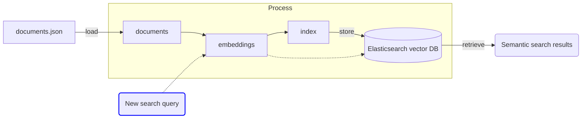

# LLM Zoomcamp - Week 3 Notes <!-- omit from toc -->

In this section the focus is on the following:
- Applying Vector Databases as an alternative to Elasticsearch in the previous two models.
    - Important to note that Elasticsearch has the ability to operate as a Vector DB as an alternative to Lucene and will be covered as well
- Vector embeddings and their role in building RAG applications
- Evaluation methods for search / query retrieval performance

## Table of Contents <!-- omit from toc -->
- [3.1 Introduction to Vector Search](#31-introduction-to-vector-search)
- [3.2 How to do Vectorized Search with Elasticsearch](#32-how-to-do-vectorized-search-with-elasticsearch)
  - [3.2.1 Let's start with Semantic Search](#321-lets-start-with-semantic-search)
    - [Step 1 - Load our documents](#step-1---load-our-documents)
    - [Step 2 - Create embeddings using pre-trained models](#step-2---create-embeddings-using-pre-trained-models)
    - [Step 3 - Set up Elasticsearch connection](#step-3---set-up-elasticsearch-connection)
    - [Step 4 Create Elasticsearch mappings and index](#step-4-create-elasticsearch-mappings-and-index)
    - [Step 5 Add documents to the index](#step-5-add-documents-to-the-index)
    - [Step 6 Create the user query](#step-6-create-the-user-query)
    - [Step 7 Perform a semantic search using Elasticsearch VectorDB](#step-7-perform-a-semantic-search-using-elasticsearch-vectordb)
  - [3.2.2 Now let's try Advanced Semantic Search](#322-now-lets-try-advanced-semantic-search)
- [3.3 Evaluation](#33-evaluation)
  - [3.3.1 Evaluation metrics for retrieval](#331-evaluation-metrics-for-retrieval)
  - [3.3.2 Ground truth generation for retrieval evaluation](#332-ground-truth-generation-for-retrieval-evaluation)
  - [3.3.3 Evaluation of text retrieval techniques for RAG](#333-evaluation-of-text-retrieval-techniques-for-rag)
  - [3.3.4 Evaluation vector retrieval](#334-evaluation-vector-retrieval)
  
## 3.1 Introduction to Vector Search
- Vector search has been around for a while and is getting popular again largely because LLMs lack long-term memory and have limited context windows
    - Vector DBs are an economical and effective way to store data for use with LLMs
- Elastic.co does a good job of explaining what vector embeddings are [here](https://www.elastic.co/what-is/vector-embedding)
    - Here's their definition:
    - ```Vector embeddings are a way to convert words and sentences and other data into numbers that capture their meaning and relationships. They represent different data types as points in a multidimensional space, where similar data points are clustered closer together. These numerical representations help machines understand and process this data more effectively.```
- Vector databases are databases that index and store vector embeddings
    - Which means you can easily store them, reference them, compare different vectors semantically (using various distance measures, etc.)
- Here's what it would look like when put together with an LLM:
<div style="max-width: 100%; overflow: hidden;">
    
</div>

## 3.2 How to do Vectorized Search with Elasticsearch
- Let's start with the architecture of the Semantic Search system we're going to build:


- The way this system works is as follows:
    - our `documents.json` file is converted into an Elasticsearch `documents` object which is then vectorized into `embeddings`
    - Those vector embeddings are the things we convert into another Elasticsearch concept called an `index`
        - We already used indexes in the previous sections
    - The `embeddings` and the `index` are what are stored in our vector database
    - And when a user passes a query, that query is first vectorized into an embedding and compared against the existing embeddings in order to produce a search result

- Let's implement this thing!

### 3.2.1 Let's start with Semantic Search

#### Step 1 - Load our documents


```python
import requests

docs_url = 'https://github.com/DataTalksClub/llm-zoomcamp/blob/main/01-intro/documents.json?raw=1'
docs_response = requests.get(docs_url)
documents_raw = docs_response.json()

documents = []

for course in documents_raw:
    course_name = course['course']

    for doc in course['documents']:
        doc['course'] = course_name
        documents.append(doc)

# write documents to a json file
import json
with open('documents.json', 'w') as f:
    json.dump(documents, f, indent=2)

```

`documents_raw` is a list having the course and the data corresponding to that course 

#### Step 2 - Create embeddings using pre-trained models
- We're going to use the `sentence_transformers` library to access pre-trained embedding models
    - You can learn more about that here: https://sbert.net/
- Before going into the rest of the tutorial, I asked ChatGPT to explain what this library does in simple terms. It's basically a library with various sentence embedding models you can use to create sentence embeddings with transformer-based models
- Here's an example of how it's used when wanting to compare sentence similarity:


```python
from sentence_transformers import SentenceTransformer, util

# Load a pre-trained model
model = SentenceTransformer('all-mpnet-base-v2')

# Encode sentences to get embeddings
sentences = ["How are you?", "What is your name?", "Hello! How do you do?"]
embeddings = model.encode(sentences)

# Compute similarity between the first sentence and the others
similarities = util.pytorch_cos_sim(embeddings[0], embeddings[1:])

print(similarities)

```

    tensor([[0.3600, 0.6323]])


- This is computing cosine similarity betwen the first word `embeddings[0]` and the other 2 words `embeddings[1:]`
    - It's telling us the 3rd sentence is almost 2x more similar to the first sentence than the second
- Intuitively, this makes sense!
- Ok, let's forge ahead and see how we apply this to our FAQ document
    - Let's create embeddings out of the `'text'` field in the documents list


```python
documents_embedding = []

for doc in documents:
    doc['text_embedding'] = model.encode(doc['text']).tolist()
    documents_embedding.append(doc)

documents_embedding[0]
```


    {'text': "The purpose of this document is to capture frequently asked technical questions\nThe exact day and hour of the course will be 15th Jan 2024 at 17h00. The course will start with the first  “Office Hours'' live.1\nSubscribe to course public Google Calendar (it works from Desktop only).\nRegister before the course starts using this link.\nJoin the course Telegram channel with announcements.\nDon’t forget to register in DataTalks.Club's Slack and join the channel.",
     'section': 'General course-related questions',
     'question': 'Course - When will the course start?',
     'course': 'data-engineering-zoomcamp',
     'text_embedding': [-0.03570355847477913,
      -0.06891412287950516,
      -0.044483352452516556,
      0.0062501393258571625,
      -0.042247142642736435,
      -0.006454026326537132,
      0.02754812128841877,
      -0.018610356375575066,
    


#### Step 3 - Set up Elasticsearch connection


```python
from elasticsearch import Elasticsearch

es_client = Elasticsearch('http://192.168.50.49:9200')

es_client.info()
```


    ObjectApiResponse({'name': 'b3a351c3296c', 'cluster_name': 'docker-cluster', 'cluster_uuid': 'OJZEGlS9RR6yoR11cShgug', 'version': {'number': '8.4.3', 'build_flavor': 'default', 'build_type': 'docker', 'build_hash': '42f05b9372a9a4a470db3b52817899b99a76ee73', 'build_date': '2022-10-04T07:17:24.662462378Z', 'build_snapshot': False, 'lucene_version': '9.3.0', 'minimum_wire_compatibility_version': '7.17.0', 'minimum_index_compatibility_version': '7.0.0'}, 'tagline': 'You Know, for Search'})


#### Step 4 Create Elasticsearch mappings and index
- The mapping is some metadata telling Elasticsearch how the fields and content in the documents should be typed
    - Each document in the is a collection of fields, each having a different data type
    - And we've now added a new one, which is the embedding of the `text` field
- This is similar to setting a database schema
- We are just going to take the `index_settings` from week 1 and add the embedding
- When adding the new embeddings field to the `properties` section, we are specifying a type `dense_vector` in addition to some other parameters:
    - A `dense vector` is a type of vector used to represent data in high-dimensional space and each element of the is stored and non-zero (contrast to a sparse vector)
    - The `dims` are just the dimension of the vector which can be found by finding the length of the encoding `len(encoded_field)`
        - Different models you choose will create vectors of the varying dimensions, but the same model will create vectors of the same length
    - Specifying `index:True` just lets us efficiently store and query it
    - And lastly setting `similarities` to `cosine` will just allow us to efficiently calculate cosine similarity between different fields efficiently


```python
len(documents_embedding[4]['text_embedding'])
```


    768


```python
index_settings = {
    "settings": {
        "number_of_shards": 1,
        "number_of_replicas": 0
    },
    "mappings": {
        "properties": {
            "text": {"type": "text"},
            "section": {"type": "text"},
            "question": {"type": "text"},
            "course": {"type": "keyword"},
            "text_embedding": {"type": "dense_vector", "dims": 768, "index": True, "similarity": "cosine"}
        }
    }
}

index_name = "course-questions"

if es_client.indices.exists(index=index_name):
    es_client.indices.delete(index=index_name)
    print(f"Index {index_name} deleted.")
else:
    print(f"Index {index_name} does not exist.")
    es_client.indices.create(index=index_name, body=index_settings)
```

    Index course-questions does not exist.


#### Step 5 Add documents to the index
- I'm just pulling the same code from the previous weeks to do this


```python
from tqdm.auto import tqdm

## Index the documents
for doc in tqdm(documents_embedding):
    try:
        es_client.index(index=index_name, document=doc)
    except Exception as e:
        print(e)
```

    100%|██████████| 948/948 [00:11<00:00, 84.76it/s]


#### Step 6 Create the user query
- Main thing to note here is the question we're asking isn't enough. We must also:
    - Convert the text question into an embedding: `model.encode`
    - Specify how many of the k-nearest neighbours to return back once we do a similarity calc: `k` parameter
    - Specify the total documents to consider: `num_candidates` parameter


```python
question = "windows or mac?"
vector_question = model.encode(question)

query = {
    "field": "text_embedding",
    "query_vector": vector_question,
    "k": 5,
    "num_candidates": 10000,
}
```

#### Step 7 Perform a semantic search using Elasticsearch VectorDB


```python
res= es_client.search(index=index_name, knn=query, source=["text", "section", "question", "course"])
res["hits"]["hits"]
```


    [{'_index': 'course-questions',
      '_id': 'Vn0ytJABBRmP4y361Shn',
      '_score': 0.71479183,
      '_source': {'question': 'Environment - Is the course [Windows/mac/Linux/...] friendly?',
       'course': 'data-engineering-zoomcamp',
       'section': 'General course-related questions',
       'text': 'Yes! Linux is ideal but technically it should not matter. Students last year used all 3 OSes successfully'}},
     {'_index': 'course-questions',
      '_id': 'aX0ytJABBRmP4y36-SuG',
      '_score': 0.61347365,
      '_source': {'question': 'WSL instructions',
       'course': 'mlops-zoomcamp',
       'section': 'Module 1: Introduction',
       'text': 'If you wish to use WSL on your windows machine, here are the setup instructions:\nCommand: Sudo apt install wget\nGet Anaconda download address here. wget <download address>\nTurn on Docker Desktop WFree Download | AnacondaSL2\nCommand: git clone <github repository address>\nVSCODE on WSL\nJupyter: pip3 install jupyter\nAdded by Gregory Morris (gwm1980@gmail.com)\nAll in all softwares at one shop:\nYou can use anaconda which has all built in services like pycharm, jupyter\nAdded by Khaja Zaffer (khajazaffer@aln.iseg.ulisboa.pt)\nFor windows “wsl --install” in Powershell\nAdded by Vadim Surin (vdmsurin@gmai.com)'}},
     {'_index': 'course-questions',
      '_id': 'Kn0ytJABBRmP4y366iqy',
      '_score': 0.60555583,
      '_source': {'question': "The answer I get for one of the homework questions doesn't match any of the options. What should I do?",
       'course': 'machine-learning-zoomcamp',
       'section': '2. Machine Learning for Regression',
       'text': 'That’s normal. We all have different environments: our computers have different versions of OS and different versions of libraries — even different versions of Python.\nIf it’s the case, just select the option that’s closest to your answer'}},
     {'_index': 'course-questions',
      '_id': 'g30ytJABBRmP4y367iqy',
      '_score': 0.6028962,
      '_source': {'question': 'How to install WSL on Windows 10 and 11 ?',
       'course': 'machine-learning-zoomcamp',
       'section': '5. Deploying Machine Learning Models',
       'text': 'It is quite simple, and you can follow these instructions here:\nhttps://www.youtube.com/watch?v=qYlgUDKKK5A&ab_channel=NeuralNine\nMake sure that you have “Virtual Machine Platform” feature activated in your Windows “Features”. To do that, search “features” in the research bar and see if the checkbox is selected. You also need to make sure that your system (in the bios) is able to virtualize. This is usually the case.\nIn the Microsoft Store: look for ‘Ubuntu’ or ‘Debian’ (or any linux distribution you want) and install it\nOnce it is downloaded, open the app and choose a username and a password (secured one). When you type your password, nothing will show in the window, which is normal: the writing is invisible.\nYou are now inside of your linux system. You can test some commands such as “pwd”. You are not in your Windows system.\nTo go to your windows system: you need to go back two times with cd ../.. And then go to the “mnt” directory with cd mnt. If you list here your files, you will see your disks. You can move to the desired folder, for example here I moved to the ML_Zoomcamp folder:\nPython should be already installed but you can check it by running sudo apt install python3 command.\nYou can make your actual folder your default folder when you open your Ubuntu terminal with this command : echo "cd ../../mnt/your/folder/path" >> ~/.bashrc\nYou can disable bell sounds (when you type something that does not exist for example) by modifying the inputrc file with this command: sudo vim /etc/inputrc\nYou have to uncomment the set bell-style none line -> to do that, press the “i” keyboard letter (for insert) and go with your keyboard to this line. Delete the # and then press the Escape keyboard touch and finally press “:wq” to write (it saves your modifications) then quit.\nYou can check that your modifications are taken into account by opening a new terminal (you can pin it to your task bar so you do not have to go to the Microsoft app each time).\nYou will need to install pip by running this command sudo apt install python3-pip\nNB: I had this error message when trying to install pipenv (https://github.com/microsoft/WSL/issues/5663):\n/sbin/ldconfig.real: Can\'t link /usr/lib/wsl/lib/libnvoptix_loader.so.1 to libnvoptix.so.1\n/sbin/ldconfig.real: /usr/lib/wsl/lib/libcuda.so.1 is not a symbolic link\nSo I had to create the following symbolic link:\nsudo ln -s /usr/lib/wsl/lib/libcuda.so.1 /usr/lib64/libcuda.so\n(Mélanie Fouesnard)'}},
     {'_index': 'course-questions',
      '_id': 'R30ytJABBRmP4y361Cik',
      '_score': 0.5985867,
      '_source': {'question': 'Environment - Should I use my local machine, GCP, or GitHub Codespaces for my environment?',
       'course': 'data-engineering-zoomcamp',
       'section': 'General course-related questions',
       'text': 'You can set it up on your laptop or PC if you prefer to work locally from your laptop or PC.\nYou might face some challenges, especially for Windows users. If you face cnd2\nIf you prefer to work on the local machine, you may start with the week 1 Introduction to Docker and follow through.\nHowever, if you prefer to set up a virtual machine, you may start with these first:\nUsing GitHub Codespaces\nSetting up the environment on a cloudV Mcodespace\nI decided to work on a virtual machine because I have different laptops & PCs for my home & office, so I can work on this boot camp virtually anywhere.'}}]


### 3.2.2 Now let's try Advanced Semantic Search
- In order to do a more advanced semantic search using Elasticsearch, we can take the query from the user, encode it and then pass a few other parameters that we saw in the previous sessions
    - The way we do this is by passing the original encoded query to the `knn` parameter
    - And, passing the filter to the `query` parameter
- When doing advanced semantic search this way, the scoring mechanism isn't normalized to [0:1]. You can get scores greater than 1
    - To find out how that score is calculated, you can pass the Elasticsearch `search` method a parameter `explain = True`


```python
question = "windows or mac?"
vector_question = model.encode(question)

# Pass the embedded version of the question to the Elasticsearch search function
knn_query = {
    "field": "text_embedding",
    "query_vector": vector_question,
    "k": 5,
    "num_candidates": 10000,
}

## Add a filter to the search
query = {"match": 
         {"course": "data-engineering-zoomcamp"}
         }

res = es_client.search(index=index_name, 
                       query = query,
                       knn=knn_query, 
                       source=["text", "section", "question", "course"],
                       size=3,
                       explain=True)

res["hits"]["hits"]
```


    [{'_shard': '[course-questions][0]',
      '_node': 'lxwBTO3-R-e0G28Pi0OWpQ',
      '_index': 'course-questions',
      '_id': 'Vn0ytJABBRmP4y361Shn',
      '_score': 1.4937057,
      '_source': {'question': 'Environment - Is the course [Windows/mac/Linux/...] friendly?',
       'course': 'data-engineering-zoomcamp',
       'section': 'General course-related questions',
       'text': 'Yes! Linux is ideal but technically it should not matter. Students last year used all 3 OSes successfully'},
      '_explanation': {'value': 1.4937057,
       'description': 'sum of:',
       'details': [{'value': 0.71479183,
         'description': 'within top k documents',
         'details': []},
        {'value': 0.778914,
         'description': 'weight(course:data-engineering-zoomcamp in 35) [PerFieldSimilarity], result of:',
         'details': [{'value': 0.778914,
           'description': 'score(freq=1.0), computed as boost * idf * tf from:',
           'details': [{'value': 2.2, 'description': 'boost', 'details': []},
            {'value': 0.778914,
             'description': 'idf, computed as log(1 + (N - n + 0.5) / (n + 0.5)) from:',
             'details': [{'value': 435,
               'description': 'n, number of documents containing term',
               'details': []},
              {'value': 948,
               'description': 'N, total number of documents with field',
               'details': []}]},
            {'value': 0.45454544,
             'description': 'tf, computed as freq / (freq + k1 * (1 - b + b * dl / avgdl)) from:',
             'details': [{'value': 1.0,
               'description': 'freq, occurrences of term within document',
               'details': []},
              {'value': 1.2,
               'description': 'k1, term saturation parameter',
               'details': []},
              {'value': 0.75,
               'description': 'b, length normalization parameter',
               'details': []},
              {'value': 1.0, 'description': 'dl, length of field', 'details': []},
              {'value': 1.0,
               'description': 'avgdl, average length of field',
               'details': []}]}]}]}]}},
     {'_shard': '[course-questions][0]',
      '_node': 'lxwBTO3-R-e0G28Pi0OWpQ',
      '_index': 'course-questions',
      '_id': 'R30ytJABBRmP4y361Cik',
      '_score': 1.3775007,
      '_source': {'question': 'Environment - Should I use my local machine, GCP, or GitHub Codespaces for my environment?',
       'course': 'data-engineering-zoomcamp',
       'section': 'General course-related questions',
       'text': 'You can set it up on your laptop or PC if you prefer to work locally from your laptop or PC.\nYou might face some challenges, especially for Windows users. If you face cnd2\nIf you prefer to work on the local machine, you may start with the week 1 Introduction to Docker and follow through.\nHowever, if you prefer to set up a virtual machine, you may start with these first:\nUsing GitHub Codespaces\nSetting up the environment on a cloudV Mcodespace\nI decided to work on a virtual machine because I have different laptops & PCs for my home & office, so I can work on this boot camp virtually anywhere.'},
      '_explanation': {'value': 1.3775007,
       'description': 'sum of:',
       'details': [{'value': 0.5985867,
         'description': 'within top k documents',
         'details': []},
        {'value': 0.778914,
         'description': 'weight(course:data-engineering-zoomcamp in 20) [PerFieldSimilarity], result of:',
         'details': [{'value': 0.778914,
           'description': 'score(freq=1.0), computed as boost * idf * tf from:',
           'details': [{'value': 2.2, 'description': 'boost', 'details': []},
            {'value': 0.778914,
             'description': 'idf, computed as log(1 + (N - n + 0.5) / (n + 0.5)) from:',
             'details': [{'value': 435,
               'description': 'n, number of documents containing term',
               'details': []},
              {'value': 948,
               'description': 'N, total number of documents with field',
               'details': []}]},
            {'value': 0.45454544,
             'description': 'tf, computed as freq / (freq + k1 * (1 - b + b * dl / avgdl)) from:',
             'details': [{'value': 1.0,
               'description': 'freq, occurrences of term within document',
               'details': []},
              {'value': 1.2,
               'description': 'k1, term saturation parameter',
               'details': []},
              {'value': 0.75,
               'description': 'b, length normalization parameter',
               'details': []},
              {'value': 1.0, 'description': 'dl, length of field', 'details': []},
              {'value': 1.0,
               'description': 'avgdl, average length of field',
               'details': []}]}]}]}]}},
     {'_shard': '[course-questions][0]',
      '_node': 'lxwBTO3-R-e0G28Pi0OWpQ',
      '_index': 'course-questions',
      '_id': 'M30ytJABBRmP4y360yh_',
      '_score': 0.778914,
      '_source': {'question': 'Course - When will the course start?',
       'course': 'data-engineering-zoomcamp',
       'section': 'General course-related questions',
       'text': "The purpose of this document is to capture frequently asked technical questions\nThe exact day and hour of the course will be 15th Jan 2024 at 17h00. The course will start with the first  “Office Hours'' live.1\nSubscribe to course public Google Calendar (it works from Desktop only).\nRegister before the course starts using this link.\nJoin the course Telegram channel with announcements.\nDon’t forget to register in DataTalks.Club's Slack and join the channel."},
      '_explanation': {'value': 0.778914,
       'description': 'sum of:',
       'details': [{'value': 0.778914,
         'description': 'weight(course:data-engineering-zoomcamp in 0) [PerFieldSimilarity], result of:',
         'details': [{'value': 0.778914,
           'description': 'score(freq=1.0), computed as boost * idf * tf from:',
           'details': [{'value': 2.2, 'description': 'boost', 'details': []},
            {'value': 0.778914,
             'description': 'idf, computed as log(1 + (N - n + 0.5) / (n + 0.5)) from:',
             'details': [{'value': 435,
               'description': 'n, number of documents containing term',
               'details': []},
              {'value': 948,
               'description': 'N, total number of documents with field',
               'details': []}]},
            {'value': 0.45454544,
             'description': 'tf, computed as freq / (freq + k1 * (1 - b + b * dl / avgdl)) from:',
             'details': [{'value': 1.0,
               'description': 'freq, occurrences of term within document',
               'details': []},
              {'value': 1.2,
               'description': 'k1, term saturation parameter',
               'details': []},
              {'value': 0.75,
               'description': 'b, length normalization parameter',
               'details': []},
              {'value': 1.0, 'description': 'dl, length of field', 'details': []},
              {'value': 1.0,
               'description': 'avgdl, average length of field',
               'details': []}]}]}]}]}}]


## 3.3 Evaluation
- Evaluating the quality of a particular RAG pipeline can be subjective
- There are many techniques you can employ to determine whether the responses you're getting are "good"
    - Often, these techniques require a "ground truth dataset"
- In the next series of exercises, we'll be exploring a few things:
    - Metrics to evaluate a RAG
    - How to create ground truth or gold standard data by which to run evaluations
        - For example, for a given query, you may have already labeled documents which are considered "correct"
        - You can run tests to ensure these documents are in the result set your RAG returns
        - You might even be able to use LLMs to generate these ground truth datasets
    - How to put them together to evaluate results based on ground truth and the metrics
- Let's go!

### 3.3.1 Evaluation metrics for retrieval
- If you think back to the different searches we've done, there are many parameters that can be tuned in order to generate different results.
- Take, for example, the `keyword search` we did with Elasticsearch, with the following search query:
```python
search_query = {
        "size": 5,
        "query": {
            "bool": {
                "must": {
                    "multi_match": {
                        "query": query,
                        "fields": ["question^3", "text", "section"],
                        "type": "best_fields"
                    }
                },
                "filter": {
                    "term": {
                        "course": "data-engineering-zoomcamp"
                    }
                }
            }
        }
    }
```

- Here you can see, we can change `field` weights, we can change the `type`, we can change the `filter`
- In the advanced vector search example, we had even more things:
```python
model = SentenceTransformer('all-mpnet-base-v2')

index_settings = {
    "settings": {
        "number_of_shards": 1,
        "number_of_replicas": 0
    },
    "mappings": {
        "properties": {
            "text": {"type": "text"},
            "section": {"type": "text"},
            "question": {"type": "text"},
            "course": {"type": "keyword"},
            "text_embedding": {"type": "dense_vector", "dims": 768, "index": True, "similarity": "cosine"}
        }
    }
}

question = "windows or mac?"
vector_question = model.encode(question)

knn_query = {
    "field": "text_embedding",
    "query_vector": vector_question,
    "k": 5,
    "num_candidates": 10000,
}

## Add a filter to the search
query = {"match": 
         {"course": "data-engineering-zoomcamp"}
         }
```

- We can change the `model` we used to encode the question, we can change the kin dof `similarity` in the index settings, etc.
- Here is a whole bunch of evaluation metrics from ChatGPT. We'll probably end up using only two of them: `Hit rate` and `MRR`:
    1. **Precision at k (P@k)**:
    - Measures the number of relevant documents in the top k results.
    - Formula: `P@k = (Number of relevant documents in top k results) / k`

    2. **Recall**:
    - Measures the number of relevant documents retrieved out of the total number of relevant documents available.
    - Formula: `Recall = (Number of relevant documents retrieved) / (Total number of relevant documents)`

    3. **Mean Average Precision (MAP)**:
    - Computes the average precision for each query and then averages these values over all queries.
    - Formula: `MAP = (1 / |Q|) * Σ (Average Precision(q))` for q in Q

    4. **Normalized Discounted Cumulative Gain (NDCG)**:
    - Measures the usefulness, or gain, of a document based on its position in the result list.
    - Formula: `NDCG = DCG / IDCG`
        - `DCG = Σ ((2^rel_i - 1) / log2(i + 1))` for i = 1 to p
        - `IDCG` is the ideal DCG, where documents are perfectly ranked by relevance.

    5. **Mean Reciprocal Rank (MRR)**:
    - Evaluates the rank position of the first relevant document.
    - Formula: `MRR = (1 / |Q|) * Σ (1 / rank_i)` for i = 1 to |Q|

    6. **F1 Score**:
    - Harmonic mean of precision and recall.
    - Formula: `F1 = 2 * (Precision * Recall) / (Precision + Recall)`

    7. **Area Under the ROC Curve (AUC-ROC)**:
    - Measures the ability of the model to distinguish between relevant and non-relevant documents.
    - AUC is the area under the Receiver Operating Characteristic (ROC) curve, which plots true positive rate (TPR) against false positive rate (FPR).

    8. **Mean Rank (MR)**:
    - The average rank of the first relevant document across all queries.
    - Lower values indicate better performance.

    9. **Hit Rate (HR) or Recall at k**:
    - Measures the proportion of queries for which at least one relevant document is retrieved in the top k results.
    - Formula: `HR@k = (Number of queries with at least one relevant document in top k) / |Q|`

    10. **Expected Reciprocal Rank (ERR)**:
        - Measures the probability that a user finds a relevant document at each position in the ranked list, assuming a cascading model of user behavior.
        - Formula: `ERR = Σ (1 / i) * Π (1 - r_j) * r_i` for j = 1 to i-1
        - Where `r_i` is the relevance probability of the document at position i.

### 3.3.2 Ground truth generation for retrieval evaluation
- In order to construct a ground truth document, we need to create a set of questions for each record that are similar to the question the user will ask
    - TODO: I don't fully understand how this is going to work!
- But here's the pseudo code for what we need to create:

    - ```python
        for each record in FAQ:
            generate 5 questions
      ```
    - This will turn a 1000 question document into a 5000 question document
    - Then we will compare the answer our retrieval system gave us with the record in the ground truth document and ... {I DON"T GET THIS PART}
- Anyway, let's implement it!


```python
## Let's re-import our documents list from above
import requests

docs_url = 'https://github.com/DataTalksClub/llm-zoomcamp/blob/main/01-intro/documents.json?raw=1'
docs_response = requests.get(docs_url)
documents_raw = docs_response.json()

documents = []

for course in documents_raw:
    course_name = course['course']

    for doc in course['documents']:
        doc['course'] = course_name
        documents.append(doc)
```


```python
print(documents[1])
print(len(documents))
```

    {'text': 'GitHub - DataTalksClub data-engineering-zoomcamp#prerequisites', 'section': 'General course-related questions', 'question': 'Course - What are the prerequisites for this course?', 'course': 'data-engineering-zoomcamp'}
    948


- Note that after processing the document, we end up with a list called `documents` that is just a set of dictionaries, each containing the question (`question`), response (`text`) and the section and course.
- In order to create a ground truth dataset, we need to uniquely identify these with some kind of id
    - We could do this by just assigning a new field `documents['id'] = for i in range(len(documents)): documents[i]['id'] = i` and we'll get a number corresponding to each record
    - The problem with this is that the source document iself isn't static, it gets added to all the time 
    - So if we generate a ground_truth dataset based on this data and the source data changes, then the ground_truth will no longer correspond to the records
- The optimal solution to this problem is to use the record google docs generated that references each question (as they are stored in headers):

    - However, when we pull the data in using `requests.get(url)` we don't capture that header. If we use some google docs API, maybe we can???
- The next best option is to generate an `id` based on the contents of the actual question
    - While this is not immune to someone editing the question / response, that rarely happens as most of the time questions just get appended
    - So let's do that!
        - We'll combine the contents of the question, concatenate them and create an MD5 hash:


```python
import hashlib

def generate_doc_id(doc):
    text = f"{doc['course']}|{doc['question']}|{doc['text'][:10]}"
    hash_object = hashlib.sha256(text.encode())
    hash_hex = hash_object.hexdigest()
    doc_id = hash_hex[:10]
    return doc_id
```


```python
for doc in documents:
    doc['id'] = generate_doc_id(doc)
```


```python
documents[4]
```


    {'text': 'You can start by installing and setting up all the dependencies and requirements:\nGoogle cloud account\nGoogle Cloud SDK\nPython 3 (installed with Anaconda)\nTerraform\nGit\nLook over the prerequisites and syllabus to see if you are comfortable with these subjects.',
     'section': 'General course-related questions',
     'question': 'Course - What can I do before the course starts?',
     'course': 'data-engineering-zoomcamp',
     'id': 'ffb90e86f4'}


- Let's check to see if our `id` are actually unique across all the records in the document


```python
from collections import defaultdict

hashes = defaultdict(list)

for doc in documents:
    hashes[doc['id']].append(doc)

print(f"len(hashes): {len(hashes)} and len(documents): {len(documents)}")
```

    len(hashes): 947 and len(documents): 948


```python
for k, values in hashes.items():
    if len(values) > 1:
        print(k, len(values))
```

    6712932b49 2


```python
hashes['6712932b49']
```


    [{'text': "They both do the same, it's just less typing from the script.\nAsked by Andrew Katoch, Added by Edidiong Esu",
      'section': '6. Decision Trees and Ensemble Learning',
      'question': 'Does it matter if we let the Python file create the server or if we run gunicorn directly?',
      'course': 'machine-learning-zoomcamp',
      'id': '6712932b49'},
     {'text': "They both do the same, it's just less typing from the script.",
      'section': '6. Decision Trees and Ensemble Learning',
      'question': 'Does it matter if we let the Python file create the server or if we run gunicorn directly?',
      'course': 'machine-learning-zoomcamp',
      'id': '6712932b49'}]


- Now that every record in our set has an id (except for one of them that's duplicated), we can do the part where we create five new questions that correspond to each answer in order to build a ground truth dataset
- Let's start by dumping the file we created above with ids into a .json file.


```python
import json
with open('documents-with-ids.json', 'wt') as f:
    json.dump(documents, f, indent=2)
```


```python
!head documents-with-ids.json
```

    [
      {
        "text": "The purpose of this document is to capture frequently asked technical questions\nThe exact day and hour of the course will be 15th Jan 2024 at 17h00. The course will start with the first  \u201cOffice Hours'' live.1\nSubscribe to course public Google Calendar (it works from Desktop only).\nRegister before the course starts using this link.\nJoin the course Telegram channel with announcements.\nDon\u2019t forget to register in DataTalks.Club's Slack and join the channel.",
        "section": "General course-related questions",
        "question": "Course - When will the course start?",
        "course": "data-engineering-zoomcamp",
        "id": "6211ca3c99"
      },
      {
        "text": "GitHub - DataTalksClub data-engineering-zoomcamp#prerequisites",


    huggingface/tokenizers: The current process just got forked, after parallelism has already been used. Disabling parallelism to avoid deadlocks...
    To disable this warning, you can either:
    	- Avoid using `tokenizers` before the fork if possible
    	- Explicitly set the environment variable TOKENIZERS_PARALLELISM=(true | false)


- Next, we want to create a prompt that will ask the LLM to emulate a student asking five questions for which the answer is provided in each record:


```python
prompt_template = """

You emulate a student who is taking our course.
Formulate 5 questions this student might ask based on the FAQ record. The record should contain the answer to the questions, and the questions should be complete and not too short. If possible, use as few words from the FAQ record as possible.

The record:

section: {section}
question: {question}
answer: {text}

Provide the output in parsable JSON without using code blocks:

["question1", "question2", "question3", "question4", "question5"]

""".strip()
```


```python
from openai import OpenAI
client = OpenAI()
```

- Let's now go through this step by step for one example record before iterating through all records to produce questions
    - Step 1: create a prompt based on a record in the document
    - Step 2: pass the prompt to OpenAI's completions API
    - Step 3: get the parsable json object back and parse it to see what five questions it created based on the record


```python
prompt = prompt_template.format(**documents[4])
print(prompt)
```

    You emulate a student who is taking our course.
    Formulate 5 questions this student might ask based on the FAQ record. The record should contain the answer to the questions, and the questions should be complete and not too short. If possible, use as few words from the FAQ record as possible.
    
    The record:
    
    section: General course-related questions
    question: Course - What can I do before the course starts?
    answer: You can start by installing and setting up all the dependencies and requirements:
    Google cloud account
    Google Cloud SDK
    Python 3 (installed with Anaconda)
    Terraform
    Git
    Look over the prerequisites and syllabus to see if you are comfortable with these subjects.
    
    Provide the output in parsable JSON without using code blocks:
    
    ["question1", "question2", "question3", "question4", "question5"]


```python
response = client.chat.completions.create(
    model="gpt-4o",
    messages=[
        {"role": "user", "content": prompt}
    ]
)

json_response = response.choices[0].message.content

print(json.loads(json_response))
```

    ['What should I do to prepare before the course starts?', 'How can I set up my environment before the course begins?', 'What tools and software do I need to install prior to starting the course?', 'Is there anything I need to check regarding my knowledge and comfort level before the course?', 'Which prerequisites and subjects should I review before the course starts?']


- Ok, so now we're ready to iterate over all records in the document and fill a dictionary called `results` that will look like this:
    - `{
        doc_id1: '[question1, question2, question3, question4, question5]',
        doc_id2: '[question1, question2, question3, question4, question5]',
        doc_idn: '[question1, question2, question3, question4, question5]'
    }`


```python
def generate_questions(doc):
    prompt = prompt_template.format(**doc)
    response = client.chat.completions.create(
        model="gpt-4o",
        messages=[
            {"role": "user", "content": prompt}
        ]
    )
    json_response = response.choices[0].message.content
    return json_response
```


```python
from tqdm.auto import tqdm

results = {}
```

    /Users/waleed/Documents/school/datatalksclub/llm-zoomcamp/llm-zoom/lib/python3.11/site-packages/tqdm/auto.py:21: TqdmWarning: IProgress not found. Please update jupyter and ipywidgets. See https://ipywidgets.readthedocs.io/en/stable/user_install.html
      from .autonotebook import tqdm as notebook_tqdm


```python
for doc in tqdm(documents):
    doc_id = doc['id']

    if doc_id in results:
        continue

    questions = generate_questions(doc)
    results[doc_id] = questions
```

    100%|██████████| 948/948 [44:45<00:00,  2.83s/it]  


- Notice that in the `generate_questions` function, we didn't return a parsed json.
- What's odd is that in the youtube lecture, the questions the LLM returns were still strings, whereas in my case, it appears the LLM returned the questions in the form of a list
    - Which I assume means I don't have to parse them with `json.loads()`?
- We can check this by checking to see whether the value in the k:v pair of the results dictionary are all of type list:


```python
first_value = type(next(iter(results.values())))

for doc_id, json_questions in results.items():
    if type(json_questions) != first_value:
        print(doc_id, type(json_questions))
```

    7671536536 <class 'dict'>
    894d8ce09c <class 'str'>
    0472c382d4 <class 'str'>
    42b4d84708 <class 'str'>
    55dcff4cf4 <class 'str'>
    29cfee5a3e <class 'str'>
    ab25edb0b9 <class 'str'>
    059eaeeb02 <class 'str'>
    cc6c02553a <class 'str'>
    dfa9da1a10 <class 'str'>
    c2df75394c <class 'str'>
    b9812f520f <class 'str'>
    6029da3a58 <class 'str'>
  


- Ok so it looks like I"m super wrong and a whole bunch of values in my results dictionary are in fact NOT lists
- So we'll need to use json.loads() after all


```python
# parsed_results = {k: json.loads(v) for k, v in results.items()}

parsed_results = {}

for doc_id, json_questions in results.items():
    if isinstance(json_questions, str):
        parsed_results[doc_id] = json.loads(json_questions)
    else:
        parsed_results[doc_id] = json_questions


```


    ---------------------------------------------------------------------------

    JSONDecodeError                           Traceback (most recent call last)

    Cell In[31], line 7
          5 for doc_id, json_questions in results.items():
          6     if isinstance(json_questions, str):
    ----> 7         parsed_results[doc_id] = json.loads(json_questions)
          8     else:
          9         parsed_results[doc_id] = json_questions


    File /opt/homebrew/Cellar/python@3.11/3.11.9/Frameworks/Python.framework/Versions/3.11/lib/python3.11/json/__init__.py:346, in loads(s, cls, object_hook, parse_float, parse_int, parse_constant, object_pairs_hook, **kw)
        341     s = s.decode(detect_encoding(s), 'surrogatepass')
        343 if (cls is None and object_hook is None and
        344         parse_int is None and parse_float is None and
        345         parse_constant is None and object_pairs_hook is None and not kw):
    --> 346     return _default_decoder.decode(s)
        347 if cls is None:
        348     cls = JSONDecoder


    File /opt/homebrew/Cellar/python@3.11/3.11.9/Frameworks/Python.framework/Versions/3.11/lib/python3.11/json/decoder.py:337, in JSONDecoder.decode(self, s, _w)
        332 def decode(self, s, _w=WHITESPACE.match):
        333     """Return the Python representation of ``s`` (a ``str`` instance
        334     containing a JSON document).
        335 
        336     """
    --> 337     obj, end = self.raw_decode(s, idx=_w(s, 0).end())
        338     end = _w(s, end).end()
        339     if end != len(s):


    File /opt/homebrew/Cellar/python@3.11/3.11.9/Frameworks/Python.framework/Versions/3.11/lib/python3.11/json/decoder.py:353, in JSONDecoder.raw_decode(self, s, idx)
        344 """Decode a JSON document from ``s`` (a ``str`` beginning with
        345 a JSON document) and return a 2-tuple of the Python
        346 representation and the index in ``s`` where the document ended.
       (...)
        350 
        351 """
        352 try:
    --> 353     obj, end = self.scan_once(s, idx)
        354 except StopIteration as err:
        355     raise JSONDecodeError("Expecting value", s, err.value) from None


    JSONDecodeError: Invalid \escape: line 3 column 81 (char 171)


- In the lesson video, the offending record is found and fixed before parsing. In my case, I'm just going to modify my parsing code above to just skip the entry that causes the issue and move on:
- Based on the below, there are three records that cause issues and I'm just going to ignore them!


```python
parsed_results = {}

for doc_id, json_questions in results.items():
    try:
        if isinstance(json_questions, str):
            parsed_results[doc_id] = json.loads(json_questions)
        else:
            parsed_results[doc_id] = json_questions if isinstance(json_questions, list) else [json_questions]
    except json.JSONDecodeError as e:
        print(f"Error decoding JSON for doc_id: {doc_id}")
        print(f"Problematic data: {json_questions}")
        continue
```

    Error decoding JSON for doc_id: 50968e75d1
    Problematic data: [
    "What should I do if I receive an invalid mode error related to Docker mounting paths?",
    "How can I resolve the Docker error response from the daemon regarding the path \Program Files\Git\var\lib\postgresql\data?",
    "What are the correct mounting paths to use in Docker if the original one is invalid?",
    "What is the solution for correcting the Docker mount path when encountering errors?",
    "How do I adjust my Docker mounting path to avoid errors related to var/lib/postgresql/data?"
    ]
    Error decoding JSON for doc_id: 4480b15330
    Problematic data: ```json
    [
      {
        "question": "How can I resolve the Docker-Compose error 'undefined volume' when working on Windows/WSL?",
        "answer": "If you wrote the docker-compose.yaml file exactly like the video, you might run into an error like this: dev service 'pgdatabase' refers to undefined volume dtc_postgres_volume_local: invalid compose project. In order to make it work, you need to include the volume in your docker-compose file. Just add the following: volumes: dtc_postgres_volume_local: (Make sure volumes are at the same level as services.)"
      },
      {
        "question": "What should I do if I get an 'invalid compose project' error due to an undefined volume in Docker-Compose?",
        "answer": "If you wrote the docker-compose.yaml file exactly like the video, you might run into an error like this: dev service 'pgdatabase' refers to undefined volume dtc_postgres_volume_local: invalid compose project. In order to make it work, you need to include the volume in your docker-compose file. Just add the following: volumes: dtc_postgres_volume_local: (Make sure volumes are at the same level as services.)"
      },
      {
        "question": "How do I fix the 'refers to undefined volume' error in my docker-compose.yaml file?",
        "answer": "If you wrote the docker-compose.yaml file exactly like the video, you might run into an error like this: dev service 'pgdatabase' refers to undefined volume dtc_postgres_volume_local: invalid compose project. In order to make it work, you need to include the volume in your docker-compose file. Just add the following: volumes: dtc_postgres_volume_local: (Make sure volumes are at the same level as services.)"
      },
      {
        "question": "What is the solution for the 'undefined volume dtc_postgres_volume_local' error in Docker-Compose?",
        "answer": "If you wrote the docker-compose.yaml file exactly like the video, you might run into an error like this: dev service 'pgdatabase' refers to undefined volume dtc_postgres_volume_local: invalid compose project. In order to make it work, you need to include the volume in your docker-compose file. Just add the following: volumes: dtc_postgres_volume_local: (Make sure volumes are at the same level as services.)"
      },
      {
        "question": "How can I correct the 'invalid compose project' error caused by an undefined volume in my docker-compose.yaml?",
        "answer": "If you wrote the docker-compose.yaml file exactly like the video, you might run into an error like this: dev service 'pgdatabase' refers to undefined volume dtc_postgres_volume_local: invalid compose project. In order to make it work, you need to include the volume in your docker-compose file. Just add the following: volumes: dtc_postgres_volume_local: (Make sure volumes are at the same level as services.)"
      }
    ]
    ```
    Error decoding JSON for doc_id: bf12082031
    Problematic data: ```json
    ["What is information gain in the context of decision trees?", "How do you define information gain due to a variable X?", "What happens if X is completely uninformative about Y?", "What is the mutual information of Y and X in decision trees?", "What is the entropy of Y in relation to information gain?"]
    ```
    Error decoding JSON for doc_id: 447fe537b1
    Problematic data: ```json
    [
      "What is a way to work with Docker in Google Colab?",
      "How can I address the 'Missing Authentication Token' error when using Lambda API Gateway?",
      "What is the solution if I can't run 'pip install tflite_runtime' from GitHub wheel links?",
      "Can you share the steps to install Docker (udocker) in Google Colab?",
      "How do I test invoking a method using boto3 in API Gateway?"
    ]
    ```


- Now that we've parsed our json output, we need to reassemble it into a dataframe that has the following columns: `[question, course, doc_id]`


```python
first_value = type(next(iter(parsed_results.values())))

for doc_id, json_questions in parsed_results.items():
    if type(json_questions) != first_value:
        print(doc_id, json_questions)
```

    50210049e8 {'questions': ['Which version of Python should I use for this course in 2024?', 'Is it better to use Python 3.9 for course consistency?', 'Can I use Python 3.10 or 3.11 for this course?', 'What is the recommended Python version for troubleshooting during this course?', 'Are there newer Python versions that work fine for this course?']}
    9dfbf0120a {'questions': ['How can I open the Run command window on a Windows machine?', 'What steps should I follow to change registry values in Registry Editor?', "Where do I find the 'Autorun' registry value in the Registry Editor?", 'What is an alternative solution to changing registry values for solving the connection issue?', 'Where is the known_hosts file located on a Windows machine?']}
    974e5aab70 {'question1': 'What is the best way to support and promote the course?', 'question2': 'How can I assist in enhancing the course materials?', 'question3': 'Are there any actions students can take to spread awareness of this course?', 'question4': 'If I have suggestions for improving the course, what should I do?', 'question5': 'What are some recommended ways to give back to the course community?'}
    ad319494ec {'questions': [{'question': 'What should Windows users do when they encounter *.sh (shell scripts) in later modules?', 'answer': 'Windows users should set up a WSL environment as shell scripts in modules like module-05 & RisingWave workshop may not run properly even in git bash or MINGW64.'}, {'question': 'Why is the WSL environment set up recommended at the start for Windows users?', 'answer': 'WSL environment setup is recommended because later modules use shell scripts in *.sh files, and Windows users not using WSL might hit a wall and cannot continue.'}, {'question': 'Are there any records of how past cohorts handled the issue with *.sh files on Windows?', 'answer': 'There are no FAQ entries or slack messages available that explain how past cohorts managed to get past the issue with *.sh files on Windows.'}, {'question': 'Which later modules in the course use shell scripts that may cause issues for Windows users?', 'answer': 'Modules such as module-05 & RisingWave workshop use shell scripts that might cause issues for Windows users not using WSL.'}, {'question': 'Can Windows users continue using git bash or MINGW64 for modules with *.sh files?', 'answer': 'Most Windows users will not be able to continue using git bash or MINGW64 for modules with *.sh files and are recommended to use WSL instead.'}]}


- Ok so it looks like what's happening is that the LLM added the key `question` in some cases to its response.
- I'm going to have to write some code to clean this up


```python
parsed_results_fixed = {}

for doc_id, json_questions in parsed_results.items():
    if isinstance(json_questions, dict) and len(json_questions) == 1:
        parsed_results_fixed[doc_id] = next(iter(json_questions.values()))
    else:
        parsed_results_fixed[doc_id] = json_questions
```


```python
results['50210049e8']
```


    '{\n  "questions": [\n    "Which version of Python should I use for this course in 2024?",\n    "Is it better to use Python 3.9 for course consistency?",\n    "Can I use Python 3.10 or 3.11 for this course?",\n    "What is the recommended Python version for troubleshooting during this course?",\n    "Are there newer Python versions that work fine for this course?"\n  ]\n}'


```python
parsed_results['50210049e8']
```


    {'questions': ['Which version of Python should I use for this course in 2024?',
      'Is it better to use Python 3.9 for course consistency?',
      'Can I use Python 3.10 or 3.11 for this course?',
      'What is the recommended Python version for troubleshooting during this course?',
      'Are there newer Python versions that work fine for this course?']}


```python
parsed_results_fixed['50210049e8']
```


    ['Which version of Python should I use for this course in 2024?',
     'Is it better to use Python 3.9 for course consistency?',
     'Can I use Python 3.10 or 3.11 for this course?',
     'What is the recommended Python version for troubleshooting during this course?',
     'Are there newer Python versions that work fine for this course?']


```python
first_value = type(next(iter(parsed_results_fixed.values())))

for doc_id, json_questions in parsed_results_fixed.items():
    if type(json_questions) != first_value:
        print(doc_id, json_questions)
```

    974e5aab70 {'question1': 'What is the best way to support and promote the course?', 'question2': 'How can I assist in enhancing the course materials?', 'question3': 'Are there any actions students can take to spread awareness of this course?', 'question4': 'If I have suggestions for improving the course, what should I do?', 'question5': 'What are some recommended ways to give back to the course community?'}
    757ba10dab {'question1': 'Are there any recommended books or resources for the course?', 'question2': 'Where can I find additional materials for the course?', 'question3': 'Is there a list of suggested readings or resources for this class?', 'question4': 'Do you have any external resources that can supplement our learning?', 'question5': 'Can you point me to recommended books or other learning materials?'}
    4d43512131 {'question1': 'Can I have more than one chance to submit a project in this course?', 'question2': 'What happens if I miss the first project deadline or fail the first submission?', 'question3': 'Are there multiple attempts allowed for project submissions in this course?', 'question4': 'Is there a second opportunity to submit the project after the first attempt?', 'question5': 'How many tries do I have if my initial project submission is unsuccessful?'}
    cd62dd2ce5 {'questions': ['Do I need to delete my instance in Google Cloud as shown in the lecture?', 'Is it necessary to remove my Google Cloud instance after the lecture by Alexey?', "Should I follow Alexey's lecture and delete my Google Cloud instance?", "Am I required to delete my instance in Google Cloud for this week's readings?", 'Is it mandatory to delete the Google Cloud instance as demonstrated?'], 'answers': ['No, you do not need to delete your instance in Google Cloud platform. Otherwise, you have to do this twice for the week 1 readings.']}
    7971d947d9 {'question1': 'How can I load data from a URL list into a GCS bucket as taught in Module 3 of our data warehousing course?', 'question2': 'Who is the instructor covering the topic on loading data from URL lists into a GCP bucket in Module 3?', 'question3': 'In the context of Module 3 on data warehousing, what is the process to load data from a list of URLs into a GCS bucket?', 'question4': 'What guidance does Krishna Anand provide in Module 3 regarding loading data from URLs into a GCP bucket?', 'question5': 'Which instructor should I refer to for learning about loading data from a URL list into a GCS bucket as per Module 3?'}


- You know what, cleaning up all this data that came back from the LLM is going to take a lot of work
- I'm just going to give up and move on
    - If I really want to, I can just delete all the records that can't be easily parsed into a list format but I won't bother

- And now we're ready to start comparing our RAG performance against this ground truth dataset!

### 3.3.3 Evaluation of text retrieval techniques for RAG

- Now we're at the point where we can use our ground truth dataset from above to evaluate how good our semantic search engine using embeddings is working
    - NB.: Since my last few steps to generate a ground truth dataset didn't quite work I'm just going to import the one that was created in the lecture
    - I was getting really varied results from OpenAI for the questions, making it hard to clean and structure in a way that I can use in the evaluation step 
- So the way we're going to evaluate is by doing the following:

```python
for each question in ground_truth_dataset:
    ask the question
    return 5 "documents"
    check if the document_id in the ground_truth_dataset is one of the 5 documents returned
```

- Based on that, we can calculate two important evaluation scores:
    - The `Hit rate` which basically checks whether the document is in the set at all
    - The `Mean reciprical rank (MRR)` which checks how high in the ranking the document appears

- Ok let's go!


```python
# let's first copy over the ground_truth_data.csv from the main DTC repo:
!wget https://raw.githubusercontent.com/DataTalksClub/llm-zoomcamp/main/03-vector-search/eval/ground-truth-data.csv
```

    --2024-07-18 10:02:58--  https://raw.githubusercontent.com/DataTalksClub/llm-zoomcamp/main/03-vector-search/eval/ground-truth-data.csv
    Resolving raw.githubusercontent.com (raw.githubusercontent.com)... 185.199.111.133, 185.199.108.133, 185.199.109.133, ...
    Connecting to raw.githubusercontent.com (raw.githubusercontent.com)|185.199.111.133|:443... connected.
    HTTP request sent, awaiting response... 200 OK
    Length: 504747 (493K) [text/plain]
    Saving to: ‘ground-truth-data.csv’
    
    ground-truth-data.c 100%[===================>] 492.92K  --.-KB/s    in 0.01s   
    
    2024-07-18 10:02:58 (34.4 MB/s) - ‘ground-truth-data.csv’ saved [504747/504747]
    


```python
## Now let's load the document-with-ids.json from DTC so that the doc_ids match

!wget https://raw.githubusercontent.com/DataTalksClub/llm-zoomcamp/main/03-vector-search/eval/documents-with-ids.json

import json

with open('documents-with-ids.json', 'rt') as f:
    documents = json.load(f)
```

    --2024-07-19 12:35:36--  https://raw.githubusercontent.com/DataTalksClub/llm-zoomcamp/main/03-vector-search/eval/documents-with-ids.json
    Resolving raw.githubusercontent.com (raw.githubusercontent.com)... 185.199.109.133, 185.199.110.133, 185.199.108.133, ...
    Connecting to raw.githubusercontent.com (raw.githubusercontent.com)|185.199.109.133|:443... connected.
    HTTP request sent, awaiting response... 200 OK
    Length: 699257 (683K) [text/plain]
    Saving to: ‘documents-with-ids.json.1’
    
    documents-with-ids. 100%[===================>] 682.87K  --.-KB/s    in 0.02s   
    
    2024-07-19 12:35:36 (37.0 MB/s) - ‘documents-with-ids.json.1’ saved [699257/699257]
    


    ---------------------------------------------------------------------------

    JSONDecodeError                           Traceback (most recent call last)

    Cell In[113], line 8
          5 import json
          7 with open('documents-with-ids.json', 'rt') as f:
    ----> 8     documents = json.load(f)


    File /opt/homebrew/Cellar/python@3.11/3.11.9/Frameworks/Python.framework/Versions/3.11/lib/python3.11/json/__init__.py:293, in load(fp, cls, object_hook, parse_float, parse_int, parse_constant, object_pairs_hook, **kw)
        274 def load(fp, *, cls=None, object_hook=None, parse_float=None,
        275         parse_int=None, parse_constant=None, object_pairs_hook=None, **kw):
        276     """Deserialize ``fp`` (a ``.read()``-supporting file-like object containing
        277     a JSON document) to a Python object.
        278 
       (...)
        291     kwarg; otherwise ``JSONDecoder`` is used.
        292     """
    --> 293     return loads(fp.read(),
        294         cls=cls, object_hook=object_hook,
        295         parse_float=parse_float, parse_int=parse_int,
        296         parse_constant=parse_constant, object_pairs_hook=object_pairs_hook, **kw)


    File /opt/homebrew/Cellar/python@3.11/3.11.9/Frameworks/Python.framework/Versions/3.11/lib/python3.11/json/__init__.py:346, in loads(s, cls, object_hook, parse_float, parse_int, parse_constant, object_pairs_hook, **kw)
        341     s = s.decode(detect_encoding(s), 'surrogatepass')
        343 if (cls is None and object_hook is None and
        344         parse_int is None and parse_float is None and
        345         parse_constant is None and object_pairs_hook is None and not kw):
    --> 346     return _default_decoder.decode(s)
        347 if cls is None:
        348     cls = JSONDecoder


    File /opt/homebrew/Cellar/python@3.11/3.11.9/Frameworks/Python.framework/Versions/3.11/lib/python3.11/json/decoder.py:337, in JSONDecoder.decode(self, s, _w)
        332 def decode(self, s, _w=WHITESPACE.match):
        333     """Return the Python representation of ``s`` (a ``str`` instance
        334     containing a JSON document).
        335 
        336     """
    --> 337     obj, end = self.raw_decode(s, idx=_w(s, 0).end())
        338     end = _w(s, end).end()
        339     if end != len(s):


    File /opt/homebrew/Cellar/python@3.11/3.11.9/Frameworks/Python.framework/Versions/3.11/lib/python3.11/json/decoder.py:355, in JSONDecoder.raw_decode(self, s, idx)
        353     obj, end = self.scan_once(s, idx)
        354 except StopIteration as err:
    --> 355     raise JSONDecodeError("Expecting value", s, err.value) from None
        356 return obj, end


    JSONDecodeError: Expecting value: line 1 column 1 (char 0)


```python
## Now let's set up our Elasticsearch indexes and load the documents. The steps are always:
### 1. Set up the elasticsearch client
### 2. Create the index settings which is basically defining the schema of the documents
###     Note that here, we're going to add the id we created to the index
### 3. Load the documents

## Step 1
from elasticsearch import Elasticsearch

es_client = Elasticsearch('http://192.168.50.49:9200')
```


```python
## Step 2

index_settings = {
    "settings": {
        "number_of_shards": 1,
        "number_of_replicas": 0
    },
    "mappings": {
        "properties": {
            "text": {"type": "text"},
            "section": {"type": "text"},
            "question": {"type": "text"},
            "course": {"type": "keyword"},
            "id": {"type": "keyword"}
        }
    }
}

index_name = "course-questions"


es_client.indices.delete(index=index_name, ignore_unavailable=True)
print(f"Index {index_name} deleted.")

es_client.indices.create(index=index_name, body=index_settings)
print(f"Index {index_name} created.")
```

    Index course-questions deleted.
    Index course-questions created.


```python
## Step 3: Load the documents
from tqdm.auto import tqdm

for doc in tqdm(documents):
    try:
        es_client.index(index=index_name, document=doc)
    except Exception as e:
        print(e)
```

    100%|██████████| 948/948 [00:04<00:00, 229.11it/s]


```python
def elastic_search(query, course, num_results=5):
    search_query = {
        "size": num_results,
        "query": {
            "bool": {
                "must": {
                    "multi_match": {
                        "query": query,
                        "fields": ["question^3", "text", "section"],
                        "type": "best_fields"
                    }
                },
                "filter": {
                    "term": {
                        "course": course
                    }
                }
            }
        }
    }

    response = es_client.search(index=index_name, body=search_query)
    
    result_docs = []
    
    for hit in response['hits']['hits']:
        result_docs.append(hit['_source'])
    
    return result_docs
```


```python
elastic_search(
    query = "I just discovered the course, can I still enroll?",
    course = "data-engineering-zoomcamp",
    num_results=5
)
```


    [{'text': "Yes, even if you don't register, you're still eligible to submit the homeworks.\nBe aware, however, that there will be deadlines for turning in the final projects. So don't leave everything for the last minute.",
      'section': 'General course-related questions',
      'question': 'Course - Can I still join the course after the start date?',
      'course': 'data-engineering-zoomcamp',
      'id': 'bf432e9a88'},
     {'text': 'You can start by installing and setting up all the dependencies and requirements:\nGoogle cloud account\nGoogle Cloud SDK\nPython 3 (installed with Anaconda)\nTerraform\nGit\nLook over the prerequisites and syllabus to see if you are comfortable with these subjects.',
      'section': 'General course-related questions',
      'question': 'Course - What can I do before the course starts?',
      'course': 'data-engineering-zoomcamp',
      'id': 'ffb90e86f4'},
     {'text': 'Yes, we will keep all the materials after the course finishes, so you can follow the course at your own pace after it finishes.\nYou can also continue looking at the homeworks and continue preparing for the next cohort. I guess you can also start working on your final capstone project.',
      'section': 'General course-related questions',
      'question': 'Course - Can I follow the course after it finishes?',
      'course': 'data-engineering-zoomcamp',
      'id': '0472c382d4'},
     {'text': 'Yes, the slack channel remains open and you can ask questions there. But always sDocker containers exit code w search the channel first and second, check the FAQ (this document), most likely all your questions are already answered here.\nYou can also tag the bot @ZoomcampQABot to help you conduct the search, but don’t rely on its answers 100%, it is pretty good though.',
      'section': 'General course-related questions',
      'question': 'Course - Can I get support if I take the course in the self-paced mode?',
      'course': 'data-engineering-zoomcamp',
      'id': '42b4d84708'},
     {'text': "You don't need it. You're accepted. You can also just start learning and submitting homework without registering. It is not checked against any registered list. Registration is just to gauge interest before the start date.",
      'section': 'General course-related questions',
      'question': 'Course - I have registered for the Data Engineering Bootcamp. When can I expect to receive the confirmation email?',
      'course': 'data-engineering-zoomcamp',
      'id': 'c7e6a04ed8'}]


- Now that we have the elastic search database running *without* embeddings (i.e. we're just doing a keyword search at this stage), we are ready to load in the ground truth dataset and iterate over the questions


```python
import pandas as pd

df_ground_truth = pd.read_csv('ground-truth-data.csv')

ground_truth = df_ground_truth.to_dict(orient='records')
```


```python
for q in ground_truth:
    print(f"The question we're testing is: {q['question']} and the document id is: {q['document']}")
    doc_id = q['document']
    results = elastic_search(query=q['question'], course=q['course'])
    relevance = [d['id'] == doc_id for d in results]
    break

relevance
```

    The question we're testing is: When does the course begin? and the document id is: c02e79ef


    [False, True, False, False, False]


```python
results
```


    [{'text': "The purpose of this document is to capture frequently asked technical questions\nThe exact day and hour of the course will be 15th Jan 2024 at 17h00. The course will start with the first  “Office Hours'' live.1\nSubscribe to course public Google Calendar (it works from Desktop only).\nRegister before the course starts using this link.\nJoin the course Telegram channel with announcements.\nDon’t forget to register in DataTalks.Club's Slack and join the channel.",
      'section': 'General course-related questions',
      'question': 'Course - When will the course start?',
      'course': 'data-engineering-zoomcamp',
      'id': '6211ca3c99'},
     {'text': "The purpose of this document is to capture frequently asked technical questions\nThe exact day and hour of the course will be 15th Jan 2024 at 17h00. The course will start with the first  “Office Hours'' live.1\nSubscribe to course public Google Calendar (it works from Desktop only).\nRegister before the course starts using this link.\nJoin the course Telegram channel with announcements.\nDon’t forget to register in DataTalks.Club's Slack and join the channel.",
      'section': 'General course-related questions',
      'question': 'Course - When will the course start?',
      'course': 'data-engineering-zoomcamp',
      'id': 'c02e79ef'},
     {'text': 'GitHub - DataTalksClub data-engineering-zoomcamp#prerequisites',
      'section': 'General course-related questions',
      'question': 'Course - What are the prerequisites for this course?',
      'course': 'data-engineering-zoomcamp',
      'id': '36690a222c'},
     {'text': 'GitHub - DataTalksClub data-engineering-zoomcamp#prerequisites',
      'section': 'General course-related questions',
      'question': 'Course - What are the prerequisites for this course?',
      'course': 'data-engineering-zoomcamp',
      'id': '1f6520ca'},
     {'text': "Yes, even if you don't register, you're still eligible to submit the homeworks.\nBe aware, however, that there will be deadlines for turning in the final projects. So don't leave everything for the last minute.",
      'section': 'General course-related questions',
      'question': 'Course - Can I still join the course after the start date?',
      'course': 'data-engineering-zoomcamp',
      'id': 'bf432e9a88'}]


```python
next((item for item in documents if item.get('id') == 'c02e79ef'), None)
```


    {'text': "The purpose of this document is to capture frequently asked technical questions\nThe exact day and hour of the course will be 15th Jan 2024 at 17h00. The course will start with the first  “Office Hours'' live.1\nSubscribe to course public Google Calendar (it works from Desktop only).\nRegister before the course starts using this link.\nJoin the course Telegram channel with announcements.\nDon’t forget to register in DataTalks.Club's Slack and join the channel.",
     'section': 'General course-related questions',
     'question': 'Course - When will the course start?',
     'course': 'data-engineering-zoomcamp',
     'id': 'c02e79ef'}


- Ok so now we're ready to calculate the match sequence for all the questions in the ground truth set
    - Recall that because we created 5 questions for each answer, we now have close to 5000 records we can iterate over (instead of the original 1000)


```python
match_array = []

for q in tqdm(ground_truth):
    doc_id = q['document']
    results = elastic_search(query=q['question'], course=q['course'])
    match = [d['id'] == doc_id for d in results]
    match_array.append(match)
```

    100%|██████████| 4627/4627 [00:11<00:00, 403.53it/s]


```python
match_array
```


    [[False, True, False, False, False],
     [False, False, False, False, False],
     [False, False, False, False, False],
     [False, False, False, False, False],
     [False, False, False, False, False],
     [False, True, False, False, False],
     [False, True, False, False, False],
     [False, True, False, False, False],
     [False, True, False, False, False],
     [False, True, False, False, False],
     [False, False, False, False, False],
     [False, False, False, False, False],
     [False, False, False, False, False],
     [False, False, False, False, False],
     [False, True, False, False, False],
     [False, True, False, False, False],
     [False, True, False, False, False],
     [False, True, False, False, False],
     [False, True, False, False, False],
     [False, True, False, False, False]


- Alright, so now that we have the data ordered, we can now calculate the performance metrics:
    - Hit rate:
    
        ```python
        for each record in match_array:
            if any item is True:
                add 1 to hit_rate counter
        
        return hit_rate counter divided by total number of entries in match_array
        ```
    - Mean reciprocal rank:
        - The implementation here gets fractional because we give weighting to where in the array a particular document appears
        - So if the document is the first item we add 1, but if it's the nth item, we add 1/n

        ```python
        for each record in match_array:
            for each item in record:
                if item is True:
                    add 1/(item index + 1) to mrr counter
        
        return mrr counter divided by total number of entries in match_array
        ```


```python

def hit_rate(match_array):
    cnt = 0

    for line in match_array:
        if True in line:
            cnt += 1
    
    return cnt / len(match_array)
```


```python
def mrr(match_array):
    score = 0.0

    for line in match_array:
        for i in range(len(line)):
            if line[i]:
                score += 1.0 / (i + 1)
                
    return score / len(match_array)
```


```python
print(f"The hit rate is {hit_rate(match_array)} and the MRR is {mrr(match_array)}")
```

    The hit rate is 0.6202723146747352 and the MRR is 0.28552697932425625


### 3.3.4 Evaluation vector retrieval
- In the above examples, we were still doing keyword or semantic search.
    - In summary, we were storing our documents as text with clearly identified `text` and `keyword` fields
    - We then incorporated the concept of a `ground truth` dataset in order to assess how well our Elasticsearch search engine works at retrieving the right documents corresponding to a text question that a user asks
- In this section, we combine what we did in the first section, namely vectorized search with the evaluation methodologies
    - This way, we can assess whether vector search does a better job than keyword/semantic search
- So let's begin. The first thing we need to do is create a new index in Elasticsearch specifying vector embeddings:


```python
!wget https://raw.githubusercontent.com/DataTalksClub/llm-zoomcamp/main/03-vector-search/eval/documents-with-ids.json
```

    --2024-07-19 12:38:59--  https://raw.githubusercontent.com/DataTalksClub/llm-zoomcamp/main/03-vector-search/eval/documents-with-ids.json
    Resolving raw.githubusercontent.com (raw.githubusercontent.com)... 185.199.109.133, 185.199.110.133, 185.199.108.133, ...
    Connecting to raw.githubusercontent.com (raw.githubusercontent.com)|185.199.109.133|:443... connected.
    HTTP request sent, awaiting response... 200 OK
    Length: 699257 (683K) [text/plain]
    Saving to: ‘documents-with-ids.json’
    
    documents-with-ids. 100%[===================>] 682.87K  --.-KB/s    in 0.02s   
    
    2024-07-19 12:38:59 (29.4 MB/s) - ‘documents-with-ids.json’ saved [699257/699257]
    


```python
import json

with open('documents-with-ids.json', 'rt') as f:
    documents = json.load(f)
```


```python
from elasticsearch import Elasticsearch

es_client = Elasticsearch('http://192.168.50.49:9200')
```

- In the previous section, we used `all-mpnet-base-v2` to create model encodings
- You can find the full list of SBERT's original models [here](https://sbert.net/docs/sentence_transformer/pretrained_models.html)
    - For the purpose of this next section, we're going to pick the model with the highest performance and speed: `multi-qa-MiniLM-L6-cos-v1`
    - You can find some sample code for how to use this model on its HuggingFace card [here](https://huggingface.co/sentence-transformers/multi-qa-MiniLM-L6-cos-v1)
    


```python
from sentence_transformers import SentenceTransformer, util

# Load a pre-trained model
model = SentenceTransformer('multi-qa-MiniLM-L6-cos-v1')
```


```python
# Encode sentences to get embeddings
sentences = ["How are you?", "What is your name?", "Hello! How do you do?"]
embeddings = model.encode(sentences)

# Compute similarity between the first sentence and the others
similarities = util.dot_score(embeddings[0], embeddings[1:])[0].cpu().tolist()

print(similarities)
```

    [0.358455091714859, 0.46344706416130066]


- At this point, we need to create embeddings for three things:
    - The questions
    - The answers
    - The combination of questions and answers
- The way we add embeddings, if you recall from the previous lessons, to Elasticsearch's index is like this:
    ```python
    "text_embedding": {"type": "dense_vector", "dims": 768, "index": True, "similarity": "cosine"}
    ```
    - For our new model, we'll need to change the dimensionality to match
        - See below, but each embedding has a dimension of size 384


```python
len(embeddings[0])
```


    384


```python
index_settings = {
    "settings": {
        "number_of_shards": 1,
        "number_of_replicas": 0
    },
    "mappings": {
        "properties": {
            "text": {"type": "text"},
            "section": {"type": "text"},
            "question": {"type": "text"},
            "course": {"type": "keyword"},
            "id": {"type": "keyword"},
            "question_vector": {
                "type": "dense_vector",
                "dims": 384,
                "index": True,
                "similarity": "cosine"
            },
            # the answer vector:
            "text_vector": {
                "type": "dense_vector",
                "dims": 384,
                "index": True,
                "similarity": "cosine"
            },
            "question_text_vector": {
                "type": "dense_vector",
                "dims": 384,
                "index": True,
                "similarity": "cosine"
            },

        }
    }
}

index_name = "course-questions"

if es_client.indices.exists(index=index_name):
    es_client.indices.delete(index=index_name)
    print(f"Index {index_name} deleted.")

es_client.indices.create(index=index_name, body=index_settings)
print(f"Index {index_name} created.")
```

    Index course-questions deleted.
    Index course-questions created.


- Now we need to iterate over all the records in the document and encode the question, the answer and the question+answer combo
- And then we can index them all in our Elasticsearch database


```python
from tqdm.auto import tqdm

for doc in tqdm(documents):
    question = doc['question']
    text = doc['text']
    question_text = f"{question} {text}"

    doc['question_vector'] = model.encode(question)
    doc['text_vector'] = model.encode(text)
    doc['question_text_vector'] = model.encode(question_text)
```

    100%|██████████| 948/948 [02:28<00:00,  6.37it/s]


```python
for doc in tqdm(documents):
    try:
        es_client.index(index=index_name, document=doc)
    except Exception as e:
        print(e)
```

    100%|██████████| 948/948 [00:06<00:00, 139.32it/s]


- Now we can construct our search query, just like we did in the first section:


```python
user_query = "I just discovered the course. Can I still joint it?" 
v_user_query = model.encode(user_query)

# Pass the embedded version of the question to the Elasticsearch search function
knn_query = {
    "field": "question_vector",
    "query_vector": v_user_query,
    "k": 5,
    "num_candidates": 10000,
}

## Add a filter to the search
filter_query = {"match": {"course": "data-engineering-zoomcamp"}}

res = es_client.search(index=index_name,
                       query = filter_query,
                       knn=knn_query, 
                       source=["text", "section", "question", "course", "id"],
                       size=3,
                       explain=True)

res["hits"]["hits"]
```


    [{'_shard': '[course-questions][0]',
      '_node': 'lxwBTO3-R-e0G28Pi0OWpQ',
      '_index': 'course-questions',
      '_id': 'vlYizJABj0afZ5DYluGe',
      '_score': 1.5826765,
      '_source': {'question': 'Course - Can I follow the course after it finishes?',
       'course': 'data-engineering-zoomcamp',
       'section': 'General course-related questions',
       'text': 'Yes, we will keep all the materials after the course finishes, so you can follow the course at your own pace after it finishes.\nYou can also continue looking at the homeworks and continue preparing for the next cohort. I guess you can also start working on your final capstone project.',
       'id': 'a482086d'},
      '_explanation': {'value': 1.5826765,
       'description': 'sum of:',
       'details': [{'value': 0.80376256,
         'description': 'within top k documents',
         'details': []},
        {'value': 0.778914,
         'description': 'weight(course:data-engineering-zoomcamp in 7) [PerFieldSimilarity], result of:',
         'details': [{'value': 0.778914,
           'description': 'score(freq=1.0), computed as boost * idf * tf from:',
           'details': [{'value': 2.2, 'description': 'boost', 'details': []},
            {'value': 0.778914,
             'description': 'idf, computed as log(1 + (N - n + 0.5) / (n + 0.5)) from:',
             'details': [{'value': 435,
               'description': 'n, number of documents containing term',
               'details': []},
              {'value': 948,
               'description': 'N, total number of documents with field',
               'details': []}]},
            {'value': 0.45454544,
             'description': 'tf, computed as freq / (freq + k1 * (1 - b + b * dl / avgdl)) from:',
             'details': [{'value': 1.0,
               'description': 'freq, occurrences of term within document',
               'details': []},
              {'value': 1.2,
               'description': 'k1, term saturation parameter',
               'details': []},
              {'value': 0.75,
               'description': 'b, length normalization parameter',
               'details': []},
              {'value': 1.0, 'description': 'dl, length of field', 'details': []},
              {'value': 1.0,
               'description': 'avgdl, average length of field',
               'details': []}]}]}]}]}},
     {'_shard': '[course-questions][0]',
      '_node': 'lxwBTO3-R-e0G28Pi0OWpQ',
      '_index': 'course-questions',
      '_id': 'uVYizJABj0afZ5DYluF0',
      '_score': 1.5805355,
      '_source': {'question': 'Course - Can I still join the course after the start date?',
       'course': 'data-engineering-zoomcamp',
       'section': 'General course-related questions',
       'text': "Yes, even if you don't register, you're still eligible to submit the homeworks.\nBe aware, however, that there will be deadlines for turning in the final projects. So don't leave everything for the last minute.",
       'id': '7842b56a'},
      '_explanation': {'value': 1.5805355,
       'description': 'sum of:',
       'details': [{'value': 0.80162156,
         'description': 'within top k documents',
         'details': []},
        {'value': 0.778914,
         'description': 'weight(course:data-engineering-zoomcamp in 2) [PerFieldSimilarity], result of:',
         'details': [{'value': 0.778914,
           'description': 'score(freq=1.0), computed as boost * idf * tf from:',
           'details': [{'value': 2.2, 'description': 'boost', 'details': []},
            {'value': 0.778914,
             'description': 'idf, computed as log(1 + (N - n + 0.5) / (n + 0.5)) from:',
             'details': [{'value': 435,
               'description': 'n, number of documents containing term',
               'details': []},
              {'value': 948,
               'description': 'N, total number of documents with field',
               'details': []}]},
            {'value': 0.45454544,
             'description': 'tf, computed as freq / (freq + k1 * (1 - b + b * dl / avgdl)) from:',
             'details': [{'value': 1.0,
               'description': 'freq, occurrences of term within document',
               'details': []},
              {'value': 1.2,
               'description': 'k1, term saturation parameter',
               'details': []},
              {'value': 0.75,
               'description': 'b, length normalization parameter',
               'details': []},
              {'value': 1.0, 'description': 'dl, length of field', 'details': []},
              {'value': 1.0,
               'description': 'avgdl, average length of field',
               'details': []}]}]}]}]}},
     {'_shard': '[course-questions][0]',
      '_node': 'lxwBTO3-R-e0G28Pi0OWpQ',
      '_index': 'course-questions',
      '_id': 'v1YizJABj0afZ5DYluGn',
      '_score': 1.5664915,
      '_source': {'question': 'Course - Can I get support if I take the course in the self-paced mode?',
       'course': 'data-engineering-zoomcamp',
       'section': 'General course-related questions',
       'text': 'Yes, the slack channel remains open and you can ask questions there. But always sDocker containers exit code w search the channel first and second, check the FAQ (this document), most likely all your questions are already answered here.\nYou can also tag the bot @ZoomcampQABot to help you conduct the search, but don’t rely on its answers 100%, it is pretty good though.',
       'id': 'eb56ae98'},
      '_explanation': {'value': 1.5664915,
       'description': 'sum of:',
       'details': [{'value': 0.7875775,
         'description': 'within top k documents',
         'details': []},
        {'value': 0.778914,
         'description': 'weight(course:data-engineering-zoomcamp in 8) [PerFieldSimilarity], result of:',
         'details': [{'value': 0.778914,
           'description': 'score(freq=1.0), computed as boost * idf * tf from:',
           'details': [{'value': 2.2, 'description': 'boost', 'details': []},
            {'value': 0.778914,
             'description': 'idf, computed as log(1 + (N - n + 0.5) / (n + 0.5)) from:',
             'details': [{'value': 435,
               'description': 'n, number of documents containing term',
               'details': []},
              {'value': 948,
               'description': 'N, total number of documents with field',
               'details': []}]},
            {'value': 0.45454544,
             'description': 'tf, computed as freq / (freq + k1 * (1 - b + b * dl / avgdl)) from:',
             'details': [{'value': 1.0,
               'description': 'freq, occurrences of term within document',
               'details': []},
              {'value': 1.2,
               'description': 'k1, term saturation parameter',
               'details': []},
              {'value': 0.75,
               'description': 'b, length normalization parameter',
               'details': []},
              {'value': 1.0, 'description': 'dl, length of field', 'details': []},
              {'value': 1.0,
               'description': 'avgdl, average length of field',
               'details': []}]}]}]}]}}]


- Let's put this into a function so we can use it to evaluate like before


```python
def elastic_search_knn(user_query, query_vector, course_filter):
    # Define the KNN query
    knn_query = {
        "field": query_vector,
        "query_vector": user_query,
        "k": 5,
        "num_candidates": 10000
    }

    # Define the filter query
    filter_query = {
        "match": {
            "course": course_filter
        }
    }

    # Execute the KNN search
    res = es_client.search(index=index_name,
                           query = filter_query,
                           knn=knn_query, 
                           source=["text", "section", "question", "course", "id"])

    result_docs = []
    
    # Extract the relevant documents from the search results
    result_docs = [hit['_source'] for hit in res['hits']['hits']]

    return result_docs
```


```python
elastic_search_knn("question_vector", v_user_query, "data-engineering-zoomcamp")
```


    [{'question': 'Course - Can I follow the course after it finishes?',
      'course': 'data-engineering-zoomcamp',
      'section': 'General course-related questions',
      'text': 'Yes, we will keep all the materials after the course finishes, so you can follow the course at your own pace after it finishes.\nYou can also continue looking at the homeworks and continue preparing for the next cohort. I guess you can also start working on your final capstone project.',
      'id': 'a482086d'},
     {'question': 'Course - Can I still join the course after the start date?',
      'course': 'data-engineering-zoomcamp',
      'section': 'General course-related questions',
      'text': "Yes, even if you don't register, you're still eligible to submit the homeworks.\nBe aware, however, that there will be deadlines for turning in the final projects. So don't leave everything for the last minute.",
      'id': '7842b56a'},
     {'question': 'Course - Can I get support if I take the course in the self-paced mode?',
      'course': 'data-engineering-zoomcamp',
      'section': 'General course-related questions',
      'text': 'Yes, the slack channel remains open and you can ask questions there. But always sDocker containers exit code w search the channel first and second, check the FAQ (this document), most likely all your questions are already answered here.\nYou can also tag the bot @ZoomcampQABot to help you conduct the search, but don’t rely on its answers 100%, it is pretty good though.',
      'id': 'eb56ae98'},
     {'question': 'Course - What can I do before the course starts?',
      'course': 'data-engineering-zoomcamp',
      'section': 'General course-related questions',
      'text': 'You can start by installing and setting up all the dependencies and requirements:\nGoogle cloud account\nGoogle Cloud SDK\nPython 3 (installed with Anaconda)\nTerraform\nGit\nLook over the prerequisites and syllabus to see if you are comfortable with these subjects.',
      'id': '63394d91'},
     {'question': 'The course has already started. Can I still join it?',
      'course': 'machine-learning-zoomcamp',
      'section': 'General course-related questions',
      'text': 'Yes, you can. You won’t be able to submit some of the homeworks, but you can still take part in the course.\nIn order to get a certificate, you need to submit 2 out of 3 course projects and review 3 peers’ Projects by the deadline. It means that if you join the course at the end of November and manage to work on two projects, you will still be eligible for a certificate.',
      'id': 'ee58a693'},
     {'question': 'Course - When will the course start?',
      'course': 'data-engineering-zoomcamp',
      'section': 'General course-related questions',
      'text': "The purpose of this document is to capture frequently asked technical questions\nThe exact day and hour of the course will be 15th Jan 2024 at 17h00. The course will start with the first  “Office Hours'' live.1\nSubscribe to course public Google Calendar (it works from Desktop only).\nRegister before the course starts using this link.\nJoin the course Telegram channel with announcements.\nDon’t forget to register in DataTalks.Club's Slack and join the channel.",
      'id': 'c02e79ef'},
     {'question': 'Course - What are the prerequisites for this course?',
      'course': 'data-engineering-zoomcamp',
      'section': 'General course-related questions',
      'text': 'GitHub - DataTalksClub data-engineering-zoomcamp#prerequisites',
      'id': '1f6520ca'},
     {'question': 'Course - I have registered for the Data Engineering Bootcamp. When can I expect to receive the confirmation email?',
      'course': 'data-engineering-zoomcamp',
      'section': 'General course-related questions',
      'text': "You don't need it. You're accepted. You can also just start learning and submitting homework without registering. It is not checked against any registered list. Registration is just to gauge interest before the start date.",
      'id': '0bbf41ec'},
     {'question': 'Course - how many Zoomcamps in a year?',
      'course': 'data-engineering-zoomcamp',
      'section': 'General course-related questions',
      'text': "There are 3 Zoom Camps in a year, as of 2024. However, they are for separate courses:\nData-Engineering (Jan - Apr)\nMLOps (May - Aug)\nMachine Learning (Sep - Jan)\nThere's only one Data-Engineering Zoomcamp “live” cohort per year, for the certification. Same as for the other Zoomcamps.\nThey follow pretty much the same schedule for each cohort per zoomcamp. For Data-Engineering it is (generally) from Jan-Apr of the year. If you’re not interested in the Certificate, you can take any zoom camps at any time, at your own pace, out of sync with any “live” cohort.",
      'id': '2ed9b986'},
     {'question': 'Course - Is the current cohort going to be different from the previous cohort?',
      'course': 'data-engineering-zoomcamp',
      'section': 'General course-related questions',
      'text': 'Yes. For the 2024 edition we are using Mage AI instead of Prefect and re-recorded the terraform videos, For 2023, we used Prefect instead of Airflow..',
      'id': '93e2c8ed'}]


- Now we're ready to evaluate. Let's create a function to evaluate how well our search function works
- To do that, we need to iterate over all the records in our ground_truth dataset, grab the question, vectorize it and then pass it through our `elastic_search_knn` function
- Then we take the results of that and we calculate the hit rate and the mrr


```python
def question_vector_knn(q):
    question = q['question']
    course = q['course']

    v_q = model.encode(question)

    return elastic_search_knn("question_vector", v_q, course)    
```


```python
def evaluate(ground_truth, search_function):
    match_array = []

    for q in tqdm(ground_truth):
        doc_id = q['document']
        results = search_function(q)
        match = [d['id'] == doc_id for d in results]
        match_array.append(match)

    return {
        "hit_rate": hit_rate(match_array),
        "mrr": mrr(match_array)
    }
```


```python
import pandas as pd
ground_truth = pd.read_csv('ground-truth-data.csv').to_dict(orient='records')
ground_truth[0]
```


    {'question': 'When does the course begin?',
     'course': 'data-engineering-zoomcamp',
     'document': 'c02e79ef'}


```python
evaluate(ground_truth, question_vector_knn)
```

    100%|██████████| 4627/4627 [01:53<00:00, 40.74it/s]


    {'hit_rate': 0.7406526907283337, 'mrr': 0.654936260939071}


- The previous hit rate and mrr were:
    - `The hit rate is 0.6202723146747352 and the MRR is 0.28552697932425625`
    - But it took 11.4 seconds to run, whereas this took almost 2 minutes to run
    - Does the performance improvement justify the switch from a keyword search to a vectorized search?


```python
def text_vector_knn(q):
    question = q['question']
    course = q['course']

    v_q = model.encode(question)

    return elastic_search_knn("text_vector", v_q, course)  
```


```python
evaluate(ground_truth, text_vector_knn)
```

    100%|██████████| 4627/4627 [01:52<00:00, 41.28it/s]


    {'hit_rate': 0.7968446077371947, 'mrr': 0.6952315772501649}


```python
def question_text_vector_knn(q):
    question = q['question']
    course = q['course']

    v_q = model.encode(question)

    return elastic_search_knn("question_text_vector", v_q, course)  
```


```python
evaluate(ground_truth, question_text_vector_knn)
```

    100%|██████████| 4627/4627 [01:51<00:00, 41.48it/s]


    {'hit_rate': 0.8958288307758807, 'mrr': 0.816419926518263}


- The performance has improved dramatically when you combine question and text into one vector