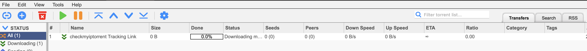
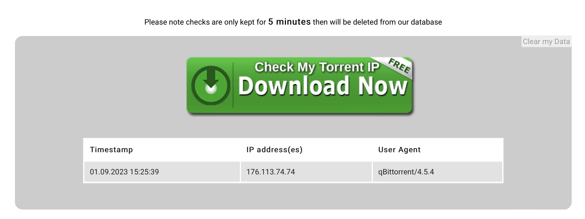
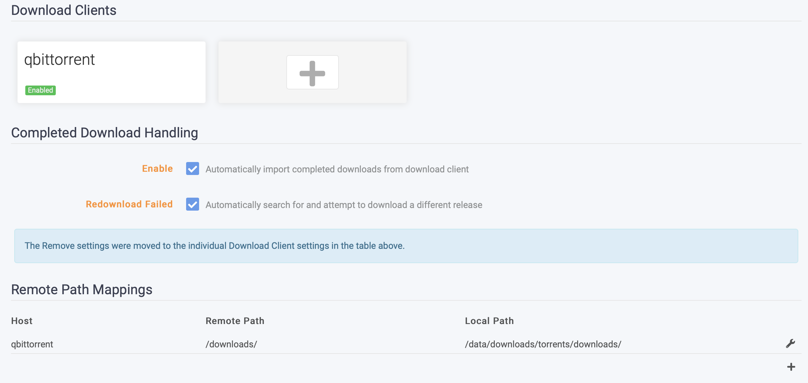
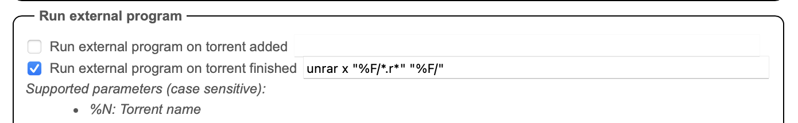

# Synology Media Configuration

This is my attempt at publishing a write up on a rough timeliens of my journey setting up an open source media centre on my Synology DSM713+.
It includes a configuration guide and links to scripts that should help others work through their own setups.

## Table of Contents
1. [Introduction](#introduction)
2. [The Setup](#the-setup)
    - [Applications](#applications)
    - [System details](#system-details)
    - [What is OpenVPN?](#what-is-openvpn)
    - [Ok, so now What is tun?](#ok-so-now-what-is-tun)
3. [UnRar-ing files after download](#running-a-script-to-extract-rard-or-zipd-files)
    - [Attempt 1 - Unrar script](#the-first-unrar-script)
4. [Switching to qBittorrent](#switching-to-qbittorrent)
    - [The VPN challenge - some options](#some-options)
    - [Making life easy - SOCKS5](#using-socks5-proxy---torguard-and-qbittorrent)
    - [Important - remote path mapping](#remote-path-mapping-between-sonarr-and-qbittorrent)
    - [Attempt 2 - Another failed Unrar script](#the-second-failed-unrar-script)
    - [That didn't work either - no more scripts](#that-didnt-actually-work)
5. [Final docker-compose](#final-docker-compose)
6. [Further Resources](#further-resources)

## Introduction
So a while back, motivated by a desire to make more use out of my [Synology DSM713+ NAS](https://www.synology.com/en-global/support/download/DS713+?version=7.1#system), I decided to explore ways to turn it into a self-managed but highly automated media centre.
It must have been at most four years ago when I started this project because [this Reddit post](https://www.reddit.com/r/synology/comments/eahndo/synology_media_advanced_setup_guide/) from December 2019 was my original starting point. It also explains why I started off using Transmission as a my client instead of qbittorrent.

So let's dive in!

## The Setup

### Applications
Originally, the set up included the following applications:
- [Radarr](https://radarr.video/)
- [Sonarr](https://sonarr.tv/)
- [Transmission](https://transmissionbt.com/)
    - Importantly here, I am not using vanilla transmission image
    - I was using a custom image with openvpn capabilities, found [here](https://haugene.github.io/docker-transmission-openvpn/)

As of June 2023, I added [Jackett](https://github.com/Jackett/Jackett) for better management of indexers and swapped Transmission out for [qbittorrent](https://docs.linuxserver.io/images/docker-qbittorrent/). This was prompted by [rarbg finally deciding to hang its boots up](https://www.reddit.com/r/CrackWatch/comments/13wj1bp/rarbg_down_seemingly_for_good/).

December 2023 note: looks like rarbg is back?

### System Details
Lastly, the hardware I'm running this on, as mentioned, is a Synology DSM713+
```shell
waleed@seventhirteen:/volume1/docker/mediacentre$ uname -a
Linux seventhirteen 3.10.108 #42962 SMP Fri Mar 24 00:28:47 CST 2023 x86_64 GNU/Linux synology_cedarview_713+
```

My setup has always relied on docker for managing these applications and I don't have an automated way of keeping the images updated just yet.


The trickiest part of this set up, and the one that I forget every time I go through an upgrade cycle is the requirements to get VPN working with transmission.

June 2023 NOTE:
- Ever since I upgraded my synology DSM firmware to the latest version, the need to do all this tunneling below has gone away!

Thankfully, my VPN provider of choice has config files provided by huagene. What isn't as clear is the role /dev/tun plays.


### What is OpenVPN?
- TODO

### Ok, so now what is tun?
- TODO

And here's the bash script I use to check if /dev/tun exists, and if it doesn't, to create it:

```bash
#!/bin/sh

# Create the necessary file structure for /dev/net/tun
if ( [ ! -c /dev/net/tun ] ); then
    if ( [ ! -d /dev/net ] ); then
            mkdir -m 755 /dev/net
        fi
        mknod /dev/net/tun c 10 200
fi

# Load the tun module if not already loaded
if ( !(lsmod | grep -q "^tun\s") ); then
    insmod /lib/modules/tun.ko
fi
```

## Running a script to extract rar'd or zip'd files
As of June 2023, I also added an unrar script to the post download instructions to transmission

### The first Unrar script
The only real mention of how to get an unrar script going when a torrent is completed can be found [here](https://github.com/haugene/docker-transmission-openvpn/issues/75).

The main things you need to do are:
- In the environment options:
    - enable the flag to run a script when a torrent is done
    - point to where the script is
```docker
-e "TRANSMISSION_SCRIPT_TORRENT_DONE_ENABLED=true" \
-e "TRANSMISSION_SCRIPT_TORRENT_DONE_FILENAME=/data/extract_torrent.sh" \
```
- Since I keep my scripts in ```$(PATH_TO_DOCKER_DIR)/mediacentre/transmission/scripts``` you also need to mount this:
```docker
-v /volume1/docker/mediacentre/transmission/scripts:/scripts
```
- The contents of the script ```unrar-torrent.sh``` would make use of $TR_TORRENT_NAME and TR_TORRENT_DIR which I'm assuming as environment variables set by transmission containing the specific torrent downloaded and the name of the torrent file
- In my setup, the directory with torrents in it is actually this: TRANSMISSION_DOWNLOAD_DIR=/data/downloads/torrents/downloads
    - The var I don't understand is $TR_TORRENT_NAME <- where does this get set???

#!/bin/bash
CUR_DIR=`pwd` 
cd $TR_TORRENT_DIR
test -d "$TR_TORRENT_NAME" && cd "$TR_TORRENT_NAME"
unrar e -inul *.rar
7z e *.zip > /dev/null 2>&1
cd $CUR_DIR

**THE SCRIPT DOESN'T WORK WITH THE CONFIGURATION**

**SO LET'S MOVE TO QBITTORRENT FINALLY**

- The challenge with qBittorrent is going to be VPN setup, as always. The way I overcame this with transmission was to use huagene's docker container that had VPN configurations for various providers baked in and so I didn't have to mess around with certs, wireguard and a bunch of stuff I don't fully comprehend.

## Time to switch to qBittorrent
- The first thing I tried, obviously, is just a vanilla docker compose with VPN settings filled in:
```docker
environment:
      - PUID=1032
      - PGID=65537
      - TZ=America/Toronto
      - WEBUI_PORT=8080
      - WEBUI_USERNAME=
      - WEBUI_PASSWORD=
      - VPN_ENABLED=yes
      - VPN_PROV=custom
      - VPN_CLIENT=openvpn
      - VPN_USER=vpnusername
      - VPN_PASS=vpnpassword
      - VPN_OPTIONS=--inactive 3600 --ping 10 --ping-exit 60
```
- This didn't work out of the box with torguard. I'm not sure whether the base qBittorrent container knows how to parse random VPN providers and their certificates
- So while this deployed and the client was running, the VPN connection wasn't working

### Some options
1. One alternative would be to, like with transmission, use a qBittorrent image configured for VPN and with capability to handle torguard
    - Something like this, for example: https://hub.docker.com/r/dyonr/qbittorrentvpn/
2. Using something like [gluetun](https://github.com/qdm12/gluetun-wiki), deploy it to a container and then use the ```network_mode: "service:gluetun"``` parameter in the containers that need it
    - Since gluetun has support for torguard, this would surely be an easy solution
    - It wasn't. I kept getting this error when it was trying to authenticate the VPN connection to torguard's IPs:
    ```shell
    gluetun    | 2023-09-01T12:38:58Z INFO [vpn] stopping
    gluetun    | 2023-09-01T12:38:58Z INFO [vpn] starting
    gluetun    | 2023-09-01T12:38:58Z INFO [firewall] allowing VPN connection...
    gluetun    | 2023-09-01T12:38:58Z INFO [openvpn] OpenVPN 2.5.8 x86_64-alpine-linux-musl [SSL (OpenSSL)] [LZO] [LZ4] [EPOLL] [MH/PKTINFO] [AEAD] built on Nov  2 2022
    gluetun    | 2023-09-01T12:38:58Z INFO [openvpn] library versions: OpenSSL 3.1.2 1 Aug 2023, LZO 2.10
    gluetun    | 2023-09-01T12:38:58Z INFO [openvpn] TCP/UDP: Preserving recently used remote address: [AF_INET]146.70.137.74:1912
    gluetun    | 2023-09-01T12:38:58Z INFO [openvpn] UDP link local: (not bound)
    gluetun    | 2023-09-01T12:38:58Z INFO [openvpn] UDP link remote: [AF_INET]146.70.137.74:1912
    gluetun    | 2023-09-01T12:39:58Z WARN [openvpn] TLS Error: TLS key negotiation failed to occur within 60 seconds (check your network connectivity)
    gluetun    | 🚒🚒🚒🚒🚒🚨🚨🚨🚨🚨🚨🚒🚒🚒🚒🚒
    gluetun    | That error usually happens because either:
    gluetun    | 
    gluetun    | 1. The VPN server IP address you are trying to connect to is no longer valid 🔌
    gluetun    |    Check out https://github.com/qdm12/gluetun-wiki/blob/main/setup/servers.md#update-the-vpn-servers-list
    gluetun    | 
    gluetun    | 2. The VPN server crashed 💥, try changing your VPN servers filtering options such as SERVER_REGIONS
    gluetun    | 
    gluetun    | 3. Your Internet connection is not working 🤯, ensure it works
    gluetun    | 
    gluetun    | 4. Something else ➡️ https://github.com/qdm12/gluetun/issues/new/choose
    gluetun    | 
    gluetun    | 2023-09-01T12:39:58Z INFO [openvpn] TLS Error: TLS handshake failed
    gluetun    | 2023-09-01T12:39:58Z INFO [openvpn] SIGTERM received, sending exit notification to peer
    gluetun    | 2023-09-01T12:39:58Z INFO [openvpn] SIGTERM[soft,tls-error] received, process exiting
    gluetun    | 2023-09-01T12:39:58Z INFO [vpn] retrying in 15s
    gluetun    | 2023-09-01T12:39:59Z INFO [healthcheck] program has been unhealthy for 1m1s: restarting VPN (see https://github.com/qdm12/gluetun-wiki/blob/main/faq/healthcheck.md)
    gluetun    | 2023-09-01T12:40:13Z INFO [firewall] allowing VPN connection...
    gluetun    | 2023-09-01T12:40:14Z INFO [openvpn] OpenVPN 2.5.8 x86_64-alpine-linux-musl [SSL (OpenSSL)] [LZO] [LZ4] [EPOLL] [MH/PKTINFO] [AEAD] built on Nov  2 2022
    gluetun    | 2023-09-01T12:40:14Z INFO [openvpn] library versions: OpenSSL 3.1.2 1 Aug 2023, LZO 2.10
    gluetun    | 2023-09-01T12:40:14Z INFO [openvpn] TCP/UDP: Preserving recently used remote address: [AF_INET]146.70.34.186:1912
    gluetun    | 2023-09-01T12:40:14Z INFO [openvpn] UDP link local: (not bound)
    gluetun    | 2023-09-01T12:40:14Z INFO [openvpn] UDP link remote: [AF_INET]146.70.34.186:1912
    gluetun    | 2023-09-01T12:41:15Z WARN [openvpn] TLS Error: TLS key negotiation failed to occur within 60 seconds (check your network connectivity)
    gluetun    | 🚒🚒🚒🚒🚒🚨🚨🚨🚨🚨🚨🚒🚒🚒🚒🚒
    gluetun    | That error usually happens because either:
    gluetun    | 
    gluetun    | 1. The VPN server IP address you are trying to connect to is no longer valid 🔌
    gluetun    |    Check out https://github.com/qdm12/gluetun-wiki/blob/main/setup/servers.md#update-the-vpn-servers-list
    gluetun    | 
    gluetun    | 2. The VPN server crashed 💥, try changing your VPN servers filtering options such as SERVER_REGIONS
    gluetun    | 
    gluetun    | 3. Your Internet connection is not working 🤯, ensure it works
    gluetun    | 
    gluetun    | 4. Something else ➡️ https://github.com/qdm12/gluetun/issues/new/choose
    gluetun    | 
    gluetun    | 2023-09-01T12:41:15Z INFO [openvpn] TLS Error: TLS handshake failed
    gluetun    | 2023-09-01T12:41:15Z INFO [openvpn] SIGTERM received, sending exit notification to peer
    gluetun    | 2023-09-01T12:41:15Z INFO [openvpn] SIGTERM[soft,tls-error] received, process exiting
    gluetun    | 2023-09-01T12:41:15Z INFO [vpn] retrying in 15s
    gluetun    | 2023-09-01T12:41:19Z INFO [healthcheck] program has been unhealthy for 1m6s: restarting VPN (see https://github.com/qdm12/gluetun-wiki/blob/main
    ``` 
    3. As it turns out, torguard has a SOCKS5 proxy you can use: https://torguard.net/article/241/how-to-setup-a-socks-proxy-in-qbittorrent-on-windows.html

### Using SOCKS5 Proxy - Torguard and qBittorrent
- Follow the guide above
- Then use their helpful "Check my Torrent IP" tool. Since the VPN connection isn't set at the container level, you can't just docker exec into the container and check its IP
- When you run it, it shows up like this in the download client:

- And it displays the IP your torrent appears to be downloading to like this: 
    - This isn't my IP! So it works!!!

### Remote Path Mapping between Sonarr and qBittorrent
- One very important thing to be aware of is the remote path mapping: 
- The way this reads:
    - When qBittorrent reports a file has been downloaded to ```/downloads``` (which is where you map the volume in the docker compose), it tells sonarr to look for that in its own local directory structure at ```/data/downloads/torrents/downloads```
- If you don't do this, sonarr won't know where to find the files and it will just report an error: ```"No files found are eligible for import at /downloads/<FILE>```

### The second, failed unrar script
- Last but not least, the whole reason we switched to qBittorrent: running a post-processing script to unrar files
- Here's the script:
```shell
#!/bin/bash
cd "$1"

for f in "$1"/*.rar
do
  [ -e "$f" ] && unrar x "$f"
done
```
- I saved it in the top level config dir in the volume mapping here: ```- /volume1/docker/mediacentre/qbittorrent:/config```
- And then in qbittorrent, I set the following under settings: 

### That didn't actually work!
- Ok so after monitoring a few torrent downloads, it turns out the script the way I've included it doesn't actually run or unrar anything
- So what I've done instead is just invoking unrar directly from the "run external program after torrent is finished" box, like this:

- Let's break down what this is doing:
```shell
unrar x "%F/*.r*" "%F/"
```
- The ```unrar x``` part is obvious. It just means "extract contents of an archive"
- The ```"%F/*.r*"``` breaks down into ```%F/``` which refers to the current directory in qbittorrent land and the ```*.r*``` just references any file with a ```r*``` extension.
- Lastly, the final parameter is where to unrar the files, which in this case is just the current directory again
- After monitoring this for a few torrents, it looks like it finally works!!!

## Final docker-compose.yml
- TODO: Add link to a gist

## Further resources
- Resources
- Additional things to try later
